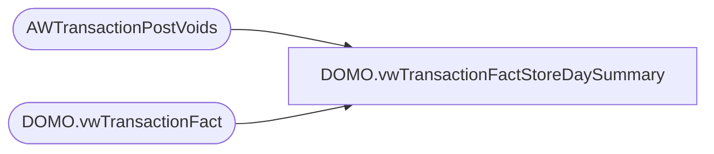

# DOMO.vwTransactionFactStoreDaySummary

**Database:** dw  
**Server:** papamart  

## Architecture Diagram



## Table Dependencies

| Referenced Table |
|---|
| AWTransactionPostVoids |
| DOMO.vwTransactionFact |

## View Code

```sql
CREATE view [DOMO].[vwTransactionFactStoreDaySummary]

AS
-- =============================================================================================================
-- Name: [DOMO].[vwTransactionFactStoreDaySummary]
--
-- Description: Transaction summary by store and day.
--
--
-- Dependencies: 
--
-- Revision History
--		Name:				Date:			Comments:
--		Anthony Delgado		05/13/2016		Initial creation
--		Anthony Delgado		06/21/2016		Added StoreTransactionCount and StoreSalesAmount
--		Anthony Delgado		08/16/2016		Added Enterprise Selling fields
--		Anthony Delgado		10/05/2016		Added CaptureEligibleTransactionCount
--		Dan Tweedie			2018-02-13		Added new measures
-- =============================================================================================================

With TransFacts as
(
	SELECT 
		  tf.StoreKey
		  ,tf.TransactionDate
  		  ,tf.CurrencyCode
		  ,SUM(CAST(tf.TotalUnits AS DECIMAL(15, 3))) AS TotalUnits
		  ,SUM(CAST(tf.GAAPUnits AS DECIMAL(15, 3))) AS GAAPUnits
		  ,SUM(CAST(tf.EnterpriseSellingUnits AS DECIMAL(15, 3))) AS EnterpriseSellingUnits
		  ,SUM(CASE WHEN tf.EnterpriseSellingOnlyTransaction=1 THEN tf.MerchandiseUnits ELSE 0 END) AS EnterpriseSellingOnlyMerchandiseUnits
		  ,SUM(CASE WHEN tf.EnterpriseSellingUnits<>0 THEN tf.MerchandiseUnits ELSE 0 END) AS EnterpriseSellingMerchandiseUnits
		  ,SUM(CAST(tf.GAAPSalesAmount AS DECIMAL(15, 3))) AS GAAPSalesAmount
		  ,SUM(CAST(tf.StoreSalesAmount AS DECIMAL(15, 3))) AS StoreSalesAmount
		  ,SUM(CAST(tf.EnterpriseSellingAmount AS DECIMAL(15,3))) AS EnterpriseSellingAmount
		  ,SUM(CASE WHEN tf.EnterpriseSellingOnlyTransaction=1 THEN CAST(tf.StoreSalesAmount AS DECIMAL(15,3)) ELSE 0 END) AS EnterpriseSellingOnlyStoreSalesAmount
		  ,SUM(CASE WHEN tf.EnterpriseSellingUnits<>0 THEN CAST(tf.StoreSalesAmount AS DECIMAL(15,3)) ELSE 0 END) AS EnterpriseSellingStoreSalesAmount
		  ,SUM(CAST(tf.NetSalesAmount AS DECIMAL(15, 3))) AS NetSalesAmount
		  ,SUM(CAST(tf.UnitGrossAmount AS DECIMAL(15, 3))) AS UnitGrossAmount
		  ,SUM(CAST(tf.UnitNetAmount AS DECIMAL(15, 3))) AS UnitNetAmount
		  ,SUM(CAST(tf.RewardCertificateAmount AS DECIMAL(15, 3))) AS RewardCertificateAmount
		  ,SUM(CAST(tf.BuyStuffAmount AS DECIMAL(15, 3))) AS BuyStuffAmount
		  ,SUM(CAST(tf.RedemptionAmount AS DECIMAL(15, 3))) AS RedemptionAmount
		  ,SUM(CAST(tf.TaxAmount AS DECIMAL(15, 3))) AS TaxAmount
		  ,SUM(CAST(tf.UnitDiscountAmount AS DECIMAL(15, 3))) AS UnitDiscountAmount
		  ,SUM(CAST(tf.CouponDiscountAmount AS DECIMAL(15, 3))) AS CouponDiscountAmount
		  ,SUM(CAST(tf.CouponDiscountUnits AS DECIMAL(15, 3))) AS CouponDiscountUnits
		  ,SUM(CAST(tf.GiftcardDiscountAmount AS DECIMAL(15, 3))) AS GiftcardDiscountAmount
		  ,SUM(CAST(tf.TotalDiscountAmount AS DECIMAL(15, 3))) AS TotalDiscountAmount
		  ,SUM(CAST(tf.ReceiptTotalAmount AS DECIMAL(15, 3))) AS ReceiptTotalAmount
		  ,SUM(CAST(tf.FinGAAPSalesAmount AS DECIMAL(15, 3))) AS FinGAAPSalesAmount 
		  ,SUM(CAST(tf.FinStoreSalesAmount AS DECIMAL(15,3))) AS FinStoreSalesAmount
		  ,SUM(CAST(tf.UpsellDiscountAmount AS DECIMAL(15, 3))) AS UpsellDiscountAmount
		  ,SUM(CAST(tf.MerchandiseUnitGrossAmount AS DECIMAL(15, 3))) AS MerchandiseUnitGrossAmount
		  ,SUM(CAST(tf.MerchandiseUnits AS DECIMAL(15, 3))) AS MerchandiseUnits
		  ,SUM(CAST(tf.MerchandiseCost AS DECIMAL(15, 3))) AS MerchandiseCost 
		  ,SUM(CAST(tf.DonationUnitGrossAmount AS DECIMAL(15, 3))) AS DonationUnitGrossAmount
		  ,SUM(CAST(tf.DonationUnits AS DECIMAL(15, 3))) AS DonationUnits
		  ,SUM(CAST(tf.PartyDepositUnitGrossAmount AS DECIMAL(15, 3))) AS PartyDepositUnitGrossAmount
		  ,SUM(CAST(tf.PartyDepositUnits AS DECIMAL(15, 3))) AS PartyDepositUnits
		  ,SUM(CAST(tf.GiftCardUnitGrossAmount AS DECIMAL(15, 3))) AS GiftCardUnitGrossAmount
		  ,SUM(CAST(tf.GiftCardUnits AS DECIMAL(15, 3))) AS GiftCardUnits
		  ,SUM(CAST(tf.AnimalUnitGrossAmount AS DECIMAL(15, 3))) AS AnimalUnitGrossAmount
		  ,SUM(CAST(tf.AnimalUnits AS DECIMAL(15, 3))) AS AnimalUnits
		  ,SUM(CAST(tf.AnimalCost AS DECIMAL(15, 3))) AS AnimalCost
		  ,SUM(CAST(tf.NonAnimalUnitGrossAmount AS DECIMAL(15, 3))) AS NonAnimalUnitGrossAmount
		  ,SUM(CAST(tf.NonAnimalUnits AS DECIMAL(15, 3))) AS NonAnimalUnits
		  ,SUM(CAST(tf.NonAnimalCost AS DECIMAL(15, 3))) AS NonAnimalCost
		  ,SUM(CAST(tf.FootwearUnitGrossAmount AS DECIMAL(15, 3))) AS FootwearUnitGrossAmount 
		  ,SUM(CAST(tf.FootwearUnits AS DECIMAL(15, 3))) AS FootwearUnits
		  ,SUM(CAST(tf.FootwearCost AS DECIMAL(15, 3))) AS FootwearCost
		  ,SUM(CAST(tf.AccessoryUnitGrossAmount AS DECIMAL(15, 3))) AS AccessoryUnitGrossAmount
		  ,SUM(CAST(tf.AccessoryCost AS DECIMAL(15, 3))) AS AccessoryCost
		  ,SUM(CAST(tf.AccessoryUnits AS DECIMAL(15, 3))) AS AccessoryUnits
		  ,SUM(CAST(tf.SoundUnitGrossAmount AS DECIMAL(15, 3))) AS SoundUnitGrossAmount
		  ,SUM(CAST(tf.SoundUnits AS DECIMAL(15, 3))) AS SoundUnits
		  ,SUM(CAST(tf.SoundCost AS DECIMAL(15, 3))) AS SoundCost
		  ,SUM(CAST(tf.ClothingUnitGrossAmount AS DECIMAL(15, 3))) AS ClothingUnitGrossAmount
		  ,SUM(CAST(tf.ClothingUnits AS DECIMAL(15, 3))) AS ClothingUnits
		  ,SUM(CAST(tf.ClothingCost AS DECIMAL(15, 3))) AS ClothingCost
		  ,SUM(CAST(tf.OtherUnitGrossAmount AS DECIMAL(15, 3))) AS OtherUnitGrossAmount
		  ,SUM(CAST(tf.OtherUnits AS DECIMAL(15, 3))) AS OtherUnits
		  ,SUM(CAST(tf.OtherCost AS DECIMAL(15, 3))) AS OtherCost
		  ,SUM(CAST(tf.ShippingUnitGrossAmount AS DECIMAL(15, 3))) AS ShippingUnitGrossAmount
		  ,SUM(CAST(tf.ShippingUnits AS DECIMAL(15, 3))) AS ShippingUnits
		  ,SUM(CAST(tf.OtherFeesUnitGrossAmount AS DECIMAL(15, 3))) AS OtherFeesUnitGrossAmount
		  ,SUM(CAST(tf.OtherFeesUnits AS DECIMAL(15, 3))) AS OtherFeesUnits
		  ,SUM(CAST(tf.CubCashUnitGrossAmount AS DECIMAL(15, 3))) AS CubCashUnitGrossAmount
		  ,SUM(CAST(tf.CubCashUnits AS DECIMAL(15, 3))) AS CubCashUnits
		  ,SUM(CAST(tf.PaidOutsUnitGrossAmount AS DECIMAL(15, 3))) AS PaidOutsUnitGrossAmount
		  ,SUM(CAST(tf.PaidOutsUnits AS DECIMAL(15, 3))) AS PaidOutsUnits
		  ,SUM(CAST(tf.StuffingSuppliesUnitGrossAmount AS DECIMAL(15, 3))) AS StuffingSuppliesUnitGrossAmount
		  ,SUM(CAST(tf.StuffingSuppliesUnits AS DECIMAL(15, 3))) AS StuffingSuppliesUnits
		  ,SUM(CAST(tf.SportUnitGrossAmount AS DECIMAL(15, 3))) AS SportUnitGrossAmount
		  ,SUM(CAST(tf.SportUnits AS DECIMAL(15, 3))) AS SportUnits
		  ,SUM(CAST(tf.SportCost AS DECIMAL(15, 3))) AS SportCost
		  ,SUM(CAST(tf.PresuffedUnitGrossAmount AS DECIMAL(15, 3))) AS PresuffedUnitGrossAmount
		  ,SUM(CAST(tf.PresuffedUnits AS DECIMAL(15, 3))) AS PresuffedUnits
		  ,SUM(CAST(tf.PresuffedCost AS DECIMAL(15, 3))) AS PresuffedCost
		  ,SUM(CAST(tf.ScentUnitGrossAmount AS DECIMAL(15, 3))) AS ScentUnitGrossAmount
		  ,SUM(CAST(tf.ScentUnits AS DECIMAL(15, 3))) AS ScentUnits
		  ,SUM(CAST(tf.ScentCost AS DECIMAL(15, 3))) AS ScentCost
		  ,COUNT(DISTINCT tf.TransactionID) AS TransactionCount
		  ,SUM(tf.GAAPTransaction) AS GAAPTransactionCount
		  ,SUM(tf.StoreTransaction) AS StoreTransactionCount
		  ,SUM(CASE WHEN tf.EnterpriseSellingAmount<>0 THEN 1 ELSE 0 END) AS EnterpriseSellingTransactionCount
		  ,SUM(tf.EnterpriseSellingOnlyTransaction) AS EnterpriseSellingOnlyTransactionCount
		  ,SUM(tf.PartyFlag) AS PartyCount
		  ,SUM(CASE WHEN tf.partyflag=1 THEN tf.GAAPSalesAmount ELSE 0 END) AS PartyGAAPSalesAmount
		  ,SUM(CASE WHEN tf.partyflag=1 THEN tf.TotalUnits ELSE 0 END) AS PartyUnits
		  ,SUM(tf.CaptureEligible) AS CaptureEligibleTransactionCount,
			SUM(CAST(ISNULL(tf.EmployeeDiscountUGA,0) AS DECIMAL(15,3))) AS EmployeeDiscountUGA,
			SUM(CAST(ISNULL(tf.ReturnUGA,0) AS DECIMAL(15,3))) AS ReturnUGA,
			SUM(CAST(ISNULL(tf.ReturnUnits,0) AS int)) AS ReturnUnits
	FROM dw.DOMO.vwTransactionFact tf
	GROUP BY 
		tf.StoreKey,
		tf.TransactionDate,
		tf.CurrencyCode
)
select 
	tf.*,
	CAST(ISNULL(pv.PostVoidUGA,0) AS DECIMAL(15,3)) as PostVoidUGA,
	CAST(ISNULL(pv.PostVoidUnits,0) AS int) as PostVoidUnits
from TransFacts tf 
left join AWTransactionPostVoids pv 
		on tf.StoreKey = cast(pv.StoreNo as int)
		and tf.TransactionDate = pv.TransactionDate
```

