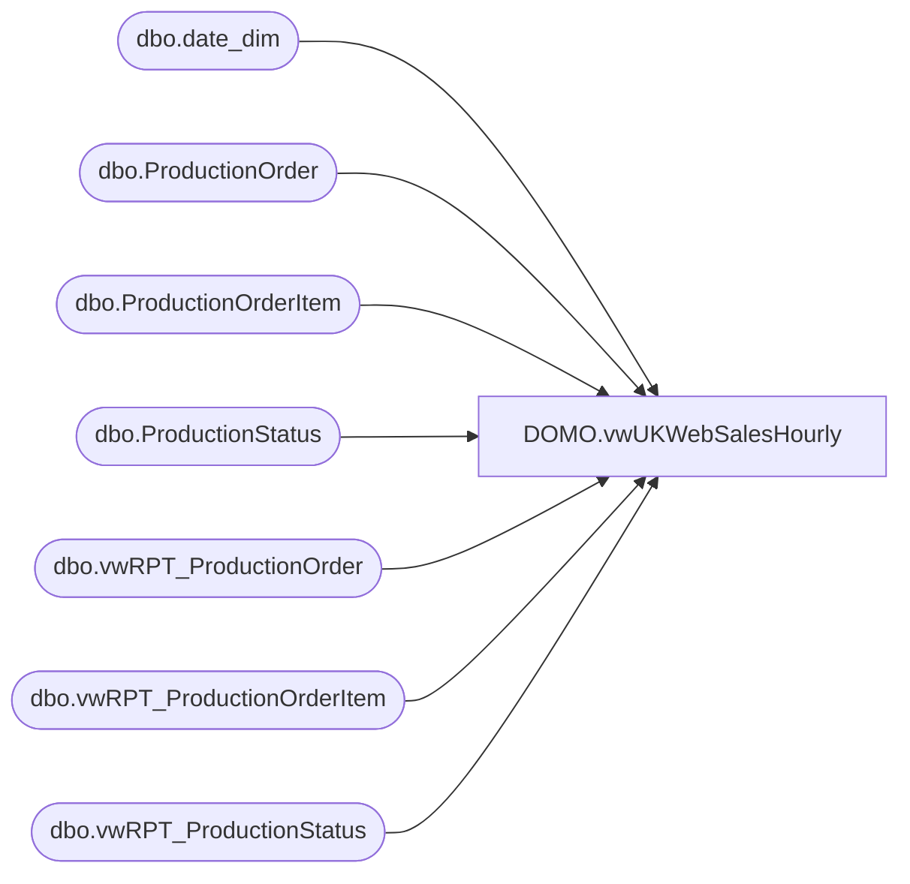

# DOMO.vwUKWebSalesHourly

**Database:** dw  
**Server:** papamart  

## Architecture Diagram



## Table Dependencies

| Referenced Table |
|---|
| dbo.date_dim |
| dbo.ProductionOrder |
| dbo.ProductionOrderItem |
| dbo.ProductionStatus |
| dbo.vwRPT_ProductionOrder |
| dbo.vwRPT_ProductionOrderItem |
| dbo.vwRPT_ProductionStatus |

## View Code

```sql
CREATE VIEW [DOMO].[vwUKWebSalesHourly]

AS
-- =============================================================================================================
-- Name: [DOMO].[vwUKWebSalesHourly]
--
-- Description: UK Web Sales grouped by date and hour.
-- 
--
--
-- Dependencies: UK Web hourly Sales
--
-- Revision History
--		Name:				Date:			Comments:
--		Brian Byas			9/1/2016		Initial creation
-- =============================================================================================================


WITH Orders (actual_date,OrderHour,TotalOrders) AS (
		
		/*
		-- This query returns total orders to current report date and hour
		*/

		SELECT  dd.actual_date,DATEPART(hour, PO.ProductionOrderDateTimeCreated) AS OrderHour, COUNT(*) AS 'TotalOrders'
		FROM [KODIAK].[BABWPMS].dbo.ProductionOrder PO WITH (NOLOCK) INNER JOIN
		PAPAMART.[dw].[dbo].[date_dim] dd WITH(NOLOCK)
			ON CONVERT(VARCHAR(10),PO.ProductionOrderDateTimeCreated,101) = dd.actual_date AND DATEPART(hour, PO.ProductionOrderDateTimeCreated) BETWEEN 0 AND 24 
		--WHERE PO.ProductionOrderDateTimeCreated BETWEEN CAST(dateadd(day,-1,CONVERT(VARCHAR,GETDATE(),101) + ' 0:00:00') as varchar(20)) AND CONVERT(VARCHAR,GETDATE(),101) + ' 0:00:00'
		WHERE PO.ProductionOrderDateTimeCreated > CAST(dateadd(day,0,CONVERT(VARCHAR,GETDATE(),101) + ' 0:00:00') as varchar(20))
		AND PO.[ProductionOrderSiteCode] = 'BABW_UK'
		AND PO.ProductionOrderBillingFirstName <> 'House Order'
		GROUP BY dd.actual_date,DATEPART(hour, PO.ProductionOrderDateTimeCreated)
		),
OrdersLY (actual_date,OrderHour,TotalOrdersLY) AS (
		
		/*
		-- This query returns total ordersLY to current report date and hour
		*/

		SELECT  dd.actual_date,DATEPART(hour, PO.ProductionOrderDateTimeCreated) AS OrderHour, COUNT(*) AS 'TotalOrdersLY'
		FROM [KODIAK].[BABWPMS].dbo.vwRPT_ProductionOrder PO WITH (NOLOCK) INNER JOIN
		PAPAMART.[dw].[dbo].[date_dim] dd WITH(NOLOCK)
			ON CONVERT(VARCHAR(10),PO.ProductionOrderDateTimeCreated,101) = dd.actual_date AND DATEPART(hour, PO.ProductionOrderDateTimeCreated) BETWEEN 0 AND 24 
		--WHERE PO.ProductionOrderDateTimeCreated BETWEEN CAST(dateadd(day,-905,CONVERT(VARCHAR,GETDATE(),101) + ' 0:00:00') as varchar(20)) AND CONVERT(VARCHAR,GETDATE(),101) + ' 0:00:00'
		WHERE po.ProductionOrderDateTimeCreated BETWEEN CAST(dateadd(day,0,CONVERT(VARCHAR,DATEADD(year, -1,GETDATE()),101) + ' 00:00:00') as varchar(20))  AND CONVERT(VARCHAR(20),CAST(dateadd(day,0,CONVERT(VARCHAR,DATEADD(year, -1,GETDATE()),101)) + CAST(CONVERT(VARCHAR(8), GETDATE(), 108) AS VARCHAR(20)) as varchar(20)),108) 
		AND PO.[ProductionOrderSiteCode] = 'BABW_UK'
		AND PO.ProductionOrderBillingFirstName <> 'House Order'
		GROUP BY dd.actual_date,DATEPART(hour, PO.ProductionOrderDateTimeCreated)
		),
GAAPSalesAmount (actual_date,OrderHour,GAAPSales) AS(

		/*
		-- This query returns total GAAP orders $ to current report date and hour
		*/
		SELECT  a.actual_date,DATEPART(hour, a.ProductionOrderDateTimeCreated) AS OrderHour,SUM(a.ProductionOrderItemExtendedPrice + a.ProductionOrderShippingAndHandling) AS 'GAAPSales'
		FROM    ( SELECT    PO.ProductionOrderId,po.ProductionOrderDateTimeCreated,dd.actual_date,
		ISNULL(SUM(ISNULL(POI.ProductionOrderItemExtendedPrice,0)), 0) AS ProductionOrderItemExtendedPrice,
		ISNULL(PO.ProductionOrderShippingAndHandling,0) AS ProductionOrderShippingAndHandling
		FROM [KODIAK].[BABWPMS].dbo.ProductionOrder PO WITH (NOLOCK) INNER JOIN
		PAPAMART.[dw].[dbo].[date_dim] dd WITH(NOLOCK)
			ON CONVERT(VARCHAR(10),PO.ProductionOrderDateTimeCreated,101) = dd.actual_date AND DATEPART(hour, PO.ProductionOrderDateTimeCreated) BETWEEN 0 AND 24
		JOIN [KODIAK].[BABWPMS].dbo.ProductionStatus PS WITH (NOLOCK) ON PO.ProductionOrderId = PS.ProductionOrderId
		JOIN [KODIAK].[BABWPMS].dbo.ProductionOrderItem POI WITH (NOLOCK) ON PO.ProductionOrderId = POI.ProductionOrderId
		--WHERE po.ProductionOrderDateTimeCreated BETWEEN CAST(dateadd(day,-1,CONVERT(VARCHAR,GETDATE(),101) + ' 0:00:00') as varchar(20)) AND CONVERT(VARCHAR,GETDATE(),101) + ' 0:00:00' 
		WHERE po.ProductionOrderDateTimeCreated > CAST(dateadd(day,0,CONVERT(VARCHAR,GETDATE(),101) + ' 0:00:00') as varchar(20))
		AND POI.ProductionOrderItemIsPhysicalGiftCard = 0
		AND POI.ProductionOrderItemIsVirtualGiftCard = 0
		AND PO.[ProductionOrderSiteCode] = 'BABW_UK'
		AND PO.ProductionOrderBillingFirstName <> 'House Order'
		AND PS.ProductionStatusActive = 1
		AND PS.ProductionStatusCode <> 'Canceled' 
		GROUP BY  PO.ProductionOrderId,
		PO.ProductionOrderShippingAndHandling,po.ProductionOrderDateTimeCreated,dd.actual_date
		) a
		 GROUP BY a.actual_date,DATEPART(hour, a.ProductionOrderDateTimeCreated)
		),
GAAPSalesAmountLY (actual_Date,OrderHour,GAAPSalesLY)AS(

/*
		-- This query returns total GAAP ordersLY $ to current report date and hour
		*/
		SELECT  a.actual_date,DATEPART(hour, a.ProductionOrderDateTimeCreated) AS OrderHour,SUM(a.ProductionOrderItemExtendedPrice + a.ProductionOrderShippingAndHandling) AS 'GAAPSalesLY'
		FROM    ( SELECT    PO.ProductionOrderId,po.ProductionOrderDateTimeCreated,dd.actual_date,
		ISNULL(SUM(ISNULL(POI.ProductionOrderItemExtendedPrice,0)), 0) AS ProductionOrderItemExtendedPrice,
		ISNULL(PO.ProductionOrderShippingAndHandling,0) AS ProductionOrderShippingAndHandling
		FROM [KODIAK].[BABWPMS].dbo.vwRPT_ProductionOrder PO WITH (NOLOCK) INNER JOIN
		PAPAMART.[dw].[dbo].[date_dim] dd WITH(NOLOCK)
			ON CONVERT(VARCHAR(10),PO.ProductionOrderDateTimeCreated,101) = dd.actual_date AND DATEPART(hour, PO.ProductionOrderDateTimeCreated) BETWEEN 0 AND 24
		JOIN [KODIAK].[BABWPMS].dbo.vwRPT_ProductionStatus PS WITH (NOLOCK) ON PO.ProductionOrderId = PS.ProductionOrderId
		JOIN [KODIAK].[BABWPMS].dbo.vwRPT_ProductionOrderItem POI WITH (NOLOCK) ON PO.ProductionOrderId = POI.ProductionOrderId
		WHERE po.ProductionOrderDateTimeCreated BETWEEN CAST(dateadd(day,0,CONVERT(VARCHAR,DATEADD(year, -1,GETDATE()),101) + ' 00:00:00') as varchar(20))  AND CONVERT(VARCHAR(20),CAST(dateadd(day,0,CONVERT(VARCHAR,DATEADD(year, -1,GETDATE()),101)) + CAST(CONVERT(VARCHAR(8), GETDATE(), 108) AS VARCHAR(20)) as varchar(20)),108) 
		AND POI.ProductionOrderItemIsPhysicalGiftCard = 0
		AND POI.ProductionOrderItemIsVirtualGiftCard = 0
		AND PO.[ProductionOrderSiteCode] = 'BABW_UK'
		AND PO.ProductionOrderBillingFirstName <> 'House Order'
		AND PS.ProductionStatusActive = 1
		AND PS.ProductionStatusCode <> 'Canceled' 
		GROUP BY  PO.ProductionOrderId,
		PO.ProductionOrderShippingAndHandling,po.ProductionOrderDateTimeCreated,dd.actual_date
		) a
		 GROUP BY a.actual_date,DATEPART(hour, a.ProductionOrderDateTimeCreated)
		 ),

CASH (actual_date,OrderHour,Cash) AS (
		/*
		-- This query returns total Cash to current report date and hour
		*/
		
		SELECT  a.actual_date,DATEPART(hour, a.ProductionOrderDateTimeCreated) AS OrderHour,SUM(a.ProductionOrderItemExtendedPrice) AS 'Cash'
		FROM    ( SELECT    PO.ProductionOrderId,PO.ProductionOrderDateTimeCreated,dd.actual_date,
		ISNULL(SUM(ISNULL(POI.ProductionOrderItemExtendedPrice,0)), 0) AS ProductionOrderItemExtendedPrice
		FROM [KODIAK].[BABWPMS].dbo.ProductionOrder PO WITH (NOLOCK) INNER JOIN
		PAPAMART.[dw].[dbo].[date_dim] dd WITH(NOLOCK)
			ON CONVERT(VARCHAR(10),PO.ProductionOrderDateTimeCreated,101) = dd.actual_date AND DATEPART(hour, PO.ProductionOrderDateTimeCreated) BETWEEN 0 AND 24
		JOIN [KODIAK].[BABWPMS].dbo.ProductionStatus PS WITH (NOLOCK) ON PO.ProductionOrderId = PS.ProductionOrderId
		JOIN [KODIAK].[BABWPMS].dbo.ProductionOrderItem POI WITH (NOLOCK) ON PO.ProductionOrderId = POI.ProductionOrderId
		--WHERE po.ProductionOrderDateTimeCreated BETWEEN CAST(dateadd(day,-1,CONVERT(VARCHAR,GETDATE(),101) + ' 0:00:00') as varchar(20)) AND CONVERT(VARCHAR,GETDATE(),101) + ' 0:00:00'
		WHERE po.ProductionOrderDateTimeCreated > CAST(dateadd(day,0,CONVERT(VARCHAR,GETDATE(),101) + ' 0:00:00') as varchar(20))
		AND PO.[ProductionOrderSiteCode] = 'BABW_UK'
		AND PO.ProductionOrderBillingFirstName <> 'House Order'
		AND PS.ProductionStatusActive = 1
		AND PS.ProductionStatusCode <> 'Canceled' 
		GROUP BY  PO.ProductionOrderId,
		PO.ProductionOrderShippingAndHandling,PO.ProductionOrderDateTimeCreated,dd.actual_date
		) a
		GROUP BY a.actual_date,DATEPART(hour, a.ProductionOrderDateTimeCreated)
		)
,

CASHLY (actual_date,OrderHour,CashLY) AS (
		/*
		-- This query returns total Cash to current report date and hour
		*/
		
		SELECT  a.actual_date,DATEPART(hour, a.ProductionOrderDateTimeCreated) AS OrderHour,SUM(a.ProductionOrderItemExtendedPrice) AS 'CashLY'
		FROM    ( SELECT    PO.ProductionOrderId,PO.ProductionOrderDateTimeCreated,dd.actual_date,
		ISNULL(SUM(ISNULL(POI.ProductionOrderItemExtendedPrice,0)), 0) AS ProductionOrderItemExtendedPrice
		FROM [KODIAK].[BABWPMS].dbo.vwRPT_ProductionOrder PO WITH (NOLOCK) INNER JOIN
		PAPAMART.[dw].[dbo].[date_dim] dd WITH(NOLOCK)
			ON CONVERT(VARCHAR(10),PO.ProductionOrderDateTimeCreated,101) = dd.actual_date AND DATEPART(hour, PO.ProductionOrderDateTimeCreated) BETWEEN 0 AND 24
		JOIN [KODIAK].[BABWPMS].dbo.vwRPT_ProductionStatus PS WITH (NOLOCK) ON PO.ProductionOrderId = PS.ProductionOrderId
		JOIN [KODIAK].[BABWPMS].dbo.vwRPT_ProductionOrderItem POI WITH (NOLOCK) ON PO.ProductionOrderId = POI.ProductionOrderId
		WHERE po.ProductionOrderDateTimeCreated BETWEEN CAST(dateadd(day,0,CONVERT(VARCHAR,DATEADD(year, -1,GETDATE()),101) + ' 00:00:00') as varchar(20))  AND CONVERT(VARCHAR(20),CAST(dateadd(day,0,CONVERT(VARCHAR,DATEADD(year, -1,GETDATE()),101)) + CAST(CONVERT(VARCHAR(8), GETDATE(), 108) AS VARCHAR(20)) as varchar(20)),108) 
		AND PO.[ProductionOrderSiteCode] = 'BABW_UK'
		AND PO.ProductionOrderBillingFirstName <> 'House Order'
		AND PS.ProductionStatusActive = 1
		AND PS.ProductionStatusCode <> 'Canceled' 
		GROUP BY  PO.ProductionOrderId,
		PO.ProductionOrderShippingAndHandling,PO.ProductionOrderDateTimeCreated,dd.actual_date
		) a
		GROUP BY a.actual_date,DATEPART(hour, a.ProductionOrderDateTimeCreated)
		),
HoursOfDay AS (
    SELECT 0 AS HoursOfDay
    UNION ALL
    SELECT HoursOfDay + 1
    FROM HoursOfDay 
    WHERE HoursOfDay + 1 < 24
		)
SELECT DISTINCT CAST(o.actual_date AS DATE) AS TransactionsDate,
		ISNULL(O.OrderHour,h.HoursOfDay) AS TransactionsHour,
		ISNULL(O.TotalOrders,0) AS TotalOrders ,
		ISNULL(OLY.TotalOrdersLY,0)AS TotalOrdersLY,
		ISNULL(GAP.GAAPSales,0) AS GAAPSales,
		ISNULL(GAPLY.GAAPSalesLY,0) AS GAAPSalesLY,
		ISNULL(C.Cash,0) AS NonGAAPSales,
		ISNULL(CLY.CashLY,0) AS NonGAAPSalesLY
FROM Orders O WITH (NOLOCK) RIGHT OUTER JOIN
	HoursOfDay h ON
		h.HoursOfDay = O.OrderHour LEFT OUTER JOIN 
	OrdersLY  OLY WITH (NOLOCK) ON 
		CAST(O.actual_date AS DATE) = DATEADD(year, +1,CAST(OLY.actual_date AS DATE)) 
		AND O.OrderHour = OLY.OrderHour LEFT OUTER JOIN
	GAAPSalesAmount GAP WITH (NOLOCK) ON
		CAST(O.actual_date AS DATE) = CAST(GAP.actual_date AS DATE) 
		AND O.OrderHour = GAP.OrderHour LEFT OUTER JOIN
	GAAPSalesAmountLY GAPLY WITH (NOLOCK) ON
		CAST(GAP.actual_date AS DATE) = DATEADD(year, +1,CAST(GAPLY.actual_date AS DATE)) 
		AND GAP.OrderHour = GAPLY.OrderHour LEFT OUTER JOIN
	CASH C ON
		CAST(O.actual_date AS DATE) = CAST(C.actual_date AS DATE) 
		AND O.OrderHour = C.OrderHour LEFT OUTER JOIN
	CASHLY CLY ON
		CAST(c.actual_date AS DATE) = DATEADD(year, +1,CAST(CLY.actual_date AS DATE)) 
		AND C.OrderHour = CLY.OrderHour 
WHERE O.OrderHour <= DATEPART(hh,GETDATE())
```

