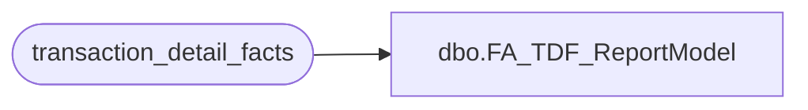

# dbo.FA_TDF_ReportModel

**Database:** dw  
**Server:** papamart  

## Architecture Diagram



## Table Dependencies

| Referenced Table |
|---|
| transaction_detail_facts |

## View Code

```sql
create view dbo.FA_TDF_ReportModel
as 
select * from transaction_detail_facts with (nolock) 
where date_key between 4229 and 4235
```

