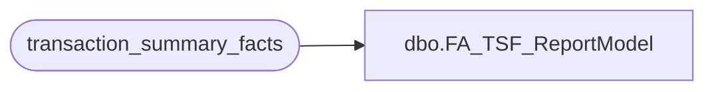

# dbo.FA_TSF_ReportModel

**Database:** dw  
**Server:** papamart  

## Architecture Diagram



## Table Dependencies

| Referenced Table |
|---|
| transaction_summary_facts |

## View Code

```sql
create view dbo.FA_TSF_ReportModel
as 
select * from transaction_summary_facts with (nolock) 
where date_key between 4229 and 4235
```

