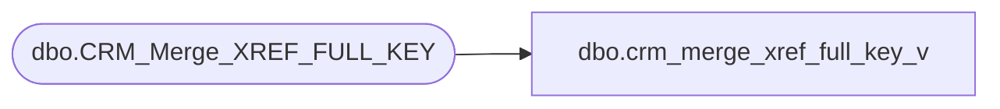

# dbo.crm_merge_xref_full_key_v

**Database:** dw  
**Server:** papamart  

## Architecture Diagram



## Table Dependencies

| Referenced Table |
|---|
| dbo.CRM_Merge_XREF_FULL_KEY |

## View Code

```sql
CREATE VIEW dbo.crm_merge_xref_full_key_v
AS
SELECT     CUST_SEQ_NO, MAX(Merge_Customer_key) AS merge_customer_key, MAX(Delete_Customer_key) AS delete_customer_key, 
                      MAX(Merge_Household_key) AS merge_household_key, MAX(Delete_Household_key) AS delete_household_key, MAX(Merge_Address_key) 
                      AS merge_address_key, MAX(Delete_Address_key) AS delete_address_key, MAX(Old_Reference_ID) AS Old_Reference_ID, 
                      MAX(Merge_Customer_NUM) AS Merge_Customer_NUM, MAX(NCOA) AS NCOA
FROM         dbo.CRM_Merge_XREF_FULL_KEY
GROUP BY CUST_SEQ_NO
```

