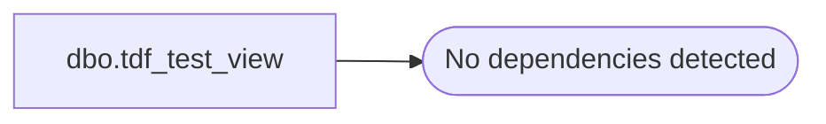

# dbo.tdf_test_view

**Database:** dw  
**Server:** papamart  

## Architecture Diagram



## Table Dependencies

_No table dependencies detected._

## View Code

```sql
CREATE VIEW tdf_test_view
AS

	SELECT *
	FROM OPENROWSET('sqloledb', 'Server=papamart;Trusted_Connection=yes;initial catalog=dw',
		'exec dw.dbo.tdf_test 1') AS t
```

