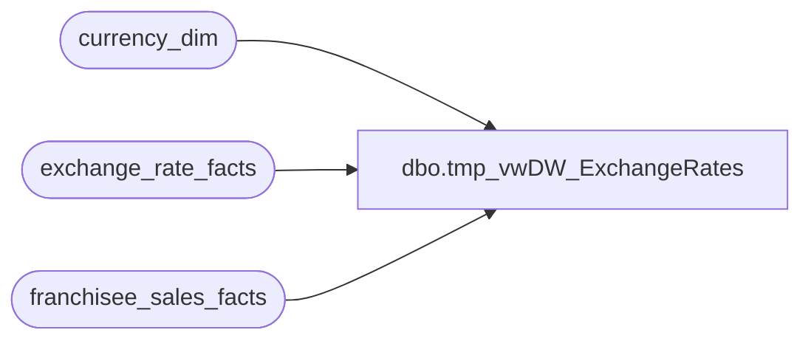

# dbo.tmp_vwDW_ExchangeRates

**Database:** dw  
**Server:** papamart  

## Architecture Diagram



## Table Dependencies

| Referenced Table |
|---|
| currency_dim |
| exchange_rate_facts |
| franchisee_sales_facts |

## View Code

```sql
CREATE VIEW [dbo].[tmp_vwDW_ExchangeRates]
AS

	SELECT date_key, from_currency_key, to_currency_key, actual_date, 
		from_currency_code, to_currency_code, bbw_rate, actual_rate, fiscal_month_ave_rate,
		fiscal_month_end_rate, calendar_month_ave_rate, calendar_month_end_rate
		,f.franchisee_applied_exchange_rate
		,f.franchisee_withholding_tax_rate
	FROM exchange_rate_facts e with (nolock) 
left join 
(select week_ending_date_key,currency_key,exchange_rate as franchisee_applied_exchange_rate
		,withholding_tax_rate as franchisee_withholding_tax_rate
	FROM franchisee_sales_facts with (nolock) 
group by  week_ending_date_key,currency_key,exchange_rate ,withholding_tax_rate
--order by f.exchange_rate desc ,f.withholding_tax_rate desc
) f  on 
e.date_key = f.week_ending_date_key
and e.to_currency_key = f.currency_key
and e.from_currency_key = 141 
--210336 records
	UNION

	SELECT date_key
		,t.to_currency_key AS from_currency_key, e.from_currency_key AS to_currency_key, actual_date
		,t.currency_code AS from_currency_code, e.from_currency_code AS to_currency_code
		,CASE WHEN bbw_rate <> 0 THEN 1.0 / bbw_rate ELSE 0 END AS bbw_rate
		,CASE WHEN actual_rate <> 0 THEN 1.0 / actual_rate ELSE 0 END AS actual_rate
		,CASE WHEN fiscal_month_ave_rate <> 0 THEN 1.0 / fiscal_month_ave_rate ELSE 0 END AS fiscal_month_ave_rate
		,CASE WHEN fiscal_month_end_rate <> 0 THEN 1.0 / fiscal_month_end_rate ELSE 0 END AS fiscal_month_end_rate
		,CASE WHEN calendar_month_ave_rate <> 0 THEN 1.0 / calendar_month_ave_rate ELSE 0 END AS calendar_month_ave_rate
		,CASE WHEN calendar_month_end_rate <> 0 THEN 1.0 / calendar_month_end_rate ELSE 0 END AS calendar_month_end_rate
		,f.franchisee_applied_exchange_rate
		,f.franchisee_withholding_tax_rate
	FROM exchange_rate_facts e with (nolock) 
	INNER JOIN
		(
			SELECT DISTINCT to_currency_key, c.currency_code
			FROM exchange_rate_facts e2 with (nolock) 
			INNER JOIN currency_dim c  with (nolock) ON c.currency_key = e2.to_currency_key
		) t ON t.to_currency_key = e.to_currency_key--1 = 1
	--ORDER BY t.to_currency_key, date_key

left join 
(select week_ending_date_key,currency_key,exchange_rate as franchisee_applied_exchange_rate
		,withholding_tax_rate as franchisee_withholding_tax_rate
	FROM franchisee_sales_facts with (nolock) 
group by  week_ending_date_key,currency_key,exchange_rate ,withholding_tax_rate
) f on 
e.date_key = f.week_ending_date_key
and e.to_currency_key = f.currency_key
and e.from_currency_key = 141 

	UNION

	SELECT DISTINCT date_key, t.from_currency_key, t.from_currency_key AS to_currency_key, actual_date,
		t.currency_code AS from_currency_code, t.currency_code AS to_currency_code, 1 AS bbw_rate, 1 AS actual_rate, 1 AS fiscal_month_ave_rate,
		1 AS fiscal_month_end_rate, 1 AS calendar_month_ave_rate, 1 AS calendar_month_end_rate
		,1 AS franchisee_applied_exchange_rate
		,1 AS franchisee_withholding_tax_rate
	FROM exchange_rate_facts e
	INNER JOIN
		(
			SELECT DISTINCT t2.from_currency_key, t2.currency_code
			FROM
			(
				SELECT DISTINCT from_currency_key, c.currency_code
				FROM exchange_rate_facts e2
				INNER JOIN currency_dim c ON c.currency_key = e2.from_currency_key

				UNION

				SELECT DISTINCT to_currency_key AS from_currency_key, c.currency_code
				FROM exchange_rate_facts e2
				INNER JOIN currency_dim c ON c.currency_key = e2.to_currency_key
			) t2
		) t ON 1 = 1

/*
select count(*) from [vwDW_ExchangeRates]
select count(*) from [tmp_vwDW_ExchangeRates]
select count(*) from [tmp_vwDW_ExchangeRates] where 
franchisee_withholding_tax_rate is not null

select * from [tmp_vwDW_ExchangeRates]
where franchisee_applied_exchange_rate is not null

select * from [tmp_vwDW_ExchangeRates]


*/
```

