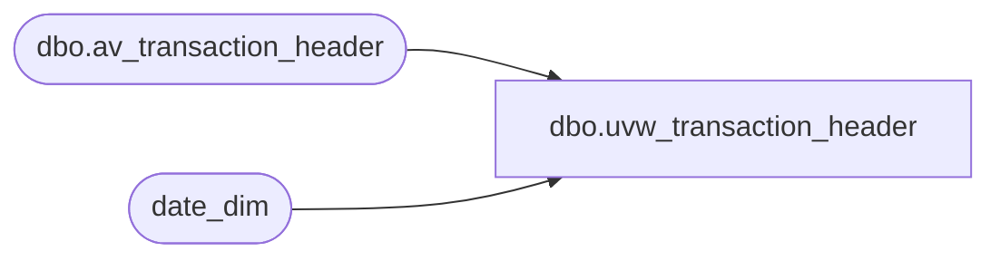

# dbo.uvw_transaction_header

**Database:** dw  
**Server:** papamart  

## Architecture Diagram



## Table Dependencies

| Referenced Table |
|---|
| dbo.av_transaction_header |
| date_dim |

## View Code

```sql
CREATE view uvw_transaction_header
as
--2002
select
	   [av_transaction_id] as transaction_id
      ,[store_no]
      ,[register_no]
      ,[transaction_date]
      ,[date_reject_id]
      ,[transaction_series]
      ,[transaction_no]
      ,[entry_date_time]
      ,[cashier_no]
      ,[transaction_category]
      ,[tender_total]
      ,[transaction_void_flag]
      ,[customer_info_exists]
      ,[exception_flag]
      ,[sa_rejection_flag]
      ,[if_rejection_flag]
      ,[deposit_declaration_flag]
      ,[closeout_flag]
      ,[media_count_flag]
      ,[customer_modified_flag]
      ,[tax_override_flag]
      ,[pos_tax_jurisdiction]
      ,[edit_progress_flag]
      ,[edit_timestamp]
      ,[employee_no]
      ,[transaction_remark]
      ,[copy_transaction_id]
      ,[last_modified_date_time]
      ,[in_use_timestamp]
      ,[updated_by_user_name]
      ,[till_no]
from AWTEST.auditworks_2002.dbo.av_transaction_header
where transaction_date	between (select min(actual_date) from date_dim
								where fiscal_year = 2002
								and fiscal_period = 7)
						and		(select max(actual_date) from date_dim
								where fiscal_year = 2002
								and fiscal_period = 12)
union all
--2003
SELECT 
	   [av_transaction_id] as transaction_id
      ,[store_no]
      ,[register_no]
      ,[transaction_date]
      ,[date_reject_id]
      ,[transaction_series]
      ,[transaction_no]
      ,[entry_date_time]
      ,[cashier_no]
      ,[transaction_category]
      ,[tender_total]
      ,[transaction_void_flag]
      ,[customer_info_exists]
      ,[exception_flag]
      ,[sa_rejection_flag]
      ,[if_rejection_flag]
      ,[deposit_declaration_flag]
      ,[closeout_flag]
      ,[media_count_flag]
      ,[customer_modified_flag]
      ,[tax_override_flag]
      ,[pos_tax_jurisdiction]
      ,[edit_progress_flag]
      ,[edit_timestamp]
      ,[employee_no]
      ,[transaction_remark]
      ,[copy_transaction_id]
      ,[last_modified_date_time]
      ,[in_use_timestamp]
      ,[updated_by_user_name]
      ,[till_no]
from AWTEST.auditworks_2003.dbo.av_transaction_header
where transaction_date	between (select min(actual_date) from date_dim
								where fiscal_year = 2003
								and fiscal_period = 1)
						and		(select max(actual_date) from date_dim
								where fiscal_year = 2003
								and fiscal_period = 12)
union all
--2004
SELECT 
	   [av_transaction_id] as transaction_id
      ,[store_no]
      ,[register_no]
      ,[transaction_date]
      ,[date_reject_id]
      ,[transaction_series]
      ,[transaction_no]
      ,[entry_date_time]
      ,[cashier_no]
      ,[transaction_category]
      ,[tender_total]
      ,[transaction_void_flag]
      ,[customer_info_exists]
      ,[exception_flag]
      ,[sa_rejection_flag]
      ,[if_rejection_flag]
      ,[deposit_declaration_flag]
      ,[closeout_flag]
      ,[media_count_flag]
      ,[customer_modified_flag]
      ,[tax_override_flag]
      ,[pos_tax_jurisdiction]
      ,[edit_progress_flag]
      ,[edit_timestamp]
      ,[employee_no]
      ,[transaction_remark]
      ,[copy_transaction_id]
      ,[last_modified_date_time]
      ,[in_use_timestamp]
      ,[updated_by_user_name]
      ,[till_no]
from AWTEST.auditworks_2004.dbo.av_transaction_header
where transaction_date	between (select min(actual_date) from date_dim
								where fiscal_year = 2004
								and fiscal_period = 1)
						and		(select max(actual_date) from date_dim
								where fiscal_year = 2004
								and fiscal_period = 12)
union all
--2005
SELECT 
	   [av_transaction_id] as transaction_id
      ,[store_no]
      ,[register_no]
      ,[transaction_date]
      ,[date_reject_id]
      ,[transaction_series]
      ,[transaction_no]
      ,[entry_date_time]
      ,[cashier_no]
      ,[transaction_category]
      ,[tender_total]
      ,[transaction_void_flag]
      ,[customer_info_exists]
      ,[exception_flag]
      ,[sa_rejection_flag]
      ,[if_rejection_flag]
      ,[deposit_declaration_flag]
      ,[closeout_flag]
      ,[media_count_flag]
      ,[customer_modified_flag]
      ,[tax_override_flag]
      ,[pos_tax_jurisdiction]
      ,[edit_progress_flag]
      ,[edit_timestamp]
      ,[employee_no]
      ,[transaction_remark]
      ,[copy_transaction_id]
      ,[last_modified_date_time]
      ,[in_use_timestamp]
      ,[updated_by_user_name]
      ,[till_no]
from AWTEST.auditworks_2005.dbo.av_transaction_header
where transaction_date	between (select min(actual_date) from date_dim
								where fiscal_year = 2005
								and fiscal_period = 1)
						and		(select max(actual_date) from date_dim
								where fiscal_year = 2005
								and fiscal_period = 12)
union all
--2006
SELECT 
	   [av_transaction_id] as transaction_id
      ,[store_no]
      ,[register_no]
      ,[transaction_date]
      ,[date_reject_id]
      ,[transaction_series]
      ,[transaction_no]
      ,[entry_date_time]
      ,[cashier_no]
      ,[transaction_category]
      ,[tender_total]
      ,[transaction_void_flag]
      ,[customer_info_exists]
      ,[exception_flag]
      ,[sa_rejection_flag]
      ,[if_rejection_flag]
      ,[deposit_declaration_flag]
      ,[closeout_flag]
      ,[media_count_flag]
      ,[customer_modified_flag]
      ,[tax_override_flag]
      ,[pos_tax_jurisdiction]
      ,[edit_progress_flag]
      ,[edit_timestamp]
      ,[employee_no]
      ,[transaction_remark]
      ,[copy_transaction_id]
      ,[last_modified_date_time]
      ,[in_use_timestamp]
      ,[updated_by_user_name]
      ,[till_no]
from AWTEST.auditworks_2006.dbo.av_transaction_header
where transaction_date	between (select min(actual_date) from date_dim
								where fiscal_year = 2006
								and fiscal_period = 1)
						and		(select max(actual_date) from date_dim
								where fiscal_year = 2006
								and fiscal_period = 12)
union all
--2007
SELECT 
	   [av_transaction_id] as transaction_id
      ,[store_no]
      ,[register_no]
      ,[transaction_date]
      ,[date_reject_id]
      ,[transaction_series]
      ,[transaction_no]
      ,[entry_date_time]
      ,[cashier_no]
      ,[transaction_category]
      ,[tender_total]
      ,[transaction_void_flag]
      ,[customer_info_exists]
      ,[exception_flag]
      ,[sa_rejection_flag]
      ,[if_rejection_flag]
      ,[deposit_declaration_flag]
      ,[closeout_flag]
      ,[media_count_flag]
      ,[customer_modified_flag]
      ,[tax_override_flag]
      ,[pos_tax_jurisdiction]
      ,[edit_progress_flag]
      ,[edit_timestamp]
      ,[employee_no]
      ,[transaction_remark]
      ,[copy_transaction_id]
      ,[last_modified_date_time]
      ,[in_use_timestamp]
      ,[updated_by_user_name]
      ,[till_no]
from AWTEST.auditworks_2007.dbo.av_transaction_header
where transaction_date	between (select min(actual_date) from date_dim
								where fiscal_year = 2007
								and fiscal_period = 1)
						and		(select max(actual_date) from date_dim
								where fiscal_year = 2007
								and fiscal_period = 12)
```

