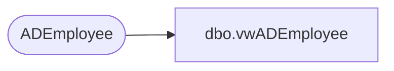

# dbo.vwADEmployee

**Database:** dw  
**Server:** papamart  

## Architecture Diagram



## Table Dependencies

| Referenced Table |
|---|
| ADEmployee |

## View Code

```sql
CREATE view [dbo].[vwADEmployee] as 

with
Start1 as
    (
        select
            EmployeeID,
            charindex('=', manager, 1) +1 as Start1
        from ADEmployee with (nolock)
        where manager<> 'no data'
    ),
Stop1 as
    (
        select
            ad.EmployeeID,
            charindex(',', ad.manager, s1.Start1) -4 as Stop1
        from ADEmployee ad with (nolock)
        join Start1 s1 on ad.EmployeeID=s1.EmployeeID
    ),
Start2 as
    (
        select
            ad.EmployeeID,
            charindex('=', ad.manager, ss1.Stop1) +1 as Start2
        from ADEmployee ad with (nolock)
        join Start1 s1 on ad.EmployeeID=s1.EmployeeID
        join Stop1 ss1 on ad.EmployeeID=ss1.EmployeeID
    ),
Stop2 as
    (
        select
            ad.EmployeeID,
            charindex(',', ad.manager, s2.Start2) -s2.Start2 as Stop2
        from ADEmployee ad with (nolock)
        join Start1 s1 on ad.EmployeeID=s1.EmployeeID
        join Stop1 ss1 on ad.EmployeeID=ss1.EmployeeID
        join Start2 s2 on ad.EmployeeID=s2.EmployeeID
    ),
Start3 as
    (
        select
            EmployeeID,
            charindex('=', memberOf, 1) +1 as Start3
        from ADEmployee with (nolock)
    ),
Stop3 as
    (
        select
            ad.EmployeeID,
            charindex(',', ad.memberOf, s3.Start3) -4 as Stop3
        from ADEmployee ad with (nolock)
        join Start3 s3 on ad.EmployeeID=s3.EmployeeID
    ),
Start4 as
    (
        select
            ad.EmployeeID,
            charindex('=', ad.memberOf, ss3.Stop3) +1 as Start4
        from ADEmployee ad with (nolock)
        join Start3 s3 on ad.EmployeeID=s3.EmployeeID
        join Stop3 ss3 on ad.EmployeeID=ss3.EmployeeID
    ),
Stop4 as
    (
        select
            ad.EmployeeID,
            charindex(',', ad.memberOf, s4.Start4) -s4.Start4 as Stop4
        from ADEmployee ad with (nolock)
        join Start3 s3 on ad.EmployeeID=s3.EmployeeID
        join Stop3 ss3 on ad.EmployeeID=ss3.EmployeeID
        join Start4 s4 on ad.EmployeeID=s4.EmployeeID
    ) ,
GroupMember as
	(
		select
    		ad.EmployeeID,
			substring(ad.memberOf, s4.Start4, ss4.Stop4) as EmployeeADGroup
		from ADEmployee ad with (nolock)
		join Start4 s4 on ad.EmployeeID=s4.EmployeeID
		join Stop4 ss4 on ad.EmployeeID=ss4.EmployeeID
		where ad.memberOf not in ( 'System.Object[]', 'no data')
	),
Manager as
	(
		select
    		ad.EmployeeID,
    		substring(ad.manager, s1.Start1, ss1.Stop1) as ManagerName,
    		ad2.EmployeeID as ManagerEmployeeID,
    		substring(ad.manager, s2.Start2, ss2.Stop2) as ManagerADGroup
		from ADEmployee ad with (nolock)
		join Start1 s1 on ad.EmployeeID=s1.EmployeeID
		join Stop1 ss1 on ad.EmployeeID=ss1.EmployeeID
		join Start2 s2 on ad.EmployeeID=s2.EmployeeID
		join Stop2 ss2 on ad.EmployeeID=ss2.EmployeeID
		left join ADEmployee ad2 on substring(ad.manager, s1.Start1, ss1.Stop1)=ad2.DisplayName
)
select 
	e.EmployeeID,
	e.sAMAccountName,
	e.mail,
	e.Department,
	e.Description,
	e.givenName,
	e.sn,
	e.cn,
	e.displayName,
	e.company,
	e.title,
	m.ManagerEmployeeID,
	m.ManagerADGroup,
	gm.EmployeeADGroup
from ADEmployee e with (nolock)
left join GroupMember gm on e.EmployeeID=gm.EmployeeID
left join Manager m on e.EmployeeID=m.EmployeeID
```

