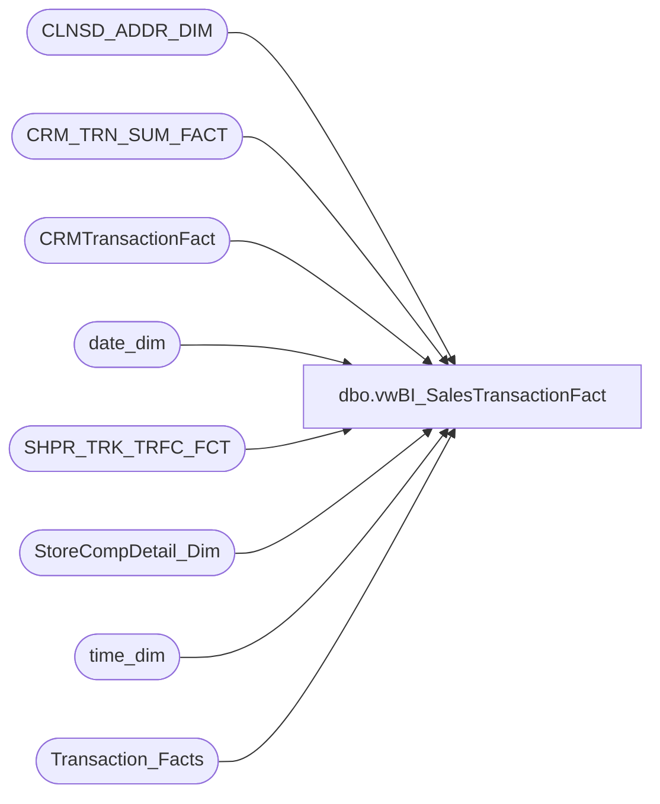

# dbo.vwBI_SalesTransactionFact

**Database:** dw  
**Server:** papamart  

## Architecture Diagram



## Table Dependencies

| Referenced Table |
|---|
| CLNSD_ADDR_DIM |
| CRM_TRN_SUM_FACT |
| CRMTransactionFact |
| date_dim |
| SHPR_TRK_TRFC_FCT |
| StoreCompDetail_Dim |
| time_dim |
| Transaction_Facts |

## View Code

```sql
CREATE VIEW vwBI_SalesTransactionFact

AS
-- =============================================================================================================
-- Name: vwBI_SalesTransactionFact
--	
--	2018-03-15	-	Dan Tweedie	-	Created view for tabular model, (nearly) identical to vwDW_Transactions_Cube_V3.
-- =============================================================================================================


WITH hasTraf as
	(
		select 
			STR_KEY AS store_key,
			DT_KEY AS date_key,
			case when sum(EXITS) = 0 
					then 0
				else 1
			end as hasTraffic
		FROM
			SHPR_TRK_TRFC_FCT STTF WITH (NOLOCK)
		group by 
			STR_KEY,
			DT_KEY
	)
SELECT
	transaction_id,
	tf.store_key,
	cast(dd.actual_date as date) as TransactionDate,
	tf.TIME_KEY,
	transaction_type_key,
	currency_key,
	Party_Flag,
	GAAP_transaction_flag,
	CAST(ISNULL(cmp.isCompTY, 0) AS integer) AS isComp,
	CAST(ISNULL(cmp.isCompNY, 0) AS integer) AS isCompNextYear,
	line_count,
	unit_net_amount,
	unit_gross_amount,
	unit_discount_amount,
	animal_UGA,
	animal_units,
	non_animal_UGA,
	non_animal_units,
	Footwear_UGA,
	footwear_units,
	accessories_UGA,
	accessories_units,
	sounds_UGA,
	sounds_units,
	Scents_UGA,
	Scents_units,
	Clothing_UGA,
	clothing_units,
	Other_UGA,
	other_units,
	GAAP_sales_amount,
	net_sales_amount,
	giftcard_discount_amount,
	giftcard_UGA,
	Merchandise_UGA,
	merchandise_units,
	Donations_UGA,
	donations_units,
	stuffing_supplies_UGA,
	Shipping_UGA,
	shipping_units,
	Other_Fees_UGA,
	other_fees_units,
	Cub_Cash_UGA,
	Party_Deposit_UGA,
	party_deposit_units,
	reward_certificate_amount * -1 as reward_certificate_amount,
	buy_stuff_amount,
	tax_amount,
	redemption_amount,
	coupon_discount_amount * -1 AS coupon_discount_amount,
	total_discount_amount * -1 AS total_discount_amount,
	sports_UGA,
	sports_units,
	Prestuffed_UGA,
	prestuffed_units,
	--ctsf.SFS_TRN_TYP_CD,
	cast(case 
		when v.CRMTransactionType = 'NEW' then 1
		when v.CRMTransactionType = 'Repeat' then 2
		when v.CRMTransactionType is NULL then 0
		else 0
	end as int) as SFS_TRN_TYP_CD,
	ctsf.MNTH_01_12_VST_CNT,
	ctsf.MNTH_01_24_VST_CNT,
	ctsf.MNTH_01_36_VST_CNT,
	1 AS calc,
	CASE
		WHEN tf.sounds_units > 0 THEN 1
		ELSE 0
	END AS isSoundTrans,
	tf.giftcard_units,
	CAST(0 AS decimal(10, 2)) AS giftcards_redeemed,
	CAST(0 AS decimal(15, 8)) AS franchisee_exchange_rate,
	CAST(0 AS decimal(15, 8)) AS franchisee_withholding_tax_rate,
	CAST(0 AS decimal(10, 2)) AS returns_UGA,
	CAST(CASE
		WHEN cmp.isShopperTrak IS NULL THEN 0
		WHEN cmp.isShopperTrak = 1 
		--AND td.hour BETWEEN cmp.ShopperTrakStartHour AND cmp.ShopperTrakEndHour 
			THEN 1
		ELSE 0
	END AS smallint) AS isShopperTrak,
	CAST(CASE
		WHEN tf.unit_discount_amount <> 0 THEN tf.GAAP_transaction_flag
		ELSE 0
	END AS smallint) AS numGAAPTransWithDiscount,
	CAST(CASE
		WHEN cmp.isShopperTrakCompTY IS NULL THEN 0
		WHEN cmp.isShopperTrakCompTY = 1 
		--AND td.hour BETWEEN cmp.ShopperTrakStartHour AND cmp.ShopperTrakEndHour 
			THEN 1
		ELSE 0
	END AS integer) AS isSTComp,
	CAST(CASE
		WHEN cmp.isShopperTrakCompNY IS NULL THEN 0
		WHEN cmp.isShopperTrakCompNY = 1 
		--AND td.hour BETWEEN cmp.ShopperTrakStartHour AND cmp.ShopperTrakEndHour 
			THEN 1
		ELSE 0
	END AS integer) AS isSTCompNextYear,
	CAST(ISNULL(cmp.isSOTF, 0) AS integer) AS isSOTF,
	tf.fin_GAAP_sales_amount AS Financial_GAAP_Sales_Amount,
	tf.Upsell_Discount_Amount * -1 AS Upsell_Discount_Amount,
	tf.merchandise_cost as Merchandise_Cost,
	tf.animal_cost as Animal_Cost,
	tf.non_animal_cost as Non_Animal_Cost,
	tf.footwear_cost as Footwear_Cost,
	tf.accessories_cost AS Accessories_Cost,
	tf.sounds_cost AS Sounds_Cost,
	tf.Scents_cost AS Scents_Cost,
	tf.clothing_cost as Clothing_Cost,
	tf.other_cost as Other_Cost,
	tf.sports_cost as Sports_Cost,
	tf.prestuffed_cost as Prestuffed_Cost,
	Store_transaction_flag,
	Store_Sales_Amount,
	Store_units,
	CAST(CASE
		WHEN tf.unit_discount_amount <> 0 THEN tf.Store_transaction_flag
		ELSE 0
	END AS smallint) AS numStoreTransWithDiscount,
	tf.fin_Store_sales_amount as Financial_Store_Sales_Amount,
	isnull(ht.hasTraffic, 0) as hasTraffic,
	
	tf.Enterprise_Selling_Amount,

	CAST(CASE
		WHEN
			tf.Enterprise_selling_units <> 0
				then 1
				else 0
		end as smallint) as Enterprise_Selling_Transaction_Count,
	
	tf.Enterprise_Selling_Units,
	tf.Gaap_Units,
	
	tf.Enterprise_Selling_only_flag as Enterprise_Selling_Only_Transaction_Count,

	CASE
		WHEN tf.enterprise_selling_only_flag = 1
			then tf.Enterprise_selling_amount
			else 0
		end as Enterprise_Selling_Only_Amount,
		
	CAST(CASE
		WHEN tf.enterprise_selling_only_flag = 1
			then tf.Enterprise_selling_units
			else 0
		end as smallint) as Enterprise_Selling_Only_Units,
	isnull(tf.giftcard_only_flag, 0) as GiftCard_Only_Flag,
	case when isnull(tf.giftcard_only_flag, 0) = 1 or tf.Store_transaction_flag =1 
		then 1
		else 0
	end as [TransactionEligibleForLoyaltyCapture],
	ISNULL(tf.party_master,0) as party_master,
	Case ISNULL(Mail_stat_cd,'None') when 'OPT-IN' then 1 else 0 end as DM_Transactions

FROM
	Transaction_Facts tf WITH (NOLOCK)
	LEFT JOIN CRM_TRN_SUM_FACT ctsf WITH (NOLOCK)
		ON ctsf.TDF_TRN_ID = tf.transaction_id
	LEFT JOIN StoreCompDetail_Dim cmp WITH (NOLOCK)
		ON cmp.store_key = tf.store_key
		AND cmp.date_key = tf.date_key
	INNER JOIN time_dim td WITH (NOLOCK)
		ON tf.TIME_KEY = td.TIME_KEY
	LEFT OUTER JOIN hasTraf ht 
		ON tf.store_key = ht.store_key
		AND tf.date_key = ht.date_key
	LEFT JOIN CRMTransactionFact v with (nolock) on tf.transaction_id = v.TransactionID
	LEFT JOIN CLNSD_ADDR_DIM CAD with (nolock) on ctsf.clnsd_addr_id = cad.clnsd_addr_ID
	join date_dim dd on tf.date_key = dd.date_key

	where dd.fiscal_year in (2017,2018)
```

