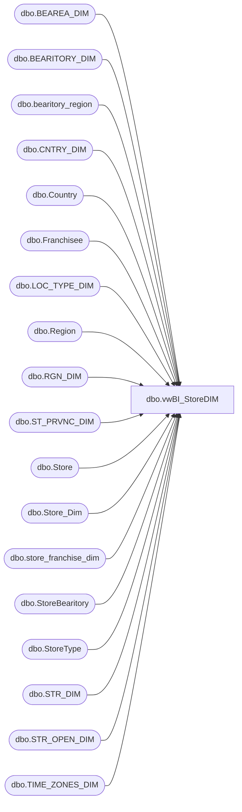

# dbo.vwBI_StoreDIM

**Database:** dw  
**Server:** papamart  

## Architecture Diagram



## Table Dependencies

| Referenced Table |
|---|
| dbo.BEAREA_DIM |
| dbo.BEARITORY_DIM |
| dbo.bearitory_region |
| dbo.CNTRY_DIM |
| dbo.Country |
| dbo.Franchisee |
| dbo.LOC_TYPE_DIM |
| dbo.Region |
| dbo.RGN_DIM |
| dbo.ST_PRVNC_DIM |
| dbo.Store |
| dbo.Store_Dim |
| dbo.store_franchise_dim |
| dbo.StoreBearitory |
| dbo.StoreType |
| dbo.STR_DIM |
| dbo.STR_OPEN_DIM |
| dbo.TIME_ZONES_DIM |

## View Code

```sql
create view vwBI_StoreDIM

as 

WITH PermCloseStores (StoreKey) AS (
	SELECT	DISTINCT STR_KEY
	FROM	KODIAK.BABWMstrData.dbo.STR_OPEN_DIM
	WHERE	PERM_CLOSE=1
	)
SELECT	 CAST(dsd.store_id AS VARCHAR) AS StoreID
		,right(('0000' + CAST(sd.STR_NUM AS VARCHAR)), 4) AS StoreNumber
		,CAST(dsd.Store_Key AS VARCHAR) AS StoreKey
		,CASE WHEN pc.StoreKey IS NOT NULL THEN 1 ELSE 0 END AS PermCloseStatus
		,sd.NM_ABBRV AS StoreNameAbbr
		,sd.NM_FULL AS StoreNameFull
		,sd.PHN_NBR AS StorePhoneNumber
		,sd.FAX_NBR AS StoreFaxNumber
		,sd.EMAIL AS StoreEmail
		,td.DESCR AS TimeZoneDesc
		,spd.NM_ABBRV AS StateProvinceNameAbbr
		,spd.NM_FULL AS StateProvinceNameFull
		,sd.LCTR AS StoreLocator
		,sd.MALL_WEBSITE_URL AS StoreMallWebsiteURL
		,sd.LONGITUDE AS StoreLongitude
		,sd.LATITUDE AS StoreLatitude
		,sd.LGL_DESC AS StoreLegalDescription
		,'Direct' AS Channel
		,CASE WHEN cd.NM_ABBRV IN ('US','CA') THEN 'North America'
	          WHEN cd.NM_ABBRV IN ('UK','DK','IE','CN') THEN 'Europe'
		 END AS [TradingGroup]
		,cd.NM_ABBRV AS CountryNameAbbr
		,cd.NM_FULL AS CountryNameFull
		,CASE WHEN sd.STR_NUM IN (013, 2013) THEN 'Web'
		      ELSE 'Retail'
		 END AS [SubChannel]
		,ISNULL(rd.NM,'No Zone') AS Zone
		,ISNULL(bd.NM, 'No Area') AS Area
		,ISNULL(btd.NM, 'No District') AS District
FROM KODIAK.BABWMstrData.dbo.STR_DIM sd
INNER JOIN PAPAMART.dw.dbo.Store_Dim dsd
	ON dsd.store_id=sd.STR_NUM
LEFT OUTER JOIN KODIAK.BABWMstrData.dbo.LOC_TYPE_DIM ld
	ON ld.LOC_TYPE_KEY=sd.LOC_TYPE_KEY
LEFT OUTER JOIN KODIAK.BABWMstrData.dbo.RGN_DIM rd
	ON rd.RGN_ID=sd.RGN_ID
LEFT OUTER JOIN KODIAK.BABWMstrData.dbo.BEAREA_DIM bd
	ON bd.BEAREA_ID=sd.BEAREA_ID
LEFT OUTER JOIN KODIAK.BABWMstrData.dbo.BEARITORY_DIM btd
	ON btd.BEARITORY_ID=sd.BEARITORY_ID
LEFT OUTER JOIN KODIAK.BABWMstrData.dbo.TIME_ZONES_DIM td
	ON td.TM_ZN_ID=sd.TM_ZN_ID
LEFT OUTER JOIN KODIAK.BABWMstrData.dbo.CNTRY_DIM cd
	ON cd.CNTRY_ID=sd.CNTRY_ID
LEFT OUTER JOIN KODIAK.BABWMstrData.dbo.ST_PRVNC_DIM spd
	ON spd.ST_PRVNC_ID=sd.ST_PRVNC_ID
LEFT OUTER JOIN PermCloseStores pc
	ON pc.StoreKey=sd.STR_ID
WHERE sd.CMPNY_ID=1 AND sd.STR_ID > 0
AND (dsd.closing_date>=DATEADD(day, -7, DATEADD(year, -2, DATEADD(yy, DATEDIFF(yy, 0, GETDATE()), 0)))
	OR dsd.closing_date IS NULL)
AND sd.STR_NUM not between 501 and 599 -- Labs
AND sd.STR_NUM NOT BETWEEN 9001 AND 9100 -- Test Stores
AND sd.STR_NUM NOT IN (473) 

-- Corporate Sales
UNION ALL
SELECT	CAST(store_id AS VARCHAR), right(('0000' + CAST(store_id AS VARCHAR)), 4), store_key, 0, store_name_abbrv, store_name, phone, fax, email, NULL, state_province, state_province_name, NULL, NULL, latitude, longitude,
		NULL, 'Indirect', 'North America', country, country_name, 'Corporate Sales', 'No Zone', 'No Area', 'No District'
FROM PAPAMART.dw.dbo.store_dim
WHERE store_id=470

UNION ALL
-- Franchise Stores
SELECT
	 s.Code
	,s.Code
	,sfd.store_key
	,0
	,s.store_name
	,s.store_name
	,NULL--StorePhoneNumber
	,NULL--StoreFaxNumber
	,NULL--StoreEmail
	,NULL--TimeZoneDesc
	,NULL--StateProvinceNameAbbr
	,NULL--StateProvinceNameFull
	,NULL--StoreLocator
	,NULL--StoreMallWebsiteURL
	,NULL--StoreLongitude
	,NULL--StoreLatitude
	,NULL--StoreLegalDescription
	,'Indirect' AS [Channel]
	,'Franchise - ' + f.Name AS [TradingGroup]
	,c.CountryName AS [CountryNameAbbr]
	,c.FullName As [CountryNameFull]
	,CASE WHEN st.descrip='Store' THEN c.CountryName + ' Retail'
		  WHEN st.descrip='Web' THEN c.CountryName + ' Web'
	 END AS [SubChannel]
	,ISNULL(r.name, 'No Zone')
	,ISNULL(NULL,'No Area')					
	,ISNULL(br.name, 'No District')
FROM KODIAK.FranchMstrData.dbo.Store s
INNER JOIN dw.dbo.store_franchise_dim sfd
	ON sfd.store_id=s.Code
LEFT OUTER JOIN KODIAK.FranchMstrData.dbo.Country c
	ON c.CountryID=s.CountryID
LEFT OUTER JOIN KODIAK.FranchMstrData.dbo.StoreBearitory sb
	ON sb.storeID=s.storeID
	AND GETDATE() BETWEEN sb.startDate and sb.endDate
LEFT OUTER JOIN KODIAK.FranchMstrData.dbo.bearitory_region br
	ON br.bearitoryID=sb.bearitoryID
LEFT OUTER JOIN KODIAK.FranchMstrData.dbo.Region r
	ON r.regionID=br.regionID
LEFT OUTER JOIN KODIAK.FranchMstrData.dbo.StoreType st
	ON st.storeTypeID =s.storeTypeID
LEFT OUTER JOIN KODIAK.FranchMstrData.dbo.Franchisee f
	ON f.franchID=s.franchID
WHERE st.descrip IN ('Store', 'Web', 'Other')
AND s.closeDate>=DATEADD(day, -7, DATEADD(year, -2, DATEADD(yy, DATEDIFF(yy, 0, GETDATE()), 0)))
AND LEFT(s.Code,2) NOT IN ('JP','BZ','SW','NO','KR','RU','NL','DK')
```

