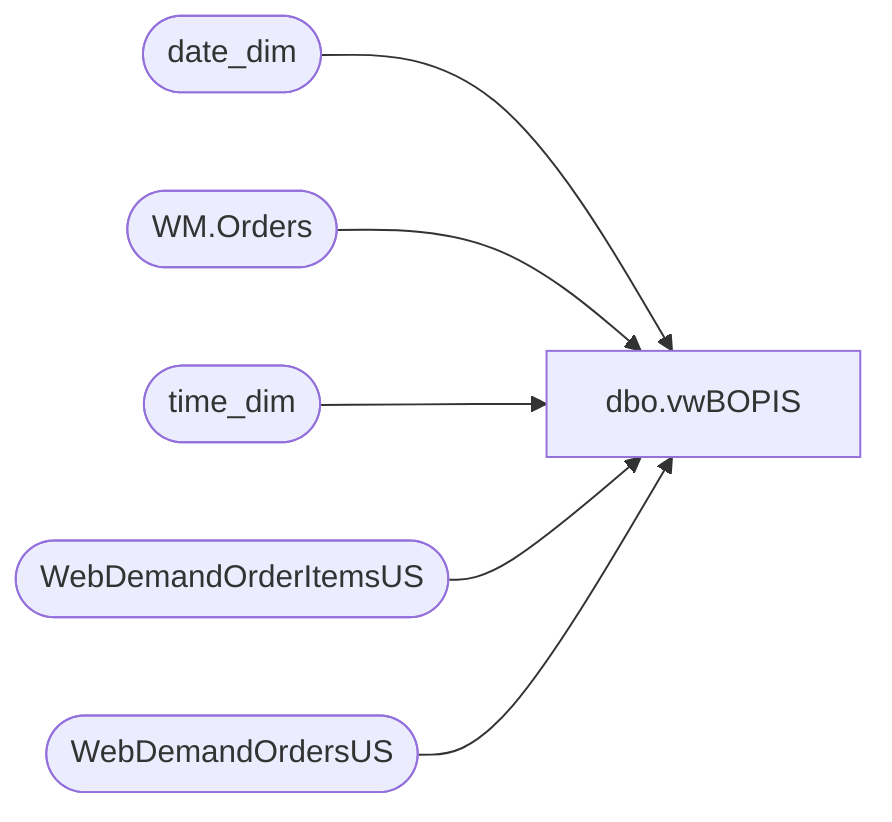

# dbo.vwBOPIS

**Database:** dw  
**Server:** papamart  

## Architecture Diagram



## Table Dependencies

| Referenced Table |
|---|
| date_dim |
| WM.Orders |
| time_dim |
| WebDemandOrderItemsUS |
| WebDemandOrdersUS |

## View Code

```sql
create view vwBOPIS

as


with 
MaxItemDate as
	(
		select 
			OrderNumber,
			max(LastUpdateDateUTC) LastUpdateDate
		from WebDemandOrderItemsUS
		group by 
			OrderNumber
	),
OrderItemCount as
	(
		select
			o.OrderNumber,
			sum(cast(o.Quantity as int)) ItemCount
		from WebDemandOrderItemsUS o
		join MaxItemDate m 
			on o.OrderNumber=m.OrderNumber
			and o.LastUpdateDateUTC=m.LastUpdateDate
		group by o.OrderNumber
	),
MaxUpdate as
	(
		select 
			OrderNumber,
			max(LastUpdateDateUTC) LastUpdateDate
		from WebDemandOrdersUS
		group by 
			OrderNumber
	)
select 
	cast(wo.PickUpStore as int) as StoreNumber,
	case 
		when cast(wo.PickUpStore as int) < 2000 
			then 1000 + cast(wo.PickUpStore as int)
		else cast(wo.PickUpStore as int)
	end StoreCode,
	cast(m.LastUpdateDate as date) as ShipDate,
	right((cast('00' as varchar) + cast(td.hour as varchar)),2)
		+ ':' + case when td.Minute < 30 then '00' else '30' end as Slot,
	case 
		when o.ShippingMethod in ('Curbside Pickup')
			then count(distinct o.OrderNumber) 
		else 0
	end as CurbsideTransactions,
	case 
		when o.ShippingMethod in ('Curbside Pickup')
			then sum(o.SubTotal)
		else 0
	end as CurbsideSales,
	case 
		when o.ShippingMethod in ('Curbside Pickup')
			then sum(oi.ItemCount)
		else 0
	end as CurbsideUnits,
	
	case 
		when o.ShippingMethod in ('In Store Pickup')
			then count(distinct o.OrderNumber) 
		else 0
	end as PickupFromStoreTransactions,
	case 
		when o.ShippingMethod in ('In Store Pickup')
			then sum(o.SubTotal)
		else 0
	end as PickupFromStoreSales,
	case 
		when o.ShippingMethod in ('In Store Pickup')
			then sum(oi.ItemCount)
		else 0
	end as PickupFromStoreUnits
	
from WebDemandOrdersUS o 
join OrderItemCount oi on o.OrderNumber=oi.OrderNumber
join MaxUpdate m 
	on o.OrderNumber=m.OrderNumber
	and o.LastUpdateDateUTC=m.LastUpdateDate
join date_dim dd with (nolock) on cast(m.LastUpdateDate as date)=cast(dd.actual_date as date)
join time_dim td with (nolock) 
	on datepart(hh, m.LastUpdateDate)=td.hour
	and datepart(mi, m.LastUpdateDate)=td.minute
join [bearcluster01.sql.buildabear.com].WebOrderProcessing.WM.Orders wo on o.OrderNumber=wo.OrderNumber
where o.OrderStatus='Completed'
and o.ShippingMethod in ('Curbside Pickup', 'In Store Pickup')
and (
		datediff(dd, m.LastUpdateDate, getdate())=0
		or (datepart(hh,getdate())<=2 and cast(m.LastUpdateDate as date)=cast(getdate()-1 as date))
	)
group by 
	wo.PickUpStore,
	
	cast(m.LastUpdateDate as date),
	right((cast('00' as varchar) + cast(td.hour as varchar)),2)
		+ ':' + case when td.Minute < 30 then '00' else '30' end,
	o.ShippingMethod
```

