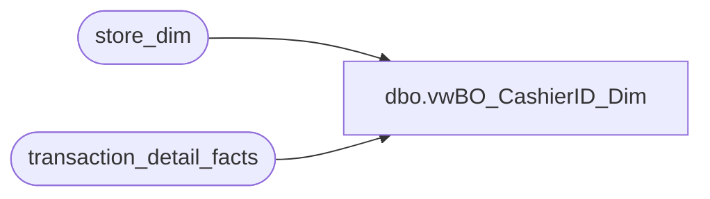

# dbo.vwBO_CashierID_Dim

**Database:** dw  
**Server:** papamart  

## Architecture Diagram



## Table Dependencies

| Referenced Table |
|---|
| store_dim |
| transaction_detail_facts |

## View Code

```sql
CREATE view [dbo].[vwBO_CashierID_Dim]
as
SELECT t.cashier_id, t.store_key, s.store_id, s.store_name, 
'Store ' + cast(s.store_id as varchar(20)) + '_CashierID ' + Cast(cashier_id as varchar(50)) as CashierIDSID
from transaction_detail_facts t with (nolock)
join store_dim s with (nolock) on 
t.store_key = s.store_key
group by t.cashier_id, t.store_key, s.store_id, s.store_name
```

