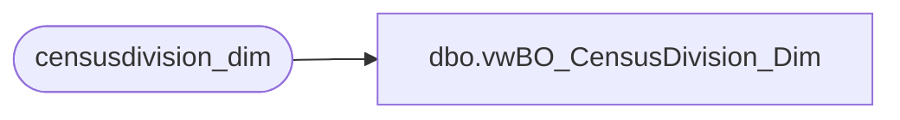

# dbo.vwBO_CensusDivision_Dim

**Database:** dw  
**Server:** papamart  

## Architecture Diagram



## Table Dependencies

| Referenced Table |
|---|
| censusdivision_dim |

## View Code

```sql
create view vwBO_CensusDivision_Dim as 
select case when region like 'CAN' then 'CA'
else 'US' end as Country,
* from censusdivision_dim
```

