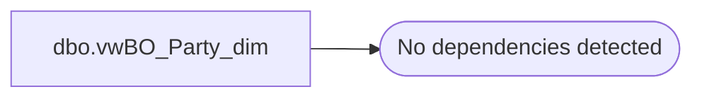

# dbo.vwBO_Party_dim

**Database:** dw  
**Server:** papamart  

## Architecture Diagram



## Table Dependencies

_No table dependencies detected._

## View Code

```sql
CREATE VIEW [dbo].[vwBO_Party_dim]
AS

	SELECT 0 AS party_key, 'Non-party' AS party_dim_description
	UNION
	SELECT 1 AS party_key, 'Party' AS party_dim_description
```

