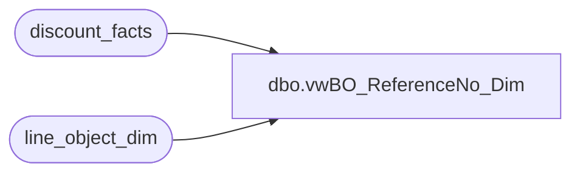

# dbo.vwBO_ReferenceNo_Dim

**Database:** dw  
**Server:** papamart  

## Architecture Diagram



## Table Dependencies

| Referenced Table |
|---|
| discount_facts |
| line_object_dim |

## View Code

```sql
CREATE view [dbo].[vwBO_ReferenceNo_Dim] as
select 'df' as source,
df.line_object_key, line_object, reference_no , sum(units) UnitsRedeemed,
count(distinct transaction_id) NoOfTransWithRefNo
from discount_facts df with (nolock) join
line_object_dim l  with (nolock) on 
df.line_object_key = l.line_object_key
--where reference_no is not null 
--	and df.line_object_key <> 0
group by df.line_object_key, reference_no,line_object
--order by line_object_key, count(distinct transaction_id) desc
union
select 'tdf' as source,
null as line_object_key, 
null as line_object, 
null as reference_no , 
null as UnitsRedeemed,
null as NoOfTransWithRefNo
union
select 'tgd' as source,
null as line_object_key, 
null as line_object, 
null as reference_no , 
null as UnitsRedeemed,
null as NoOfTransWithRefNo
```

