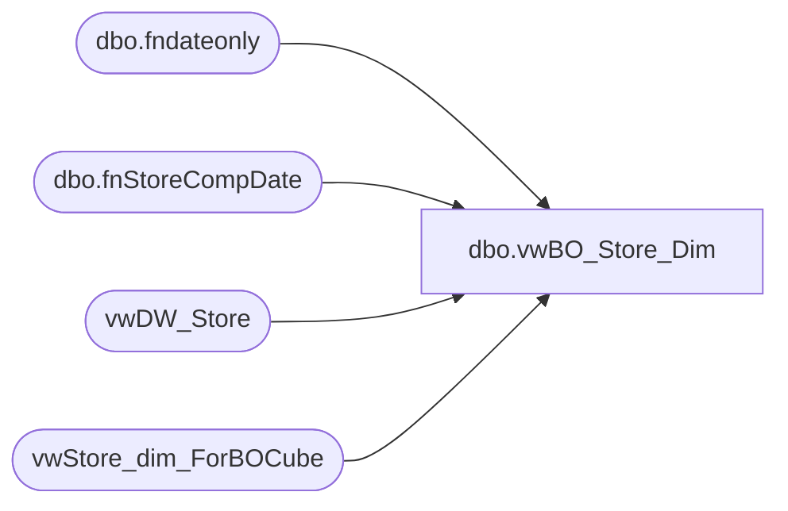

# dbo.vwBO_Store_Dim

**Database:** dw  
**Server:** papamart  

## Architecture Diagram



## Table Dependencies

| Referenced Table |
|---|
| dbo.fndateonly |
| dbo.fnStoreCompDate |
| vwDW_Store |
| vwStore_dim_ForBOCube |

## View Code

```sql
/*select top 3 * from vwStore_dim_ForBOCube
select top 3 * from vwDW_Store
*/
CREATE view [dbo].[vwBO_Store_Dim] as
/*

SELECT s.*
	,b.[dma_code]
   --   ,b.[dma_name]
      ,b.[metro_name]
	 -- ,b.[metro_code]
		,b.[metro_code]
      ,b.[cluster_name]
      ,b.[cluster_code]
   --   ,b.[state_province]
   --   ,b.[city]
   --   ,b.[country]
   --   ,b.[division]
   --   ,b.[region]
      ,b.[CensusDivision]
      ,b.[CensusRegion]
      ,b.[StoreType]
      ,b.[StoreProductType]
      ,b.[StoreSeasonality]
      ,b.[dma_key]
      ,b.[dma_display]
      ,b.[msa_key]
      ,b.[msa_display]
      ,b.[CensusDivisionKey]
      ,b.[CensusDivisionDisplay]
  FROM 
 vwStore_dim_ForBOCube b left join vwDW_Store s on
b.store_key = s.store_key
*/


SELECT b.[store_key]
	,b.[store_id]
	,b.[store_name]
	,b.[storeNameNum]
	,s.[bearea]
	,case when s.[bearritory] is null or len(s.[bearritory]) = 0 then '(blank)'
	 else s.[bearritory] end as bearritory
	,case when s.[region] is null or len(s.[region]) = 0 then '(blank)'
	 else s.[region] end as region
	--,s.[country]
	,b.[country_name]
	,s.[state_province]
	,s.[state_province_key]
	,b.[state_province_name]
	,b.[address1]
	,case when s.[city] is null or len(s.[city]) = 0 then '(blank)'
	 else s.[city] end as city
	,s.[postal_code]
	,s.[latitude]
	,s.[longitude]
	,s.[dma_name]
	,b.[opening_date]
	,dbo.fnStoreCompDate(b.opening_date) as comp_date
	, case when dbo.fnStoreCompDate(b.opening_date) <= dbo.fndateonly(getdate()) then 'Y'
	else 'N' end as comp_y_n
	,s.[opening_date_id]
	,s.[closing_date]
	,s.[comp_week_id]
	,s.[open_fp_id]
	,s.[open_week_id]
	,s.[comp_date_key]
	,s.[ReportFlag]
	,s.[ClubMaxFlag]
	,s.[BearRange]
	,s.[CompanyLevel]
	,s.[BearRangeKey]
	,s.[RegionKey]
	,s.[BearitoryKey]
	,s.[city_key]
	,s.[city_display]
	,s.[postal_code_key]
	,s.[postal_code_display]
	,b.[dma_code]
	--   ,b.[dma_name]
	,b.[metro_name]
	-- ,b.[metro_code]
	,b.[metro_code]
	,b.[cluster_name]
	,b.[cluster_code]
	--   ,b.[state_province]
	--   ,b.[city]
	,b.[country]
	--   ,b.[division]
	--   ,b.[region]
	,b.[CensusDivision]
	,b.[CensusRegion]
	,b.[StoreType]
	,b.[StoreProductType]
	,b.[StoreSeasonality]
	,b.[dma_key]
	,b.[dma_display]
	,b.[msa_key]
	,b.[msa_display]
	,b.[CensusDivisionKey]
	,b.[CensusDivisionDisplay]
	from vwStore_dim_ForBOCube b 
	left join vwDW_Store s 
		on b.store_key = s.store_key
```

