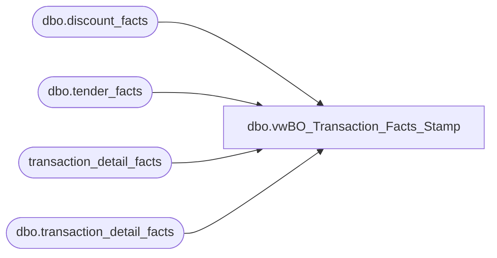

# dbo.vwBO_Transaction_Facts_Stamp

**Database:** dw  
**Server:** papamart  

## Architecture Diagram



## Table Dependencies

| Referenced Table |
|---|
| dbo.discount_facts |
| dbo.tender_facts |
| transaction_detail_facts |
| dbo.transaction_detail_facts |

## View Code

```sql
/*
select sum(transaction_count) as transaction_count, count(*) as line_count from [vwBO_Transaction_Facts_Stamp] where date_key between 4012 and 4039

SELECT top 10 null as [underlying_table_key]
      ,null as [source]
      ,[currency_key]
      ,[transaction_id]
      ,null as [product_key]
      ,[store_key]
      ,[date_key]
      ,[time_key]
      ,[register_num]
      ,[cashier_id]
      ,null as [PartyFlag]
      ,null as [party_y_n]
      ,[transaction_type_key]
      ,[transaction_no]
      ,null as [reference_no]
      ,null as [line_object_key]
      ,null as [coupon_key]
      ,0 as [unit_gross_amount]
      ,0 as [units]
      ,0 as [unit_disc_amount]
      ,null as [tender_key]
      ,0 as [tender_amount]
      ,0 as [unit_net_amount]
      ,0 as [GiftCardDiscountInc101]
      ,0 as [GiftCardDiscount]
      ,null as [line_object_ref_no]
      ,null as [reference_no_valid]
	  ,1 as transaction_count
	from transaction_detail_facts
	where date_key between 4012 and 4039
group by [currency_key]
      ,[transaction_id]
      ,[store_key]
      ,[date_key]
      ,[time_key]
      ,[register_num]
      ,[cashier_id]
      ,[transaction_type_key]
      ,[transaction_no]

select top 10 [currency_key]
      ,[transaction_id]
      ,[store_key]
      ,[date_key]
      ,[time_key]
      ,[register_num]
      ,[cashier_id]
      ,[transaction_type_key]
      ,[transaction_no]
	  , 1 as transaction_count
	from transaction_detail_facts
	where date_key between 4012 and 4039
	group by [currency_key]
      ,[transaction_id]
      ,[store_key]
      ,[date_key]
      ,[time_key]
      ,[register_num]
      ,[cashier_id]
      ,[transaction_type_key]
      ,[transaction_no]

select sum(transaction_count) from [vwBO_Transaction_Facts_Stamp]
	where date_key between 4012 and 4039
*/

-- =============================================================================================================
-- Name: [dbo].[vwBO_Transaction_Facts_Stamp]
--
-- Description: ???
--
-- Dependencies: ???
--
-- Revision History
--		Name:				Date:		Comments:
--		Rick Caminiti			10/24/2011	Changed references from tender_group_dim to tender_facts (new table)
--		Rick Caminiti			10/23/2011     Added comments block
--		???					???			original creation
-- =============================================================================================================

CREATE view
[dbo].[vwBO_Transaction_Facts_Stamp] as

SELECT null as [underlying_table_key]
      ,'header' as [source]
      ,[currency_key]
      ,[transaction_id]
      ,null as [product_key]
      ,[store_key]
      ,[date_key]
      ,[time_key]
      ,[register_num]
      ,[cashier_id]
      ,null as [PartyFlag]
      ,null as [party_y_n]
      ,[transaction_type_key]
      ,[transaction_no]
      ,null as [reference_no]
      ,null as [line_object_key]
      ,null as [coupon_key]
      ,0 as [unit_gross_amount]
      ,0 as [units]
      ,0 as [unit_disc_amount]
      ,null as [tender_key]
      ,0 as [tender_amount]
      ,0 as [unit_net_amount]
      ,0 as [GiftCardDiscountInc101]
      ,0 as [GiftCardDiscount]
      ,null as [line_object_ref_no]
      ,null as [reference_no_valid]
	  ,1 as transaction_count
	from transaction_detail_facts
	group by [currency_key]
		  ,[transaction_id]
		  ,[store_key]
		  ,[date_key]
		  ,[time_key]
		  ,[register_num]
		  ,[cashier_id]
		  ,[transaction_type_key]
		  ,[transaction_no]
union all
SELECT 	tdf.tdf_key as underlying_table_key
	  , 'tdf' as source
--	  , lc.LineCount
	  , tdf.[currency_key]
	  ,	tdf.[transaction_id]
      , tdf.[product_key]
      , tdf.[store_key]
      , tdf.[date_key]
      , tdf.[time_key]
      , tdf.register_num
      , tdf.cashier_id
	  ,	CASE tdf.party_y_n WHEN 'y' THEN 1 ELSE 0 END AS PartyFlag  
      , tdf.party_y_n
      , tdf.transaction_type_key
      , tdf.transaction_no
 --     , tdf.reference_no
      , null as reference_no
      , tdf.[line_object_key]
      , null as [coupon_key]
      , tdf.[unit_gross_amount]
      , tdf.[units]
      , tdf.[unit_disc_amount]
  	  , null as tender_key 
	  , null as tender_amount
--	Implement logic for unit_net_amount.  i.e UGA less discounts		
	
	,isnull(CASE WHEN (tdf.unit_gross_amount > 0 AND tdf.unit_disc_amount > 0) 
							    THEN tdf.unit_gross_amount - tdf.unit_disc_amount
							    WHEN (tdf.unit_gross_amount > 0 AND tdf.unit_disc_amount < 0)
							    THEN tdf.unit_gross_amount - tdf.unit_disc_amount
							    WHEN (tdf.unit_gross_amount < 0 AND tdf.unit_disc_amount > 0)
							    THEN tdf.unit_gross_amount + tdf.unit_disc_amount
							    WHEN (tdf.unit_gross_amount < 0 AND tdf.unit_disc_amount < 0)	
							    THEN tdf.unit_gross_amount + tdf.unit_disc_amount
							    WHEN (tdf.unit_gross_amount = 0 AND tdf.unit_disc_amount < 0)
							    THEN tdf.unit_gross_amount + tdf.unit_disc_amount
							    WHEN (tdf.unit_gross_amount = 0 AND tdf.unit_disc_amount > 0)
							    THEN tdf.unit_gross_amount - tdf.unit_disc_amount
								WHEN (tdf.unit_disc_amount = 0)
							    THEN tdf.unit_gross_amount 
								ELSE tdf.unit_gross_amount
				END,0) as [unit_net_amount]
/*
	Implement current logic for Gift Card Discounts that include heart donation line_object 101 (key 490)
	(line_object_keys represent the following line_objects - 101,294,400,401,402,403,404,410)
*/				
	, isnull(CASE WHEN tdf.unit_gross_amount >= 0 AND 
				tdf.line_object_key IN (490,16,18,19,20,21,22,227) 
				THEN (tdf.unit_disc_amount*-1)
				WHEN tdf.unit_gross_amount < 0  AND 
				tdf.line_object_key IN (490,16,18,19,20,21,22,227)
				THEN tdf.unit_disc_amount END ,0) as [GiftCardDiscountInc101]
/*
	Implement new logic for Gift Card Discounts that excludes heart donation line_object 101 (key 490)
	(line_object_keys represent the following line_objects - 294,400,401,402,403,404,410)
*/			

	, isnull(CASE WHEN tdf.unit_gross_amount >= 0 AND 
				tdf.line_object_key IN (16,18,19,20,21,22,227) 
				THEN (tdf.unit_disc_amount*-1)
				WHEN tdf.unit_gross_amount < 0  AND 
				tdf.line_object_key IN (16,18,19,20,21,22,227)
				THEN tdf.unit_disc_amount END ,0) as [GiftCardDiscount]
	 , null as line_object_ref_no
	 , null as reference_no_valid
	 , 0 as transaction_count
      FROM dw.dbo.[transaction_detail_facts] tdf WITH (NOLOCK) 

UNION ALL
SELECT  df.uid as underlying_table_key
	  , 'df' as source
--	  , null as LineCount
	  , tdf.[currency_key]
	  ,	df.[transaction_id]
      , null as [product_key]
      , df.[store_key]
      , df.[date_key]
      , tdf.[time_key]
      , tdf.register_num
      , tdf.cashier_id
	  ,	CASE tdf.party_y_n WHEN 'y' THEN 1 ELSE 0 END AS PartyFlag  
      , tdf.party_y_n
      , tdf.transaction_type_key
      , tdf.transaction_no
      , df.reference_no
      , df.[line_object_key]
      , df.[coupon_key]
      , df.[unit_gross_amount]
      , df.[units]
      , null as [unit_disc_amount]
  	  , null as tender_key 
	  , null as tender_amount
	  , null as [unit_net_amount]
	  , null as [GiftCardDiscountInc101]
	  , null as [GiftCardDiscount]
	  , df.line_object_key as line_object_ref_no
	  , df.reference_no as reference_no_valid
	  , 0 as transaction_count
    from dw.dbo.[discount_facts] df WITH (NOLOCK) 

	left join (select tdf.[transaction_id]
			  , tdf.[store_key]
			  , tdf.[date_key]
			  , tdf.[currency_key]
			  , tdf.[time_key]
			  , tdf.register_num
			  , tdf.cashier_id
			  ,	CASE tdf.party_y_n WHEN 'y' THEN 1 ELSE 0 END AS PartyFlag  
			  , tdf.party_y_n
			  , tdf.transaction_type_key
			  , tdf.transaction_no
			from dw.dbo.transaction_detail_facts tdf with (nolock)
			group by tdf.[transaction_id]
			  , tdf.[store_key]
			  , tdf.[date_key]
			  , tdf.[currency_key]
			  , tdf.[time_key]
			  , tdf.register_num
			  , tdf.cashier_id
			  , tdf.party_y_n
			  , tdf.transaction_type_key
			  , tdf.transaction_no) tdf
	on		 df.transaction_id = tdf.transaction_id and
		 df.store_key = tdf.store_key and 
		 df.date_key = tdf.date_key

--		left join
--		 dw.dbo.[transaction_detail_facts] tdf WITH (NOLOCK) on 
--		 df.transaction_id = tdf.transaction_id and
--		 df.store_key = tdf.store_key and 
--		 df.date_key = tdf.date_key


    --where df.date_key between 4012 and 4018

UNION ALL
SELECT   tf.[tender_facts_key] as underlying_table_key
	   ,'tf' as source
--	   ,null as LineCount
	   ,tdf.[currency_key]
	   ,tdf.[transaction_id]
	   ,null as [product_key]
	   ,tdf.[store_key]
	   ,tdf.[date_key]
	   ,tdf.[time_key]
	   ,tdf.register_num
	   ,tdf.cashier_id
	   ,CASE tdf.party_y_n WHEN 'y' THEN 1 ELSE 0 END AS PartyFlag  
	   ,tdf.party_y_n
	   ,tdf.transaction_type_key
	   ,tdf.transaction_no
	   ,null as reference_no
	   ,null as [line_object_key]
	   ,null as [coupon_key]
--	   ,tf.tender_amt
	   ,null as [unit_gross_amount] 
	   ,null as [units]
	   ,null as [unit_disc_amount]
  	   ,tf.tender_key 
	   ,tf.tender_amt  as tender_amount
	   ,null as [unit_net_amount]
	   ,null as [GiftCardDiscountInc101]
	   ,null as [GiftCardDiscount]
	   ,null as line_object_ref_no
	   ,null as reference_no_valid
	   ,0 as transaction_count
    from dw.dbo.tender_facts tf with (nolock)
	--left join			--sfm: left join
	--dw.dbo.transaction_detail_facts tdf on 
	--tgd.tender_group_key = tdf.tender_group_key 

	inner join (
	   select   tdf.[currency_key]
			 ,tdf.[transaction_id]
			 ,tdf.[store_key]
			 ,tdf.[date_key]
			 ,tdf.[time_key]
			 ,tdf.register_num
	   		 ,tdf.cashier_id
			 ,CASE tdf.party_y_n 
				WHEN 'y' THEN 
				    1 
				ELSE 
				    0 
			  END AS PartyFlag  
			 ,tdf.party_y_n
			 ,tdf.transaction_type_key
			 ,tdf.transaction_no
	     from dw.dbo.transaction_detail_facts tdf  with (nolock)
	    group by    tdf.[currency_key]
				,tdf.[transaction_id]
				,tdf.[store_key]
				,tdf.[date_key]
				,tdf.[time_key]
				,tdf.register_num
				,tdf.cashier_id
				,tdf.party_y_n
				,tdf.transaction_type_key
				,tdf.transaction_no) tdf
	on tf.transaction_id = tdf.transaction_id 

--   changed reference from tender_grou_dim to tender_facts	--sfm: comment
--	join dw.dbo.tender_dim td on						--sfm: comment
--	tgd.tender_key = td.tender_key						--sfm: comment
--	where tdf.date_key between 4012 and 4018
```

