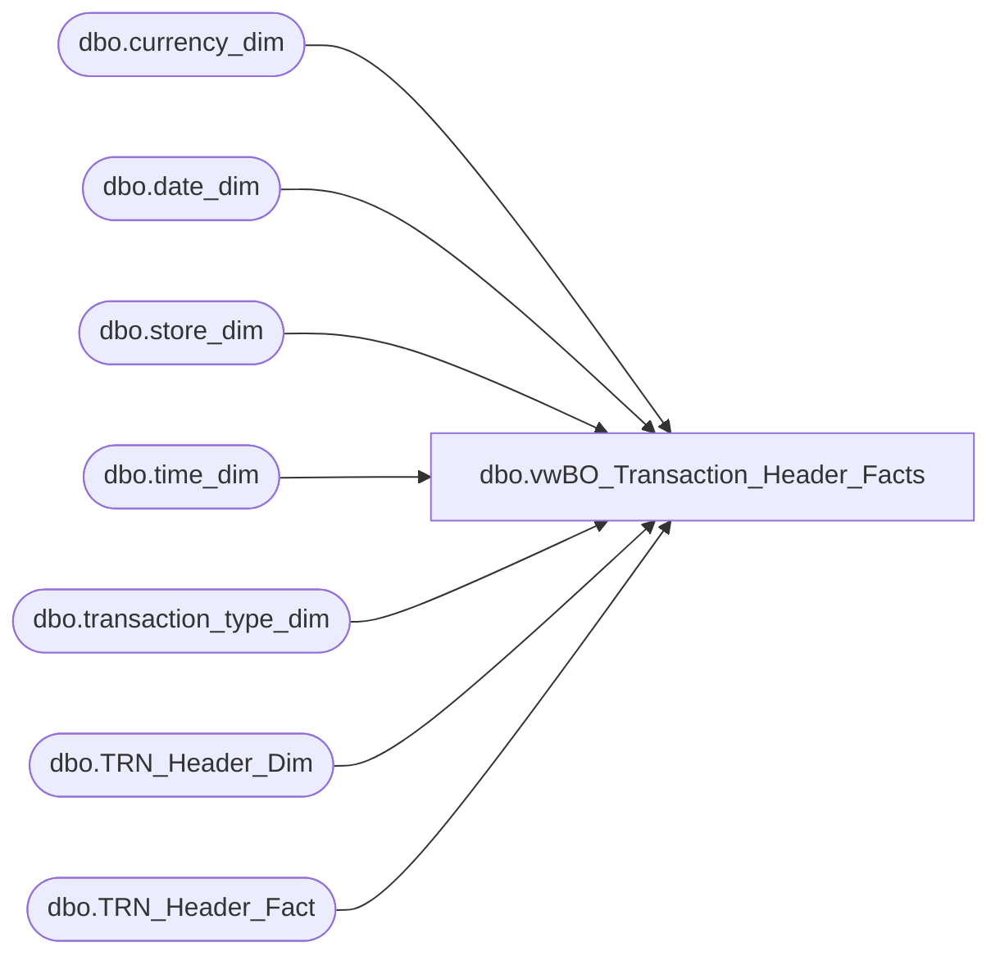

# dbo.vwBO_Transaction_Header_Facts

**Database:** dw  
**Server:** papamart  

## Architecture Diagram



## Table Dependencies

| Referenced Table |
|---|
| dbo.currency_dim |
| dbo.date_dim |
| dbo.store_dim |
| dbo.time_dim |
| dbo.transaction_type_dim |
| dbo.TRN_Header_Dim |
| dbo.TRN_Header_Fact |

## View Code

```sql
/*
select top 1 * from trn_header_fact;
select top 1 * from trn_header_dim;
select  * from time_dim order by hour,minute;
*/
--alter view [dbo].[vwRZ_Transaction_Header_Facts]

CREATE view [dbo].[vwBO_Transaction_Header_Facts]
as
SELECT
	/*Common Fields*/ 
	   thf.[TRN_Header_ID]
      ,thd.[TRN_ID]
      ,thd.[Store_Key]
      ,s.[store_id]
      ,s.[store_name]
      ,thd.[Date_Key]
      ,d.[actual_date]
      ,thf.[Time_Key]
      ,t.[daypart]
      ,t.[hour]
      ,t.[minute]
      ,thd.[TRN_NBR]
      ,thd.[Cashier_ID]
      ,thd.[Register_NBR]
      ,thf.[Currency_Key]
      ,c.[currency_code]
      ,c.[currency_desc]
      ,thf.[TRN_Type_Key]
      ,ttd.[transaction_type]
      ,thf.[Line_CNT]

	/*Flags*/ 
      ,thd.[Party_Flag]
      ,case when thd.[Party_Flag] = 1 then 'Y' else 'N' END as PartyYN
      ,thd.[Party_Flag_Comp]
      ,thd.[Party_Flag_CompLY]

      ,thd.[GAAP_TRN_Flag]
      ,thd.[GAAP_TRN_Flag_Comp]
      ,thd.[GAAP_TRN_Flag_CompLY]

      ,thd.[Is_Comp]
      ,thd.[Is_CompLY]

      ,thd.[Donation_Only]
      ,thd.[Party_Deposit_Only]
      ,thd.[Gift_Card_Only]

      ,thd.[Gift_Card_Redeemed]
      ,thd.[Gift_Card_Sold]
      ,thd.[TRN_Return]


	/*Sum Totals*/ 
      ,thf.[Unit_Gross_AMT]
      ,thf.[Donations_UGA]
      ,thf.[Unit_Gross_AMT] - thf.[Donations_UGA] as TotalUGA_X_Donations
      ,thf.[Unit]
      ,thf.[Discount_Gift_Card_Sold]

	/*Calculated Metrics*/ 

      ,thf.[Receipt_Total]
      ,thf.[Actl_Honey]
      ,thf.[Net_Sale]
      ,thf.[GAAP_Sale]
      ,thf.[GAAP_Sale_Comp]
      ,thf.[GAAP_Sales_CompLY]

/*Tenders*/ 

      ,thd.[tndr_Tax]
      ,thd.[tndr_Amex]
      ,thd.[tndr_Cash]
      ,thd.[tndr_Check]
      ,thd.[tndr_Discover]
      ,thd.[tndr_Mastercard]
      ,thd.[tndr_Visa]
      ,thd.[tndr_Party_Deposit]
      ,thd.[tndr_House]
      ,thd.[tndr_Debit_Card]
      ,thd.[tndr_ACH]
      ,thd.[tndr_BAB_Charge]
      ,thd.[tndr_JCB]
      ,thd.[tndr_UK_Credit_Card]
      ,thd.[Total_Redemption] -- ([tndr_Reward_Cert] + [tndr_Buy_Stuff] + [Gift_Card_Tender] + [tndr_Paper_Bear_Bucks])
  /*Total Redemption Breakout */
      ,thd.[tndr_Reward_Cert]
      ,thd.[tndr_Buy_Stuff]
	/*Total Gift Card Tender*/
      ,thd.[tndr_Paper_Bear_Bucks] + thd.[tndr_BABW_Gift_Card] + thd.[tndr_E_Cert] as tndr_TotalGiftCard
	/*Total Gift Card breakout */
      ,thd.[tndr_Paper_Bear_Bucks]
      ,thd.[tndr_BABW_Gift_Card] + thd.[tndr_E_Cert] as tndr_NonPaper_GiftCard
	/*Non-Paper GiftCard breakout */
      ,thd.[tndr_BABW_Gift_Card]
      ,thd.[tndr_E_Cert] 
 /*Other Tender*/
      ,thd.[tndr_Bear_Bucks_Gift_Card] + 
       thd.[tndr_MAESTR] + 
       thd.[tndr_Mall_Cert] + 
       thd.[tndr_Mall_DC] + 
       thd.[tndr_Pre_Bear_Buck_Cert] + 
       thd.[tndr_Promo_Cert] + 
       thd.[tndr_Puerto_Rico_Debit_Card] + 
       thd.[tndr_Scout_Check] + 
       thd.[tndr_Traveler_Check] + 
       thd.[tndr_US_Foreign_Currency] + 
       thd.[tndr_US_Traveler_Check] as tndr_TotalOther
	/*tndr_TotalOther breakout */
      ,thd.[tndr_Bear_Bucks_Gift_Card] as tndr_BearBucks_GiftCardCoalition
      ,thd.[tndr_MAESTR]
      ,thd.[tndr_Mall_Cert]
      ,thd.[tndr_Mall_DC]
      ,thd.[tndr_Pre_Bear_Buck_Cert]
      ,thd.[tndr_Promo_Cert]
      ,thd.[tndr_Puerto_Rico_Debit_Card]
      ,thd.[tndr_Scout_Check]
      ,thd.[tndr_Traveler_Check]
      ,thd.[tndr_US_Foreign_Currency]
      ,thd.[tndr_US_Traveler_Check]
--     ,thd.[Other]

/*Merchandise*/ 
      ,thf.[Merchandise_Unit]
      ,thf.[Merchandise_UGA]

/*Deposits*/ 
      ,thf.[Party_Deposit_UGA]


/*Discounts*/ 
      ,thf.[Gift_Card_Discount] +
       thf.[Employee_Discount] +
       thf.[Party_Discount] +
       thf.[Promotional_Discount] + 
       thf.[Coupon_Discount] as   [Total_Discount]
	/* Total_Discount breakout */
      ,thf.[Coupon_Unit]
      ,thf.[Coupon_Discount]
--     ,thf.[Other_Discount]
      ,thf.[Gift_Card_Discount] +
       thf.[Employee_Discount] +
       thf.[Party_Discount] +
       thf.[Promotional_Discount]  as Discounts_X_Coupons
	/* Discounts_X_Coupons breakout */
      ,thf.[Gift_Card_Discount]
      ,thf.[Employee_Discount]
      ,thf.[Party_Discount]
      ,thf.[Promotional_Discount]


/*Fees*/ 

      ,thf.[Shipping_UGA]
      ,thf.[Stuff_Supplies_UGA]
      ,thf.[Paid_Out]
      ,thf.[Cub_Cash_UGA]
      ,thf.[CSTMR_Service]
      ,thf.[Other_Fee_X_CSTMR_Service]

/*Gift Card UGA */ 
      ,thf.[Gift_Card_Sold_UGA]
	/*Gift Card Sold breakout*/ 
      ,thf.[Plastic_Gift_Card_Sold]
      ,thf.[Bear_Bucks_Sold]

/*Units*/ 
	/*Gift Card Units*/ 
     ,thf.[Gift_Card_Unit]
     ,thf.[Gift_Card_Redeemed_Unit]
   /**********Product Group Metrics for Strategic Planning Start *******************/
   --units for main product groups
      ,thf.[ACCSS_SP]
      ,thf.[Clothing_SP]
      ,thf.[Footwear_SP]
      ,thf.[Other_Unit_SP]
      ,thf.[Party_Skins_SP]
      ,thf.[Skins_GT20]
      ,thf.[Skins_LT15_SP]
      ,thf.[Skins_SP]
      ,thf.[Skins_BT1520_SP]
      ,thf.[Sound_SP]

/*Unit Net Amout*/ 

--unit net amount for main product groups
      ,thf.[ACCSS_NetAMT_SP]
      ,thf.[Clothing_NetAMT_SP]
      ,thf.[Footwear_NetAMT_SP]
      ,thf.[Skins_NetAMT_SP]
      ,thf.[Sound_NetAMT_SP]
      ,thf.[Other_NetAMT_SP]

 /**********Product Group Metrics for Strategic Planning End *******************/


/**********StoreOps Cube will include the following additional fields*******************

/*Common Fields*/ 
     --,thd.[TRN_Header_ID]
      --,thf.[Tender_Group_Key]
      --,thf.[TRN_Key]

/*Sum Totals*/ 
      ,thf.[Unit_Net_AMT]
      ,thf.[Unit_Discount_AMT]
      ,thf.[Unit_Gross_AMT]
      ,thf.[Unit]


/*Tender and Fees*/
      ,thf.[Buy_Stuff]
      ,thf.[Other_Fees_UGA]

/* Product Group Metrics*/
      ,thf.[Other_UGA]
      ,thf.[ACCSS_UGA]
      ,thf.[Clothing_UGA]
      ,thf.[ANML_UGA]
      ,thf.[Unstuffed_UGA]
      ,thf.[Non_ANML_UGA]
      ,thf.[Prestuffed_UGA]
      ,thf.[Footwear_UGA]
      ,thf.[Sound_UGA]
      ,thf.[Sport_UGA]
      ,thf.[Radio_CNTRL_Chassis_UGA]
      ,thf.[Rimz_UGA]
      ,thf.[ACCSS_Unit]
      ,thf.[Clothes_Unit]
      ,thf.[ANML_Unit]
      ,thf.[Unstuffed_Unit]
      ,thf.[Shoe_Unit]
      ,thf.[Sound_Unit]
      ,thf.[Prestuffed_Unit]
      ,thf.[Radio_CNTRL_Chassis_Unit]
      ,thf.[Rimz_Unit]
      ,thf.[Sport_Unit]

	/*Comp*/ 

      ,thf.[GAAP_Sale_Comp]
      ,thf.[Merchandise_Unit_Comp]
      ,thf.[ANML_UGA_Comp]
      ,thf.[ANML_Unit_Comp]
      ,thf.[Gift_Card_Sold_UGA_Comp]
      ,thf.[Gift_Card_Unit_Comp]
      ,thf.[ACCSS_UGA_Comp]
      ,thf.[ACCSS_Unit_Comp]
      ,thf.[Clothing_UGA_Comp]
      ,thf.[Clothing_Unit_Comp]
      ,thf.[Footwear_UGA_Comp]
      ,thf.[Shoe_Unit_Comp]
      ,thf.[Prestuffed_UGA_Comp]
      ,thf.[Prestuffed_Unit_Comp]
      ,thf.[Sound_UGA_Comp]
      ,thf.[Sound_Unit_Comp]
      ,thf.[Sport_UGA_Comp]
      ,thf.[Sport_Unit_Comp]
      ,thf.[Unstuffed_UGA_Comp]
      ,thf.[Unstuffed_Units_Comp]
      ,thf.[Radio_CNTRL_Chassis_Unit_Comp]
      ,thf.[Rimz_Unit_Comp]

	/*CompLY*/ 
      ,thf.[GAAP_Sales_CompLY]
      ,thf.[ANML_UGA_CompLY]
      ,thf.[ANML_Unit_CompLY]
      ,thf.[ACCSS_UGA_CompLY]
      ,thf.[ACCSS_Unit_CompLY]
      ,thf.[Sport_UGA_CompLY]
      ,thf.[Sport_Unit_CompLY]
      ,thf.[Clothes_Unit_CompLY]
      ,thf.[Clothes_UGA_CompLY]
      ,thf.[Gift_Card_Sold_UGA_CompLY]
      ,thf.[Gift_Card_Unit_CompLY]
      ,thf.[Merchandise_Unit_CompLY]
      ,thf.[Prestuffed_UGA_CompLY]
      ,thf.[Prestuffed_Units_CompLY]
      ,thf.[Footwear_UGA_CompLY]
      ,thf.[Shoe_Unit_CompLY]
      ,thf.[Shoe_UGA_CompLY]
      ,thf.[Sound_Unit_CompLY]
      ,thf.[Unstuffed_UGA_CompLY]
      ,thf.[Unstuffed_Unit_CompLY]
      ,thf.[Radio_CNTRL_Chassis_Unit_CompLY]
      ,thf.[Rimz_Unit_CompLY]
      ,thf.[Sound_UGA_CompLY]

**********Store Ops Metrics End *******************/


  FROM   [dw].[dbo].[TRN_Header_Dim] thd join 
		 [dw].[dbo].[TRN_Header_Fact] thf   on
   	     thd.[TRN_Header_ID] = thf.[TRN_Header_ID]  join
		 [dw].[dbo].[store_dim] s on 
         thd.store_key = s.[Store_Key]  join
		 [dw].[dbo].[date_dim] d on 
         thd.[Date_Key] = d.[date_key]  join
		 [dw].[dbo].[time_dim] t on 
	     thf.[Time_Key] = t.[time_key]  join
		 [dw].[dbo].[currency_dim] c on 
         thf.[Currency_Key] = c.currency_key  join
		 [dw].[dbo].[transaction_type_dim] ttd on 
		 thf.[TRN_Type_Key] = ttd.[transaction_key]
--order by thd.date_key,thf.time_key
--WHERE   (store_id not between 1500 and 1599) --BABW
--WHERE   (store_id between 1500 and 1599) --RZ

/*
select * into dbo.time_dim
from papamart.dw.dbo.time_dim
*/
```

