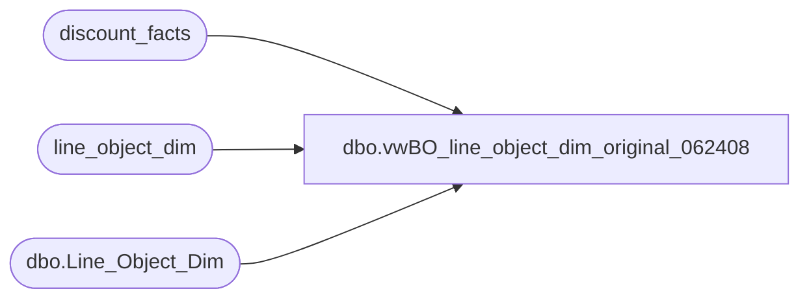

# dbo.vwBO_line_object_dim_original_062408

**Database:** dw  
**Server:** papamart  

## Architecture Diagram



## Table Dependencies

| Referenced Table |
|---|
| discount_facts |
| line_object_dim |
| dbo.Line_Object_Dim |

## View Code

```sql
CREATE view [dbo].[vwBO_line_object_dim_original_062408]
as

select lo.[Line_Object_Key]
	, lo.[Line_Object]
	, lo.[Line_Object_Type]
	, lo.[Line_Object_Description]
	, case 
		WHEN lo.line_object in (100) THEN 1 
		WHEN lo.line_object in (101,294,400,401,402,403,404,410) THEN 2
		WHEN lo.line_object in (291) THEN 3
		WHEN lo.line_object in (200,203) THEN 4
		WHEN lo.line_object in (202,204,205,206) THEN 5
		WHEN lo.line_object in (210,250) THEN 6
		WHEN lo.line_object in (640) THEN 7
		WHEN lo.line_object in (690) THEN 8
		WHEN lo.line_object in (290,295,1600,1610,1611,1615,1618,1802,1803,1806,1809) THEN 9
		--WHEN lo.line_object not in (290,295,1600,1610,1611,1615,1618,1802,1803,1806,1809) THEN 10
		WHEN d.total_discount_flag = 1 THEN 10
		else 12
	  end as metric_type_key,
	CASE 
	WHEN lo.line_object = 300 or lo.line_object between 3001 and 6999 THEN 'Deposits'
	WHEN lo.line_object in (290,295,1600,1601,1602,1603,1604,1605,1606,1607,1610,1611,1612,1613,1614,1615,1616,
	1617,1618,1620,1621,1622,1623,1625,1626,1627,1628,1629,1631,1700,1750,1800,1801,1802,1803,
	1804,1805,1806,1807,1808,1809,1810,1811,1900) THEN 'Discounts'
	WHEN lo.line_object in (101,292) THEN 'Donations'
	WHEN lo.line_object in (200,202,203,204,205,206,210,211,212,213,250,291,293,296,700,701,710,711,712,713,714) THEN 'Fees'
	WHEN lo.line_object in (294,400,401,402,403,404,405,410) THEN 'Gift Card Sold'
	WHEN lo.line_object in (100) THEN 'Merchandise'
	ELSE 'N/A' END as LineObjectTypeSummary,
	CASE 
	WHEN lo.line_object = 300 or lo.line_object between 3001 and 6999 THEN 'Party Deposit Merch'
	WHEN lo.line_object in 
	(290,295,1600,1610,1611,1615,1618,1802,1803,1806,1809) THEN 'Marketing'
	WHEN lo.line_object in (1700,1750,1900) THEN 'Employee'
	WHEN lo.line_object in (1625,1626) THEN 'Gift Card Discounts'
	WHEN lo.line_object in 
	(1602,1603,1605,1606,1613,1616,1621,1622,1623,1627,1628,1629,1631,1800,1801,1804,1807,1810,1811) 
	THEN 'Other Discounts'
	WHEN lo.line_object in (1604,1612) THEN 'Party'
	WHEN lo.line_object in (1601,1607,1614,1617,1620,1805,1808) THEN 'Promotional'
	WHEN lo.line_object in (101,292) THEN 'Donations'
	WHEN lo.line_object in (291) THEN 'Cub Cash'
	WHEN lo.line_object in (296) THEN 'Customer Service'
	WHEN lo.line_object in (700,701,710,711,712,713,714) THEN 'Paid Outs'
	WHEN lo.line_object in (200,203) THEN 'Shipping'
	WHEN lo.line_object in (210,250) THEN 'Stuffing And Supplies'
	WHEN lo.line_object in (202,204,205,206,211,212,213,293) THEN 'Other Fees'
	WHEN lo.line_object in (400,401,402) THEN 'Bear Bucks Sold'
	WHEN lo.line_object in (294,403,404,405,410) THEN 'Plastic GC Sold'
	WHEN lo.line_object in (100) THEN 'Merchandise'
	ELSE 'N/A' END as LineObjectTypeDetail
	FROM [dw].[dbo].[Line_Object_Dim] lo
	left join (select lo.[Line_Object_Key]
					, lo.line_object 
					, 1 as total_discount_flag
					from discount_facts d
					inner join line_object_dim lo
						on lo.line_object_key = d.line_object_key
					where lo.line_object not in (290,295,1600,1610,1611,1615,1618,1802,1803,1806,1809)
					group by lo.[Line_Object_Key]
						, lo.line_object) d
		on d.[Line_Object_Key] = lo.[Line_Object_Key]
	UNION ALL
	SELECT -1 as [Line_Object_Key]
	, -1 as [Line_Object]
	, -1 as [Line_Object_Type]
	, 'Tax' as [Line_Object_Description]
	, 11 as metric_type_key
	, 'N/A' as LineObjectTypeSummary
	, 'N/A' as LineObjectTypeDetail
	UNION ALL
	SELECT 0 as [Line_Object_Key]
	, 0 as [Line_Object]
	, 0 as [Line_Object_Type]
	, 'N/A' as [Line_Object_Description]
	, 12 as metric_type_key
	, 'N/A' as LineObjectTypeSummary
	, 'N/A' as LineObjectTypeDetail
```

