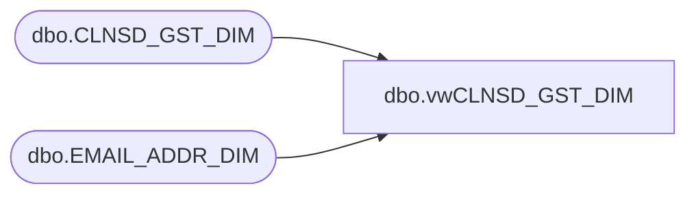

# dbo.vwCLNSD_GST_DIM

**Database:** dw  
**Server:** papamart  

## Architecture Diagram



## Table Dependencies

| Referenced Table |
|---|
| dbo.CLNSD_GST_DIM |
| dbo.EMAIL_ADDR_DIM |

## View Code

```sql
CREATE VIEW [dbo].[vwCLNSD_GST_DIM] 
AS
SELECT 
case when g.LYLTY_GST_NBR is not null then 'Y' else 'N' end as Loyalty_Member
,case when g.HOH_LYLTY_GST_NBR is not null then 'Y' else 'N' end as Loyalty_Household
      ,e.[EMAIL_ADDR_TXT]
      ,e.[OPT_IN_SRC_SYS_CD]
      ,e.[EMAIL_STAT_CD]
      ,e.[GLBL_OPT_IN_DT]
      ,e.[PERM_BOUNC_DT]
      ,e.[SRC_REC_UPDT_DT]
      ,e.[INS_DT] vwEmailAddrDimInsDt
      ,e.[UPDT_DT] vwEmailUpdtDt
      ,g.*  
FROM dbo.CLNSD_GST_DIM g  WITH (NOLOCK) 
left join  [dbo].[EMAIL_ADDR_DIM] e WITH (NOLOCK) 
ON g.[EMAIL_ADDR_ID] = e.[EMAIL_ADDR_ID]
```

