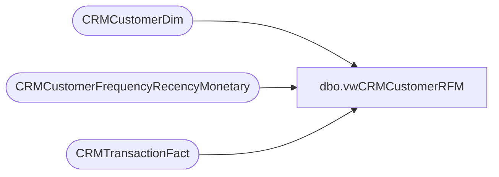

# dbo.vwCRMCustomerRFM

**Database:** dw  
**Server:** papamart  

## Architecture Diagram



## Table Dependencies

| Referenced Table |
|---|
| CRMCustomerDim |
| CRMCustomerFrequencyRecencyMonetary |
| CRMTransactionFact |

## View Code

```sql
CREATE view [dbo].[vwCRMCustomerRFM] 

as 

select 
	c.CustomerNumber,
	cast(c.MembershipDate as date) MembershipDate,
	c.Gender,
	datediff(yy, c.BirthDate, getdate()) as Age, 
	c.BirthDate,
	c.CountryCode,
	c.PointsEligible,
	c.MembershipType, 
	c.DirectMailOptIn,
	c.Emailable,
	c.HasPhoneNumber,
	ct.LifetimeTransactionCount,
	ct.LifetimeRecencyCount,	
	ct.LifetimeSalesTotal,	
	ct.FirstStoreConcept,	
	ct.FirstTransactionDate,	
	ct.Frequency3M,	
	ct.Recency3M,	
	ct.Sales3M,	
	ct.minDaysBetween3M,	
	ct.maxDaysBetween3M,	
	ct.DaysBetween3M,	
	ct.Frequency6M,	
	ct.Recency6M,	
	ct.Sales6M,	
	ct.minDaysBetween6M,	
	ct.maxDaysBetween6M,	
	ct.DaysBetween6M,	
	ct.Frequency12M,	
	ct.Recency12M,	
	ct.Sales12M,	
	ct.minDaysBetween12M,	
	ct.maxDaysBetween12M,	
	ct.DaysBetween12M,	
	ct.Frequency18M,	
	ct.Recency18M,	
	ct.Sales18M,	
	ct.minDaysBetween18M,	
	ct.maxDaysBetween18M,	
	ct.DaysBetween18M,	
	ct.Frequency24M,	
	ct.Recency24M,	
	ct.Sales24M,	
	ct.minDaysBetween24M,	
	ct.maxDaysBetween24M,	
	ct.DaysBetween24M	
from CRMCustomerDim c with (nolock)
join CRMCustomerFrequencyRecencyMonetary ct on c.CustomerNumber = ct.CustomerNumber
where exists 
	(
		select ctf.CustomerNumber 
		 from CRMTransactionFact ctf with (nolock) 
		 where c.CustomerNumber=ctf.CustomerNumber 
		 and datepart(yyyy, TransactionDate) = 2019
	 )
```

