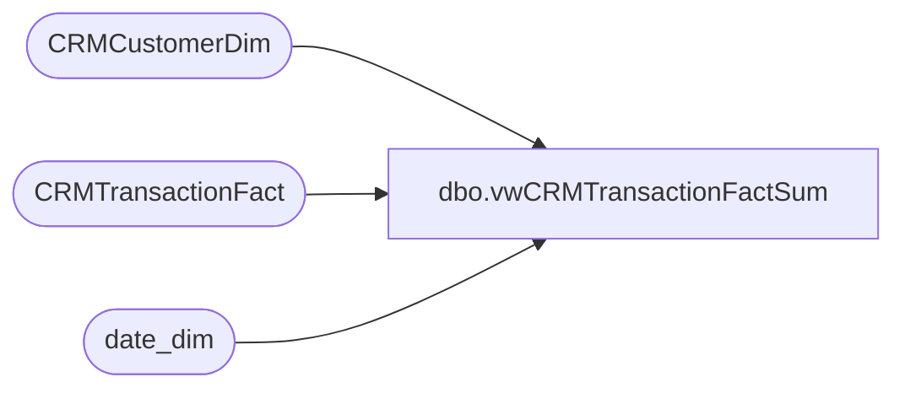

# dbo.vwCRMTransactionFactSum

**Database:** dw  
**Server:** papamart  

## Architecture Diagram



## Table Dependencies

| Referenced Table |
|---|
| CRMCustomerDim |
| CRMTransactionFact |
| date_dim |

## View Code

```sql
/***********************************************************************************************
--	vwCRMTransactionFactSum
-- Dan Tweedie	2018-10-08	-	 Created view to replace vwDW_CRM_TRN_SUM_FACT
**********************************************************************************************/


CREATE VIEW 
[dbo].[vwCRMTransactionFactSum]
AS 


select 				tran_date.actual_date transaction_date  -- to be deleted
					,g.MembershipDate as CRM_MBRSHP_DT
					,case when g.MembershipDate < '6/1/2008' then null 
					 else g.MembershipDate end as VALID_CRM_MBRSHP_DT
					,case when g.MembershipDate is null then null  
					 when g.MembershipDate < '6/1/2008' then null  
					 when g.MembershipDate > '5/31/2008'    
					 and g.MembershipDate = tran_date.actual_date then 'N' 
					 else 'R' end as SFS_GstVisitType

					,case when g.MembershipDate is null then null  
					 when g.MembershipDate < '6/1/2008' then null  
					 when g.MembershipDate > '5/31/2008'    
					 and g.MembershipDate = tran_date.actual_date then g.CustomerID --c.CLNSD_GST_ID
					 else null end as New_SFSGstID

					,case when g.MembershipDate is null then null  
					 when g.MembershipDate < '6/1/2008' then null  
					 when g.MembershipDate > '5/31/2008'    
					 and g.MembershipDate < tran_date.actual_date then g.CustomerID
					 else null end as Repeat_SFSGstID
					
					,g.SubscriberKey as EMAIL_ADDR_ID
					,isnull(g.Emailable,0) as SFSValidEmail  --  SFS_ValidEmail

					,case when isnull(g.Emailable,0) > 0 then g.CustomerID
					 else null END as SFSValidEmail_GstID  -- ValidEmail_SFSGstID  

					,case when g.MembershipDate is null then null  
					 when g.MembershipDate < '6/1/2008' then null  
					 when g.MembershipDate > '5/31/2008'    
					 and g.MembershipDate = tran_date.actual_date 
					 and isnull(g.Emailable,0) > 0 then g.CustomerID
					 else null end as NewSFSValidEmail_GstID -- ValidEmail_NewSFSGstID 

					,case when g.MembershipDate is null then null  
					 when g.MembershipDate < '6/1/2008' then null  
					 when g.MembershipDate > '5/31/2008'    
					 and g.MembershipDate < tran_date.actual_date 
					 and isnull(g.Emailable,0) > 0 then g.CustomerID
					 else null end as RepeatSFSValidEmail_GstID -- ValidEmail_RepeatSFSGstID 
, g.CustomerID, 
tran_date.date_key as dt_id, c.StoreKey as str_id, c.TransactionID as tdf_trn_id, g.CustomerID as clnsd_gst_id,
c.* 
 
 from CRMTransactionFact c with (nolock)
left join CRMCustomerDim  g  with (nolock) on 
	c.CustomerNumber = g.CustomerNumber 
left join date_dim tran_date with (nolock) on  
	cast(c.TransactionDate as date) = cast(tran_date.actual_date as date) 
left join date_dim mbrshp_date with (nolock) on  
	cast(g.MembershipDate as date) = cast(mbrshp_date.actual_date as date)
```

