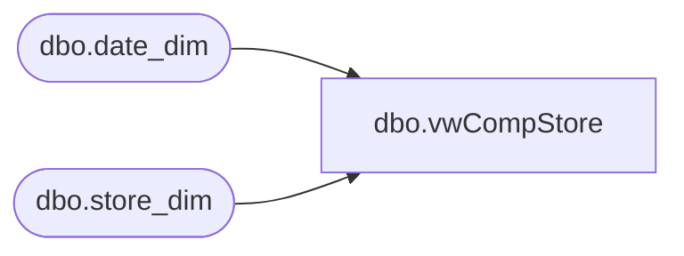

# dbo.vwCompStore

**Database:** dw  
**Server:** papamart  

## Architecture Diagram



## Table Dependencies

| Referenced Table |
|---|
| dbo.date_dim |
| dbo.store_dim |

## View Code

```sql
--ALTER     
CREATE VIEW dbo.vwCompStore
   
AS
select 	s.Store_ID,
	CASE 
	WHEN 	(d1.fiscal_year+1 < d2.fiscal_year) OR
		(d1.fiscal_year < d2.fiscal_year AND (( d1.fiscal_week < d2.fiscal_week) 
		OR (( d1.fiscal_week = d2.fiscal_week) AND (d1.day_of_week <= d2.day_of_week))))
	THEN 'y' 
	ELSE 'n'
	END as comp_y_n,
 d1.fiscal_year as openfy,
 d2.fiscal_year as actualfy,
 d1.fiscal_week as openfw,
 d2.fiscal_week as actualfw, 
 d1.day_of_week as opendw,
 d2.day_of_week as actualdw,
 s.Opening_Date,
 d2.actual_date
from dbo.store_dim s
join dbo.date_dim d1 ON s.Opening_Date = d1.actual_date
join dbo.date_dim d2 ON cast(convert(varchar(12),dateadd(d,-2,getdate()),101) as datetime) = d2.actual_date
--join dbo.date_dim d2 ON '4/24/2003' = d2.actual_date


DOMO,vwTransactionDetailFactDonations,--- 
create view DOMO.vwTransactionDetailFactDonations 

as

SELECT tdf.product_key AS ProductKey
      ,cd.currency_code AS CurrencyCode
      ,tdf.[transaction_id] AS TransactionID
      ,[transaction_line_seq] AS TransactionLineSeq
      ,[Register_Num] AS RegisterNumber	
	  ,CONVERT(DATE, dd.actual_date) AS TransactionDate  
	  ,CAST(CONVERT(VARCHAR,CONVERT(DATE,dd.actual_date)) +' ' + LEFT(CONVERT(TIME,CONVERT(VARCHAR,td.hour) + ':' + CONVERT(VARCHAR,td.minute)),5) + ':00.000' AS DATETIME) AS TransactionDateTime
      ,ds.StoreID AS StoreKey
      ,tdf.[unit_gross_amount] AS UnitGrossAmount
      ,tdf.[units] AS Units
      ,[unit_disc_amount] AS UnitDiscAmount
      ,ISNULL(tdf.[party_y_n],'N') AS PartyFlag
      ,ttd.[transaction_type] AS TransactionType
      ,lod.Line_Object_Description AS LineObject
      ,tdf.[transaction_no] AS TransactionNumber
      ,tdf.[reference_no] AS ReferenceNumber
      ,[vat_tax_amount] AS VatTaxAmount
      ,[upsell_disc_allocated] AS UpsellDiscAllocated
      ,[ext_cost] AS ExtCost 
FROM [dbo].[transaction_detail_facts] tdf 
INNER JOIN [DOMO].[vwDOMOStores] ds
	ON ds.StoreKey=CONVERT(VARCHAR, tdf.store_key) 
	LEFT OUTER JOIN [dbo].[currency_dim] cd
		ON cd.currency_key = tdf.currency_key 
	LEFT OUTER JOIN [dbo].[time_dim] td
		ON td.time_key = tdf.time_key 
	LEFT OUTER JOIN [dbo].[date_dim] dd
		ON tdf.date_key = dd.date_key 
	LEFT OUTER JOIN [dbo].[line_object_dim] lod
		ON lod.Line_Object_Key = tdf.line_object_key 
	LEFT OUTER JOIN [dbo].[Transaction_Type_Dim] ttd
		ON ttd.transaction_key = tdf.transaction_type_key
	INNER JOIN dw.dbo.product_dim pd on tdf.product_key = pd.product_key
WHERE dd.actual_date>=DATEADD(year, -2, DATEADD(yy, DATEDIFF(yy, 0, GETDATE()), 0))
AND dd.actual_date<CONVERT(DATE,GETDATE())
and ( ---donation skus, this is how we know it is a donation
		pd.sku in ('191450','111027','-16','14094','22605','91450','407601','411027','411207','414300','414826','491450')
		or pd.product_desc like '%donation%'
	)
```

