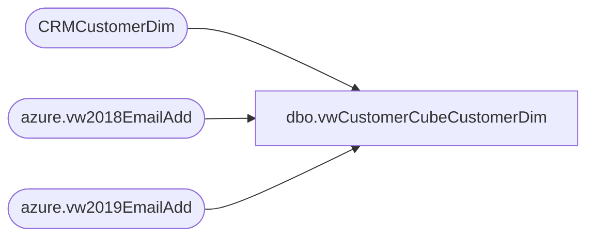

# dbo.vwCustomerCubeCustomerDim

**Database:** dw  
**Server:** papamart  

## Architecture Diagram



## Table Dependencies

| Referenced Table |
|---|
| CRMCustomerDim |
| azure.vw2018EmailAdd |
| azure.vw2019EmailAdd |

## View Code

```sql
CREATE view [dbo].[vwCustomerCubeCustomerDim]

as

select 
	cd.CustomerNumber,
	cd.SubscriberKey,
	cd.gender,
	isnull(cd.BirthDate,GetDate())  as DateOfBirth,
	cast(ISNULL(cd.MembershipDate,GetDate()) as date)  as MembershipDateKey,
	--isnull(dd2.date_key,0) as BirthdateKey,
    cd.StoreKey as StoreKey,
	cd.LanguageCode,
	CASE 
		WHEN cd.CountryCode IN ('CAN','CAF') 
			THEN 'CAN'
	    WHEN cd.CountryCode='GBR' 
			THEN 'GBR'
		ELSE 'USA'
	END AS ProgramCountryCode,
	isnull(cd.PostalCode,0) as PostalCode,
	case 
		when cd.PointsEligible = 1 
			then 'YES' 
			else 'NO' 
	end as PointsEligible,
	cd.MembershipType,
	case 
		when cd.Emailable = 1 
			then 'YES' 
		else 'NO' 
	end as EmailOptIn,
	case 
		when cd.DirectMailOptIn = 1 
			then 'YES' 
		else 'NO' 
	end as DirectMailOptIn
	,ISNULL(E1.EmailAddress,E2.EmailAddress) as EmailAddress
from CRMCustomerDim cd with (nolock)
left join azure.vw2018EmailAdd e1 on cd.subscriberKey = e1.subscriberKey
left join azure.vw2019EmailAdd e2 on cd.subscriberKey = e2.subscriberKey
where cd.SubscriberKey is not null and cd.SubscriberKey not in (4012573,10469337,13503368,17164749,18091771,21298570,21386332,
31315393,36673403) 
--select subscriberKey,count(1) from crmcustomerdim group by subscriberkey having count(1) > 1
```

