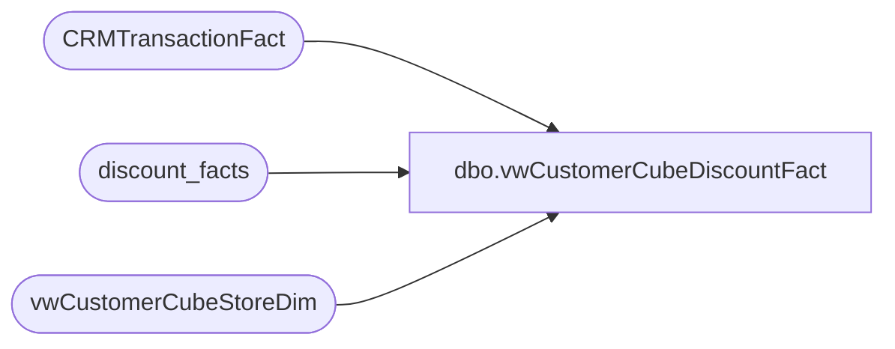

# dbo.vwCustomerCubeDiscountFact

**Database:** dw  
**Server:** papamart  

## Architecture Diagram



## Table Dependencies

| Referenced Table |
|---|
| CRMTransactionFact |
| discount_facts |
| vwCustomerCubeStoreDim |

## View Code

```sql
CREATE view [dbo].[vwCustomerCubeDiscountFact]

as 

select 
	ctf.TransactionID,
	df.coupon_key as CouponKey,
	df.reference_no DiscountReference, 
	sum(df.unit_gross_amount) DiscountAmount,
	max(df.uid) as DiscountFactID
from CRMTransactionFact ctf with (nolock)
join discount_facts df with (nolock) on ctf.TransactionID = df.transaction_id
join vwCustomerCubeStoreDim sd on ctf.StoreKey=sd.StoreKey
where datediff(dd, ctf.TransactionDate, getdate()) <=14
group by 
	ctf.TransactionID,
	df.coupon_key,
	df.reference_no
```

