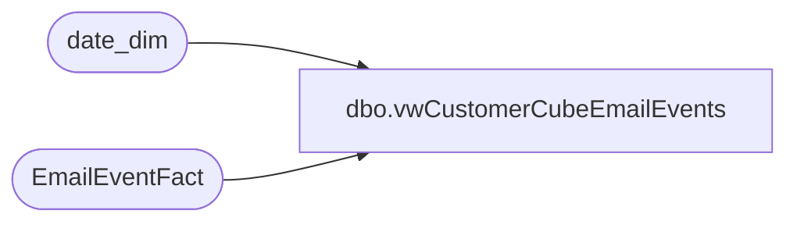

# dbo.vwCustomerCubeEmailEvents

**Database:** dw  
**Server:** papamart  

## Architecture Diagram



## Table Dependencies

| Referenced Table |
|---|
| date_dim |
| EmailEventFact |

## View Code

```sql
CREATE view [dbo].[vwCustomerCubeEmailEvents]
as
select
	concat(e.ClientID, e.SendID) as EventKey,
	e.Subject as EmailSubject,
	e.EmailName,
	dd.date_key as EventDateKey,
	dense_rank() over (order by e.Subject) as EmailSubjectID,
	dense_rank() over (order by e.EmailName) as EmailNameID,
	dd.Actual_Date as DateKey
from EmailEventFact e with (nolock)
join date_dim dd with (nolock) on cast(e.EventDate as date) = cast(dd.actual_date as date)
where datediff(yy, e.EventDate, getdate()) <= 2 and eventDate >= '01/01/19'
```

