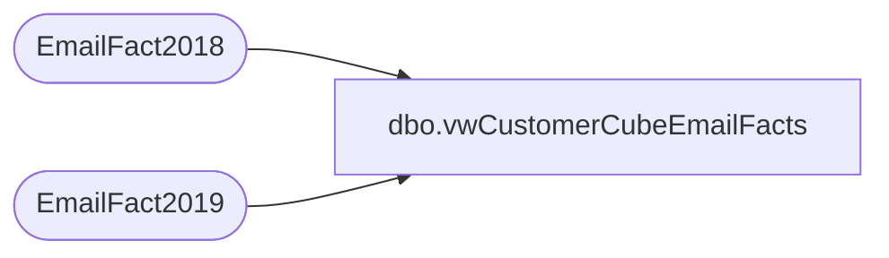

# dbo.vwCustomerCubeEmailFacts

**Database:** dw  
**Server:** papamart  

## Architecture Diagram



## Table Dependencies

| Referenced Table |
|---|
| EmailFact2018 |
| EmailFact2019 |

## View Code

```sql
CREATE view [dbo].[vwCustomerCubeEmailFacts]
as

select 
	concat(e.ClientID, e.SendID) as EventKey,
	e.SubscriberKey,	
	e.SendDate as SendDate,
	e.BounceDate  as BounceDate,
	 e.ClickDate  as ClickDate,
	e.UnSubDate  as UnSubDate,
	 e.OpenDate  as OpenDate
	
from EmailFact2019 e 

union all

select 
	concat(e.ClientID, e.SendID) as EventKey,
	e.SubscriberKey,	
	e.SendDate as SendDate,
	e.BounceDate  as BounceDate,
	 e.ClickDate  as ClickDate,
	e.UnSubDate  as UnSubDate,
	 e.OpenDate  as OpenDate
	
from EmailFact2018 e
```

