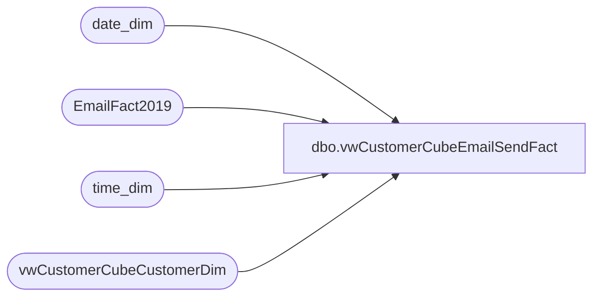

# dbo.vwCustomerCubeEmailSendFact

**Database:** dw  
**Server:** papamart  

## Architecture Diagram



## Table Dependencies

| Referenced Table |
|---|
| date_dim |
| EmailFact2019 |
| time_dim |
| vwCustomerCubeCustomerDim |

## View Code

```sql
CREATE view [dbo].[vwCustomerCubeEmailSendFact]
as

select 
	concat(e.ClientID, e.SendID) as EventKey,
	concat(e.ClientID, e.SendID, e.SubscriberKey) as EmailKey,
	e.SubscriberKey,
	cd.CustomerNumber,
	e.EmailAddress,
	dd.date_key DateKey,
	td.time_key TimeKey
from EmailFact2019 e with (nolock)
join date_dim dd with (nolock) on cast(e.SendDate as date) = cast(dd.actual_date as date)
join time_dim td with (nolock) 
	on datepart(hh,e.SendDate) = td.hour 
	and datepart(mi,e.SendDate) = td.minute
join vwCustomerCubeCustomerDim cd with (nolock) on e.SubscriberKey=cd.SubscriberKey
where e.SendDate is not null
```

