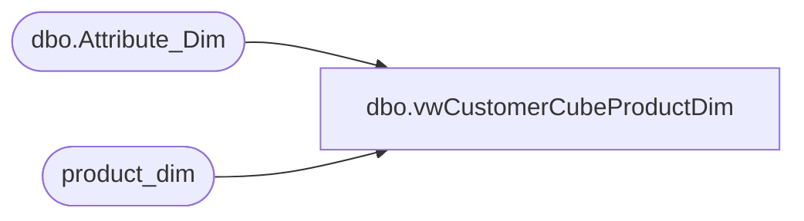

# dbo.vwCustomerCubeProductDim

**Database:** dw  
**Server:** papamart  

## Architecture Diagram



## Table Dependencies

| Referenced Table |
|---|
| dbo.Attribute_Dim |
| product_dim |

## View Code

```sql
CREATE view [dbo].[vwCustomerCubeProductDim] 

as

with 
Keystories as
	(
		SELECT Cast(style_code as varchar(10)) as Style_Code,
			   MIN(AttributeValue) as KeyStory
		from DW.dbo.Attribute_Dim with (nolock)
		WHERE AttributeName = 'KEYSTY' 
		GROUP BY style_code
	),
ProductData as
	(
		select pd.product_key as ProductKey,
			   pd.style_code as Style,
			   ISNULL(pd.style_desc, pd.product_desc) as StyleDescription,
			   isnull(KeyStories.KeyStory, 'n/a') as KeyStory,
			   pd.Concept as Concept,
			   pd.Chain as ConsumerGroup,
			   pd.division as Division,
			   pd.department as Department,
			   pd.class as Class,
			   pd.subclass as SubClass,
			   pd.ScorecardCategory as ScorecardCategory,
			   pd.jurisdiction_code as JurisdictionCode
		from product_dim pd with (nolock)
		left join KeyStories  on pd.style_code = KeyStories.style_code 
		WHERE pd.style_code IS NOT NULL
		AND pd.style_code != 'N/A'
		--and pd.Concept = 'Bab Workshop'
		and pd.Concept not in ('Test', 'Bab Franchise')
		and pd.Chain not in ('Retail Concept') 
		and pd.Division not in ('Lmm')
	)
select 
	ProductKey,
	JurisdictionCode,
	Style,
	StyleDescription,
	concat(Style, ' - ', StyleDescription) as StyleName,
	KeyStory,
	Concept,
	ConsumerGroup,
	Division,
	Department,
	Class,
	SubClass,
	dense_rank() over (order by Concept, ConsumerGroup) as ConsumerGroupID,
	dense_rank() over (order by Concept, ConsumerGroup, Division) as DivisionID,
	dense_rank() over (order by Concept, ConsumerGroup, Division, Department) as DepartmentID,
	dense_rank() over (order by Concept, ConsumerGroup, Division, Department, Class) as ClassID,
	dense_rank() over (order by Concept, ConsumerGroup, Division, Department, Class, Subclass) as SubclassID,
	dense_rank() over (order by Concept, KeyStory) as KeyStoryID
from ProductData
```

