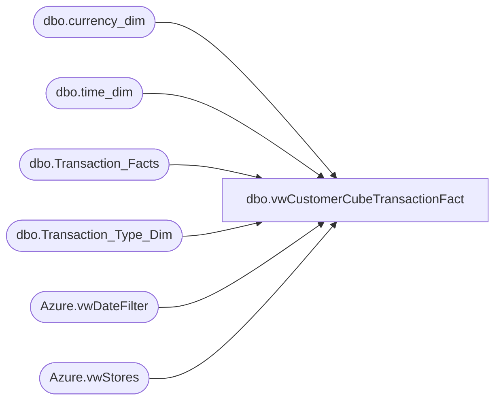

# dbo.vwCustomerCubeTransactionFact

**Database:** dw  
**Server:** papamart  

## Architecture Diagram



## Table Dependencies

| Referenced Table |
|---|
| dbo.currency_dim |
| dbo.time_dim |
| dbo.Transaction_Facts |
| dbo.Transaction_Type_Dim |
| Azure.vwDateFilter |
| Azure.vwStores |

## View Code

```sql
CREATE view [dbo].[vwCustomerCubeTransactionFact]

as

SELECT ds.StoreKey AS StoreKey
      ,CONVERT(DATE,dd.actual_date) AS TransactionDate
	  ,tff.[GAAP_transaction_flag] AS GAAPTransaction
	  ,tff.[store_transaction_flag] AS StoreTransaction
	  ,tff.[total_units] AS TotalUnits
      ,tff.[GAAP_sales_amount] AS GAAPSalesAmount
	  ,tff.[Store_Sales_Amount] AS StoreSalesAmount
	  ,tff.[Enterprise_Selling_Amount] AS EnterpriseSellingAmount
	  ,tff.[tax_amount] AS TaxAmount
	  ,tff.[Gaap_Units] AS GAAPUnits
      ,tff.[Enterprise_Selling_Units] AS EnterpriseSellingUnits
      ,Cast(transaction_id as Varchar(20)) + cast(ds.StoreKey as Varchar(10)) as TransactionKey
  FROM [dw].[dbo].[Transaction_Facts] tff WITH(NOLOCK) INNER JOIN
	    [dw].[Azure].[vwStores] ds WITH(NOLOCK)
			ON ds.StoreKey=CONVERT(VARCHAR,tff.store_key) INNER JOIN
		[dw].Azure.vwDateFilter dd WITH(NOLOCK)
			ON tff.date_key = dd.date_key  INNER JOIN
		[dw].[dbo].[time_dim] td WITH(NOLOCK)
			ON td.time_key = tff.time_key INNER JOIN
		[dw].[dbo].[Transaction_Type_Dim] ttd WITH(NOLOCK)
			ON ttd.transaction_key = tff.transaction_type_key INNER JOIN
		[dw].[dbo].[currency_dim] cd WITH(NOLOCK)
			ON cd.currency_key=tff.currency_key


where dd.actual_date >= '01/01/18'
```

