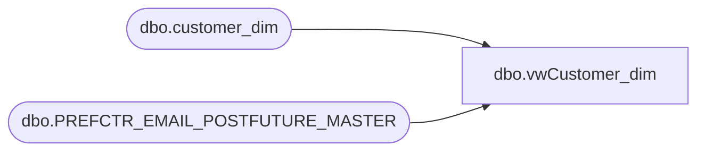

# dbo.vwCustomer_dim

**Database:** dw  
**Server:** papamart  

## Architecture Diagram



## Table Dependencies

| Referenced Table |
|---|
| dbo.customer_dim |
| dbo.PREFCTR_EMAIL_POSTFUTURE_MASTER |

## View Code

```sql
CREATE VIEW [dbo].[vwCustomer_dim]
--WITH SCHEMABINDING
AS
   SELECT c.[customer_key]
      ,c.[customer_num]
      ,c.[first_name]
      ,c.[last_name]
      ,c.[nickname]
      ,c.[gender]
      ,c.[gender_dc]
      ,c.[birth_date]
      ,c.[email]
      ,c.[send_email_y_n]
	  ,e.[email_address]
	  ,e.[open_flag]
	  ,e.[prior_emails_opened] 
	  ,e.[head_of_email]
      ,c.[Parent_Consent]
      ,c.[Parent_Name]
      ,c.[Under_13]
      ,c.[customer_num_crm]
      ,c.[Loyalty_No]
      ,c.[Loyalty_send_email_y_n]
      ,c.[head_of_household_y_n]
      ,c.[phone_number]
      ,c.[phone_number_date]
      ,c.[process_name]
      ,c.[process_date]
      ,c.[Language]
      ,c.[CRM_Status]
      ,c.[CRM_Date]
      ,c.[Email_Date]
      ,c.[Loyalty_Date]
      ,c.[Loyalty_Email_Date]
      ,c.[Status_Flag]
      ,c.[rz_loyalty_no]
      ,c.[rz_loyalty_send_email_y_n]
      ,c.[rz_loyalty_date]
  FROM [dbo].[customer_dim] c with (nolock) left join 
[dbo].[PREFCTR_EMAIL_POSTFUTURE_MASTER] e with (nolock) on
c.email = e.email_address 
where e.[head_of_email] = 'Y'
```

