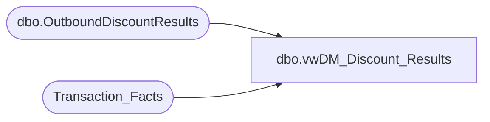

# dbo.vwDM_Discount_Results

**Database:** dw  
**Server:** papamart  

## Architecture Diagram



## Table Dependencies

| Referenced Table |
|---|
| dbo.OutboundDiscountResults |
| Transaction_Facts |

## View Code

```sql
-- This view is used to load the Discount Results back into the Discount Manager database
--	It uses the table created in spDM_Build_Discount_Results


CREATE VIEW [dbo].[vwDM_Discount_Results]
AS
SELECT
	b.fiscal_year,
	b.fiscal_period,
	b.dmDiscountID,
	b.categoryTypeID,
	CAST(CASE
		WHEN b.dmDiscountID = -1 THEN 0
		ELSE b.isExpired
	END AS bit) AS isExpired,
	b.country,
	SUM(b.unit_gross_amount) AS redeemedAmt,
	SUM(b.numRedeemed) AS numRedeemed,
	SUM(ISNULL(tf.GAAP_transaction_flag, 0)) AS GAAP_Transactions,
	SUM(CAST(ISNULL(tf.GAAP_Sales_Amount, 0) AS money)) AS GAAP_Sales_Amount
FROM
	DWStaging.dbo.OutboundDiscountResults b WITH (NOLOCK)
	LEFT JOIN Transaction_Facts tf WITH (NOLOCK)
		ON b.transaction_id = tf.transaction_id
GROUP BY	b.fiscal_year,
			b.fiscal_period,
			b.dmDiscountID,
			b.categoryTypeID,
			CAST(CASE
				WHEN b.dmDiscountID = -1 THEN 0
				ELSE b.isExpired
			END AS bit),
			b.country
```

