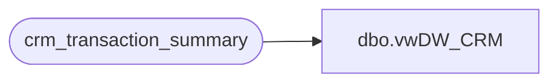

# dbo.vwDW_CRM

**Database:** dw  
**Server:** papamart  

## Architecture Diagram



## Table Dependencies

| Referenced Table |
|---|
| crm_transaction_summary |

## View Code

```sql
CREATE view [dbo].[vwDW_CRM]
as


select top 100 Percent customer_num_crm
	, cast(customer_num_crm as varchar(10)) 
			+ cast(store_key as varchar(10)) 
			+ cast(date_key as varchar(10)) as Visit_Key
	, cast(transaction_id AS varchar) 
			+ '-' + cast(store_key AS varchar) 
			+ '-' + cast(date_key AS varchar) AS Transaction_Key
	, transaction_id 
	, store_key
	, date_key
	, max(sfs_transaction_type_key) as sfs_transaction_type_key
	from crm_transaction_summary
	group by customer_num_crm
		, transaction_id 
		, store_key
		, date_key
	order by Date_Key
```

