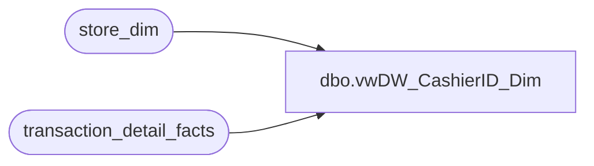

# dbo.vwDW_CashierID_Dim

**Database:** dw  
**Server:** papamart  

## Architecture Diagram



## Table Dependencies

| Referenced Table |
|---|
| store_dim |
| transaction_detail_facts |

## View Code

```sql
CREATE view [dbo].[vwDW_CashierID_Dim]
as
SELECT t.cashier_id, t.store_key, s.store_id, s.store_name, 
'Store ' + cast(s.store_id as varchar(20)) + '_CashierID ' + Cast(cashier_id as varchar(50)) as CashierIDSID
from transaction_detail_facts t with (nolock)
join store_dim s on 
t.store_key = s.store_key
group by t.cashier_id, t.store_key, s.store_id, s.store_name

dbo,vwProduct_Dim,-- =============================================================================================================
-- Name: vwProduct_Dim
--
-- Revision History:

--		Name:					Date:			Comments:
--		Kevin Shyr				1/23/2015		Changed to use new ScorecardCategory
--		Outside Contractor		1/16/2015		added logic to handle changes to the hierarchy
--		G Murrish				3/12/2012		Fixed the Join to BallParkSKU to eliminate duplicate records 
-- =============================================================================================================
CREATE VIEW [dbo].[vwProduct_Dim]
AS 
SELECT 
	CASE 
		WHEN Department IS NULL THEN
			'N/A'
		WHEN division = 'Ridemakerz' THEN
			'Ridemakerz-' + Department
		WHEN Department = 'Misc POS' THEN
			'N/A'
		WHEN p.ScorecardCategory <> 'Unknown' THEN
			p.ScorecardCategory
	ELSE
		department
	--CASE WHEN LEFT(department_code, 1) = 'W' THEN
	--	CASE	
	--			WHEN RIGHT(department_code,2)='08' THEN 'Accessories'
	--			--not sure yet WHEN RIGHT(department_code,2)='06' THEN 'Furniture'
	--			WHEN RIGHT(department_code,2)='16' THEN 'Pets'
	--			WHEN RIGHT(department_code,2)='06' AND SUBSTRING(subclass_code, 10, 2) <> '07' THEN 'Clothing'
	--			--not sure yet WHEN RIGHT(department_code,2) in ('12','33','38') THEN 'Licensing'
	--			WHEN RIGHT(department_code,2)='10' THEN 'Footwear'
	--			WHEN RIGHT(department_code,2)='12' AND SUBSTRING(subclass_code, 10, 2) = '01' THEN 'Sounds'
	--			WHEN RIGHT(department_code,2)='02' THEN 'Unstuffed'
	--			WHEN RIGHT(department_code,2)='04' AND SUBSTRING(subclass_code, 10, 2) = '02' THEN 'Prestuffed'
	--			WHEN RIGHT(department_code,2)='18' or department = 'Human' THEN 'Human'
	--			--not sure yet WHEN RIGHT(department_code,2) in ('40','48') THEN 'Parties'
	--			-- Following departments not changed from old hierarchy
	--			WHEN RIGHT(department_code,2)='45' THEN 'Bearbucks/Coupons'
	--			WHEN RIGHT(department_code,2)='46' THEN 'Donations/Discounts'
	--			WHEN RIGHT(department_code,2)='47' or department = 'Transaction Flags' THEN 'Transaction Flags'
	--			WHEN RIGHT(department_code,2)='50' THEN 'Web'
	--			WHEN RIGHT(department_code,2)='51' THEN 'Kits'
	--			WHEN RIGHT(department_code,2)='55' THEN 'Corporate'
	--			WHEN RIGHT(department_code,2)='60' or department = 'Supplies' THEN 'Supplies'
	--			WHEN RIGHT(department_code,2)='65' THEN 'Embroidery'
	--			WHEN RIGHT(department_code,2)='70' THEN 'Former Businesses'
	--			WHEN RIGHT(department_code,2)='75' THEN 'Promotions'
	--			WHEN RIGHT(department_code,2)='80' THEN 'Gift Cards'
	--			WHEN RIGHT(department_code,2)='85' THEN 'Blanks'
	--			WHEN RIGHT(department_code,2)='99' THEN 'Test'
	--		ELSE
	--			department
	--	END
	--ELSE
	--	CASE
	--			WHEN Department IS NULL THEN
	--				'N/A'
	--			WHEN division = 'Ridemakerz' THEN
	--				'Ridemakerz-' + Department
	--			WHEN right(department_code, 2) = '25' OR (department = 'Sports Licensing' AND subclass = 'Skins') THEN
	--				'Skins'
	--			WHEN right(department_code, 2) = '30' OR (department = 'Sports Licensing' AND subclass LIKE 'Prestuffed%') THEN
	--				'Prestuffed'
	--			WHEN right(department_code, 2) = '15' OR (department = 'Sports Licensing' AND subclass = 'Footwear') THEN
	--				'Footwear'
	--			WHEN right(department_code, 2) = '05' OR department = 'Accessories' OR (department = 'Sports Licensing' AND subclass IN ('Accessories', 'Caps', 'Motor Sports Access', 'Motor Sports Hats')) THEN
	--				'Accessories'
	--			WHEN right(department_code, 2) = '10' OR department IN ('clothes', 'Clothing') OR (department IN ('Sports Licensing', 'Sprts Lic') AND (subclass NOT IN ('Skins', 'Footwear') OR subclass NOT LIKE 'Prestuffed%')) THEN
	--				'Clothing'
	--			WHEN right(department_code, 2) = '06' THEN
	--				'Furniture'
	--			WHEN right(department_code, 2) = '07' OR department = 'Pets' THEN
	--				'Pets'
	--			WHEN right(department_code, 2) IN ('12', '33', '38') THEN
	--				'Licensing'
	--			WHEN right(department_code, 2) = '20' THEN
	--				'Sounds'
	--			WHEN right(department_code, 2) = '35' OR department = 'Human' THEN
	--				'Human'
	--			WHEN right(department_code, 2) IN ('40', '48') THEN
	--				'Parties'
	--			WHEN right(department_code, 2) = '45' THEN
	--				'Bearbucks/Coupons'
	--			WHEN right(department_code, 2) = '46' THEN
	--				'Donations/Discounts'
	--			WHEN right(department_code, 2) = '47' OR department = 'Transaction Flags' THEN
	--				'Transaction Flags'
	--			WHEN right(department_code, 2) = '50' THEN
	--				'Web'
	--			WHEN right(department_code, 2) = '51' THEN
	--				'Kits'
	--			WHEN right(department_code, 2) = '55' THEN
	--				'Corporate'
	--			WHEN right(department_code, 2) = '60' OR department = 'Supplies' THEN
	--				'Supplies'
	--			WHEN right(department_code, 2) = '65' THEN
	--				'Embroidery'
	--			WHEN right(department_code, 2) = '70' THEN
	--				'Former Businesses'
	--			WHEN right(department_code, 2) = '75' THEN
	--				'Promotions'
	--			WHEN right(department_code, 2) = '80' THEN
	--				'Gift Cards'
	--			WHEN right(department_code, 2) = '85' THEN
	--				'Blanks'
	--			WHEN right(department_code, 2) = '99' THEN
	--				'Test'
	--			WHEN Department = 'Misc POS' THEN
	--				'N/A'
	--		ELSE
	--			department
	--	END
	END AS PRODUCT_GROUP
		, b.Ballpark_Category
		, b.Ballpark_Subcategory
		, b.Ballpark_SKU
		, b.Ballpark_Year
		, p.*
   FROM
	   product_dim p WITH (NOLOCK)
	   LEFT JOIN 
	   (SELECT max(BallPark_Category) AS BallPark_Category
			 , max(BallPark_Subcategory) AS BallPark_Subcategory
			 , BallPark_SKU
			 , max(BallPark_Year) AS BallPark_Year FROM dbo.BallParkSKU b WITH (NOLOCK)
			 GROUP BY BallPark_SKU)b
		   ON p.sku = b.Ballpark_SKU
```

