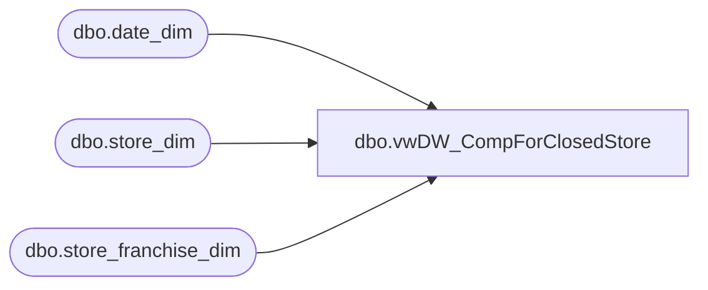

# dbo.vwDW_CompForClosedStore

**Database:** dw  
**Server:** papamart  

## Architecture Diagram



## Table Dependencies

| Referenced Table |
|---|
| dbo.date_dim |
| dbo.store_dim |
| dbo.store_franchise_dim |

## View Code

```sql
CREATE VIEW [dbo].[vwDW_CompForClosedStore]
-- =============================================================================================================
-- Name: [dbo].[vwDW_CompForClosedStore]
--
-- Description: 	View used to determine last year's comp information for closed stores.
-- Purpose:			If store closes mid-month, the last day of previous fiscal period will be used to 
--					determine the last date from previous year that will be included in this year's comp calculations 
--				
---- Dependencies: 
--
-- Revision History
--		Name:			Date:			Comments:
--		Funmi Agbebi	05/28/2010		changed all org_fiscal_week to fiscal_week 
--		Funmi Agbebi	02/15/2010		Creation 

-- =============================================================================================================

AS /* ***** Level 4 starts - determine max_ly_comp_date for closed stores *************
******** Last year's parallel date to the derived max_ly_comp_date   *********************/

SELECT
    cd3.store_key
   ,cd3.store_id
   ,cd3.store_name
   ,cd3.Bearritory
   ,cd3.IsClosed
   ,cd3.closing_date_key
   ,cd3.closing_date
   ,cd3.closing_max_comp_date_key
   ,cd3.closing_max_comp_date
   ,cd3.closing_max_ly_comp_fiscal_year		
--,cd3.closing_max_comp_fiscal_period
   ,cd3.closing_max_comp_fiscal_week
   ,max(d.actual_date) closing_max_ly_comp_date
   ,max(d.date_key) closing_max_ly_comp_date_key
FROM
    dw.dbo.date_dim d WITH (NOLOCK)
RIGHT JOIN (
            /* ***** Level 3 starts - determine max_ly_comp_fiscal_year for closed stores *************/
            SELECT
                cd2.store_key
               ,cd2.store_id
               ,cd2.store_name
               ,cd2.bearritory
               ,cd2.IsClosed
               ,cd2.closing_date_key
               ,cd2.closing_date
               ,cd2.closing_max_comp_date_key
               ,cd2.closing_max_comp_date
               ,d.fiscal_year - 1 closing_max_ly_comp_fiscal_year		
               --,d.fiscal_period  closing_max_comp_fiscal_period
               ,d.fiscal_week closing_max_comp_fiscal_week

            /*
,d.date_key closing_max_ly_comp_date_key
,d.actual_date closing_max_ly_comp_date
,d.fiscal_year closing_max_ly_comp_fiscal_year
,d.fiscal_period closing_max_ly_comp_fiscal_period
*/
            FROM
                dw.dbo.date_dim d WITH (NOLOCK)
            RIGHT JOIN (
                        /* ***** Level 2 starts - determine max_comp_date for closed stores *************
******** should be last day of most recent full fiscal period,           *********************/
                        /******* therefore, if store closes mid-month, use last day of previous fiscal period  *********************/
                        SELECT
                            cd1.store_key
                           ,cd1.store_id
                           ,cd1.store_name
                           ,cd1.bearritory
                           ,CAST(cd1.IsClosed AS bit) IsClosed
                           ,cd1.closing_date_key
                           ,cd1.closing_date
                           ,CASE
                                 WHEN cd1.closing_date_key = max(d.date_key) THEN cd1.closing_date_key
                                 ELSE (min(d.date_key) - 1)
                            END AS closing_max_comp_date_key --closing_max_ly_comp_date_key
                           ,CASE
                                 WHEN cd1.closing_date_key = max(d.date_key) THEN cd1.closing_date
                                 ELSE dateadd(d, -1, min(d.actual_date))
                            END AS closing_max_comp_date	 --closing_max_ly_comp_date		


                        /*
----	Other fields helpful for determining max_comp_date to use

	,cd1.closing_fiscal_year ,cd1.closing_fiscal_period
	,convert(varchar(10),cd1.closing_date,101) formatted_closing_date
	,convert(varchar(10),max(d.actual_date),101) formatted_FPMaxDate
	,convert(varchar(10),min(d.actual_date),101) formatted_FPMinDate
	,case when cd1.closing_date < max(d.actual_date) then 'Y' else 'N' end as UsePreviousFPforClosingComp
	,min(d.actual_date) FPMinDate
	, max(d.actual_date) FPMaxDate
	,CASE WHEN cd1.closing_date_key = max(d.date_key) THEN cd1.closing_date
	 ELSE dateadd(d, -1,min(d.actual_date)) END AS closing_max_comp_date	
	,CASE WHEN cd1.closing_date_key = max(d.date_key) THEN convert(varchar(10),cd1.closing_date,101)  
	 ELSE convert(varchar(10),dateadd(d, -1,min(d.actual_date)),101) END AS closing_max_comp_date	 
	,CASE WHEN cd1.closing_date_key = max(d.date_key) THEN cd1.closing_date_key 
	  ELSE (min(d.date_key) - 1) END AS closing_max_comp_date_key --closing_max_ly_comp_date_key

	,CASE WHEN cd1.closing_date_key = max(d.date_key) THEN year(cd1.closing_date) - 1    
	 ELSE year(dateadd(d, -1,min(d.actual_date))) -1 END AS closing_max_ly_comp_fiscal_year	 closing_max_ly_comp_fiscal_year		
	,CASE WHEN cd1.closing_date_key = max(d.date_key) THEN month(cd1.closing_date)   
	 ELSE month(dateadd(d, -1,min(d.actual_date))) END AS closing_max_ly_comp_fiscal_period	 --closing_max_ly_comp_date		

	,CASE WHEN cd1.closing_date_key = max(d.date_key) THEN year(cd1.closing_date) - 1    
	 ELSE year(dateadd(d, -1,min(d.actual_date))) -1 END AS closing_max_ly_comp_fiscal_year	 --closing_max_ly_comp_date		
	,CASE WHEN cd1.closing_date_key = max(d.date_key) THEN month(cd1.closing_date)   
	 ELSE month(dateadd(d, -1,min(d.actual_date))) END AS closing_max_ly_comp_fiscal_period	 --closing_max_ly_comp_date		

*/
                        FROM
                            dw.dbo.date_dim d WITH (NOLOCK)
                        RIGHT JOIN (

                                    /* *********************Level 1 starts - Get corresponding fiscal information for closing date  *********************/
                                    SELECT
                                        s.store_key
                                       ,CAST(s.store_id AS varchar(50)) store_id
                                       ,s.store_name
                                       ,s.closing_date
                                       ,d.date_key closing_date_key
                                       ,d.fiscal_year closing_fiscal_year
                                       ,d.fiscal_period closing_fiscal_period
                                       ,s.bearritory
                                       ,CASE
                                             WHEN s.closing_date IS NOT NULL
                                             OR s.bearritory LIKE '%Closed%' THEN 1
                                             ELSE 0
                                        END AS IsClosed
                                    FROM
                                        dw.dbo.date_dim d
                                    RIGHT JOIN dbo.store_dim s
                                        --store_franchise_dim s  
 ON                                     d.actual_date = s.closing_date
                                    UNION
                                    SELECT
                                        s.store_key
                                       ,CAST(s.store_id AS varchar(50)) store_id
                                       ,s.store_name
                                       ,s.closing_date
                                       ,d.date_key closing_date_key
                                       ,d.fiscal_year closing_fiscal_year
                                       ,d.fiscal_period closing_fiscal_period
                                       ,s.bearritory
                                       ,CASE
                                             WHEN s.closing_date IS NOT NULL
                                             OR s.bearritory LIKE '%Closed%' THEN 1
                                             ELSE 0
                                        END AS IsClosed
                                    FROM
                                        dw.dbo.date_dim d
                                    RIGHT JOIN dbo.store_franchise_dim s
                                        ON d.actual_date = s.closing_date

                                    /* *********************Level 1 ends - Get corresponding fiscal information for closing date  *********************/
                                   ) cd1
                            ON d.fiscal_year = cd1.closing_fiscal_year
                               AND d.fiscal_period = cd1.closing_fiscal_period
                        GROUP BY
                            cd1.store_key
                                                   ,cd1.store_id
                                                   ,cd1.store_name
                                                   ,cd1.closing_date
                                                   ,cd1.closing_date_key
                                                   ,cd1.closing_fiscal_year
                                                   ,cd1.closing_fiscal_period
                                                   ,cd1.IsClosed
                                                   ,cd1.Bearritory


                        /* ********************************************* Level 2 ends *************************************/
                       ) cd2
                ON d.date_key = cd2.closing_max_comp_date_key 

            /* ********************************************* Level 3 ends *************************************/
           ) cd3
    ON d.fiscal_year = cd3.closing_max_ly_comp_fiscal_year
 --and d.fiscal_period = cd3.closing_max_comp_fiscal_period
       AND d.fiscal_week = cd3.closing_max_comp_fiscal_week
GROUP BY
    cd3.store_key
   ,cd3.store_id
   ,cd3.store_name
   ,cd3.Bearritory
   ,cd3.IsClosed
   ,cd3.closing_date_key
   ,cd3.closing_date
   ,cd3.closing_max_comp_date_key
   ,cd3.closing_max_comp_date
   ,cd3.closing_max_ly_comp_fiscal_year		
--,cd3.closing_max_comp_fiscal_period
   ,cd3.closing_max_comp_fiscal_week

/* ********************************************* Level 4 ends *************************************/

/*

select * from [vwDW_CompForClosedStore]  order by cd2.closing_date_key 

select * from [vwDW_CompForClosedStore] where IsClosed = 'Y'
--closing_date is not null 
order by cd2.closing_date_key 

*/

/*
select -- actual_date 
* from date_dim 
where fiscal_year in (2007,2008) 
and fiscal_week = 1
and day_of_week = 7
go

select * from [vwDW_CompForClosedStore] where closing_date is not null order by cd2.closing_date_key 
go

select fiscal_year,week_id from date_dim
where fiscal_year > 2002
group by fiscal_year, week_id
order by fiscal_year, week_id

				,(SELECT date_key FROM date_dim WHERE actual_date = store_table.comp_date) AS comp_date_key


			FROM vwStore_dim_ForCube s
			INNER JOIN store_dim store_table ON store_table.store_key = s.store_key
			LEFT JOIN date_dim d ON d.week_id = s.comp_week_id
				AND d.day_of_week = 7
			WHERE s.store_name IS NOT NULL 

*/
```

