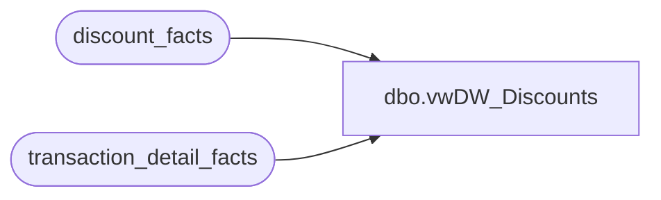

# dbo.vwDW_Discounts

**Database:** dw  
**Server:** papamart  

## Architecture Diagram



## Table Dependencies

| Referenced Table |
|---|
| discount_facts |
| transaction_detail_facts |

## View Code

```sql
CREATE VIEW [dbo].[vwDW_Discounts]
AS
SELECT dt.transaction_id, dt.store_key, dt.date_key, df.coupon_key, df.line_object_key, df.units,
		df.unit_gross_amount, df.uid,
		CASE dt.party_y_n WHEN 'y' THEN 1 ELSE 0 END AS PartyFlag,
		dt.currency_key
	FROM
		(
		SELECT dt2.date_key, dt2.store_key, dt2.transaction_id, MAX(dt2.party_y_n) AS party_y_n, MAX(dt2.currency_key) AS currency_key
		FROM transaction_detail_facts dt2 WITH (NOLOCK)
		GROUP BY dt2.date_key, dt2.store_key, dt2.transaction_id--, dt2.party_y_n, dt2.currency_key
		) dt
	INNER JOIN discount_facts df WITH (NOLOCK)
			ON df.store_key = dt.store_key
			AND df.date_key = dt.date_key
			AND df.transaction_id = dt.transaction_id
```

