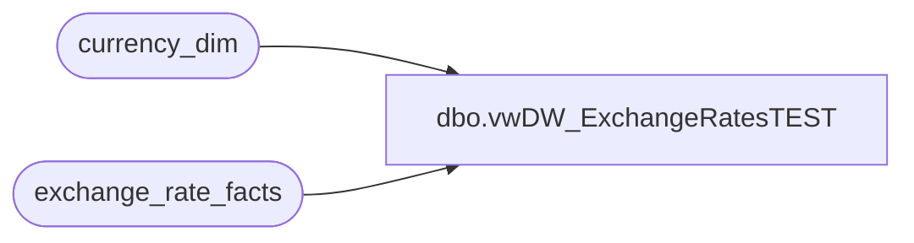

# dbo.vwDW_ExchangeRatesTEST

**Database:** dw  
**Server:** papamart  

## Architecture Diagram



## Table Dependencies

| Referenced Table |
|---|
| currency_dim |
| exchange_rate_facts |

## View Code

```sql
CREATE VIEW [dbo].[vwDW_ExchangeRatesTEST]
AS
WITH ERV AS
	(
		SELECT 
			date_key, 
			from_currency_key, 
			to_currency_key, 
			actual_date,
			from_currency_code, 
			to_currency_code, 
			round(bbw_rate, 5) bbw_rate, 
			round(actual_rate, 5) actual_rate, 
			round(fiscal_month_ave_rate, 5) fiscal_month_ave_rate,
			round(fiscal_month_end_rate, 5) fiscal_month_end_rate, 
			round(calendar_month_ave_rate, 5) calendar_month_ave_rate, 
			round(calendar_month_end_rate, 5) calendar_month_end_rate
		FROM exchange_rate_facts
		
		UNION

		SELECT 
			date_key,
			t.to_currency_key AS from_currency_key, 
			e.from_currency_key AS to_currency_key, 
			actual_date,
			t.currency_code AS from_currency_code, 
			e.from_currency_code AS to_currency_code,
			round(CASE WHEN bbw_rate <> 0 THEN 1.0 / bbw_rate ELSE 0 END, 5) AS bbw_rate,
			round(CASE WHEN actual_rate <> 0 THEN 1.0 / actual_rate ELSE 0 END, 5) AS actual_rate,
			round(CASE WHEN fiscal_month_ave_rate <> 0 THEN 1.0 / fiscal_month_ave_rate ELSE 0 END, 5) AS fiscal_month_ave_rate,
			round(CASE WHEN fiscal_month_end_rate <> 0 THEN 1.0 / fiscal_month_end_rate ELSE 0 END, 5) AS fiscal_month_end_rate,
			round(CASE WHEN calendar_month_ave_rate <> 0 THEN 1.0 / calendar_month_ave_rate ELSE 0 END, 5) AS calendar_month_ave_rate,
			round(CASE WHEN calendar_month_end_rate <> 0 THEN 1.0 / calendar_month_end_rate ELSE 0 END, 5) AS calendar_month_end_rate
		FROM exchange_rate_facts e
		INNER JOIN
			(
				SELECT DISTINCT to_currency_key, c.currency_code
				FROM exchange_rate_facts e2
				INNER JOIN currency_dim c ON c.currency_key = e2.to_currency_key
			) t ON t.to_currency_key = e.to_currency_key

		UNION

		-- sql for local to local
		SELECT DISTINCT 
			date_key, 
			t.from_currency_key, 
			t.from_currency_key AS to_currency_key, 
			actual_date,
			t.currency_code AS from_currency_code, 
			t.currency_code AS to_currency_code, 
			1 AS bbw_rate, 
			1 AS actual_rate, 
			1 AS fiscal_month_ave_rate,
			1 AS fiscal_month_end_rate, 
			1 AS calendar_month_ave_rate, 
			1 AS calendar_month_end_rate
		FROM exchange_rate_facts e
		INNER JOIN
			(
				SELECT DISTINCT t2.from_currency_key, t2.currency_code
				FROM
				(
					SELECT DISTINCT from_currency_key, c.currency_code
					FROM exchange_rate_facts e2
					INNER JOIN currency_dim c ON c.currency_key = e2.from_currency_key

					UNION

					SELECT DISTINCT to_currency_key AS from_currency_key, c.currency_code
					FROM exchange_rate_facts e2
					INNER JOIN currency_dim c ON c.currency_key = e2.to_currency_key
				) t2
			) t ON 1 = 1
	)
SELECT 
	date_key,
	from_currency_key,
	to_currency_key,
	actual_date,
	from_currency_code,
	to_currency_code,
	round(max(bbw_rate), 5) bbw_rate,
	round(max(actual_rate), 5) actual_rate,
	round(max(fiscal_month_ave_rate), 5) fiscal_month_ave_rate,
	round(max(fiscal_month_end_rate), 5) fiscal_month_end_rate,
	round(max(calendar_month_ave_rate), 5) calendar_month_ave_rate,
	round(max(calendar_month_end_rate), 5) calendar_month_end_rate
from ERV
group by 
	date_key,
	from_currency_key,
	to_currency_key,
	actual_date,
	from_currency_code,
	to_currency_code
```

