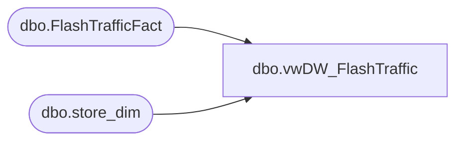

# dbo.vwDW_FlashTraffic

**Database:** dw  
**Server:** papamart  

## Architecture Diagram



## Table Dependencies

| Referenced Table |
|---|
| dbo.FlashTrafficFact |
| dbo.store_dim |

## View Code

```sql
CREATE view [dbo].[vwDW_FlashTraffic]

as

select 

	tf.startDateTime as START_TIME,
	sd.store_id as STORE_NO,
	1 as LOCATION_NO,
	DATEADD(ms,899998,tf.startDateTime) as END_TIME,
	tf.enters as ENTERS_COUNT,
	tf.exits as EXITS_COUNT,
	tf.insert_datetime as COUNTS_TIMESTAMP
from dw.dbo.FlashTrafficFact tf with (nolock)
join dw.dbo.store_dim sd on tf.store_key = sd.store_key
```

