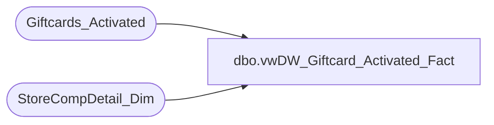

# dbo.vwDW_Giftcard_Activated_Fact

**Database:** dw  
**Server:** papamart  

## Architecture Diagram



## Table Dependencies

| Referenced Table |
|---|
| Giftcards_Activated |
| StoreCompDetail_Dim |

## View Code

```sql
CREATE VIEW [dbo].[vwDW_Giftcard_Activated_Fact]
-- =============================================================================================================
-- Name: [dbo].[vwDW_Giftcard_Activated_Fact]
--
-- Description: Selects the Giftcards that were activated
--
-- Dependencies: 
--
-- Revision History

--		Name:			Date:			Comments:
--		Gary Murrish	9/18/2013		Initial
-- =============================================================================================================

AS


SELECT
	CASE
		WHEN ga.store_key < 1 THEN -4
		ELSE ga.store_key
	END AS store_key,
	ga.date_key,
	ga.activated_amount,
	ga.discount_amount,
	ga.currency_key,
	CASE
		WHEN ga.discount_amount = 0 THEN 'Regular'
		WHEN ga.discount_amount % 5 = 0 THEN 'Upsell'
		ELSE 'Regular'
	END AS GiftcardType,
	1 AS calc,
	CAST(ISNULL(cmp.isCompTY, 0) AS integer) AS isComp,
	CAST(ISNULL(cmp.isCompNY, 0) AS integer) AS isCompNextYear
FROM
	Giftcards_Activated ga WITH (NOLOCK)
	LEFT JOIN StoreCompDetail_Dim cmp WITH (NOLOCK)
		ON cmp.store_key = ga.store_key
		AND cmp.date_key = ga.date_key
```

