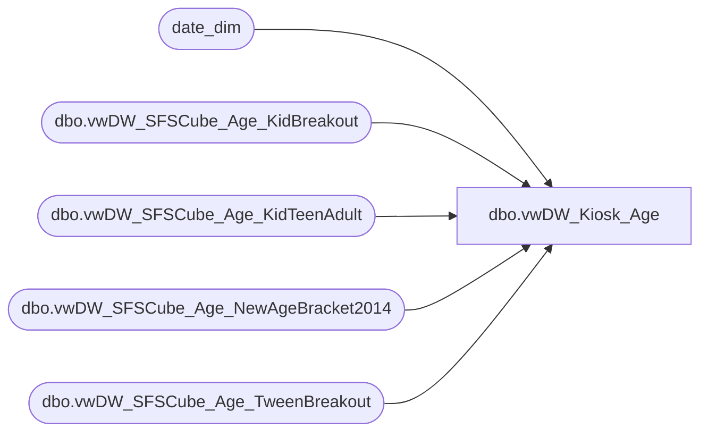

# dbo.vwDW_Kiosk_Age

**Database:** dw  
**Server:** papamart  

## Architecture Diagram



## Table Dependencies

| Referenced Table |
|---|
| date_dim |
| dbo.vwDW_SFSCube_Age_KidBreakout |
| dbo.vwDW_SFSCube_Age_KidTeenAdult |
| dbo.vwDW_SFSCube_Age_NewAgeBracket2014 |
| dbo.vwDW_SFSCube_Age_TweenBreakout |

## View Code

```sql
CREATE VIEW [dbo].[vwDW_Kiosk_Age]
AS SELECT TOP (100) PERCENT
      Number AS Age
      , CAST(Number AS INT) AS DiscreetAge
      ,CASE
            WHEN x.number < 0 THEN 'Unknown'
            WHEN x.number < 10 THEN '0-10 Yrs'
            WHEN x.number < 20 THEN '10-20 Yrs'
            WHEN x.number < 50 THEN '30-50 Yrs'
            WHEN x.number < 100 THEN '50-100 Yrs'
            ELSE '100 + Yrs'
       END AS BandDecadeDescr
      ,CASE
            WHEN x.number < 0 THEN 900
            WHEN x.number < 10 THEN 10
            WHEN x.number < 20 THEN 20
            WHEN x.number < 50 THEN 30
            WHEN x.number < 100 THEN 40
            ELSE 50
       END AS BandDecadeSeq
       , KB.relSeq AS BandKidSeq
       , KB.Descr AS BandKidDescr
       , kt.relSeq AS BandKidTeenSeq
       , kt.Descr AS BandKidTeenDescr
       , tw.relSeq AS BandTweenSeq
       , tw.Descr AS BandTweenDescr
       , NAB.relSeq AS NewAgeBracket2014Seq
       , NAB.Descr AS NewAgeBracket2014Descr
      ,CASE
            WHEN x.number < 0 THEN 'Unknown'
            WHEN x.number BETWEEN 7 AND 8 THEN '7-8 Yrs'
			else 'Other'
       END AS Band7_8Descr
      ,CASE
            WHEN x.number < 0 THEN 900
            WHEN x.number BETWEEN 7 AND 8 THEN 10
			else 20       
		END AS Band7_8Seq
	  ,CASE
            WHEN x.number < 0 THEN 'Unknown'
            WHEN x.number BETWEEN 0 AND 2.9 THEN '0-2 Yrs'
            WHEN x.number BETWEEN 3 AND 6.9 THEN '3-6 Yrs'
            WHEN x.number BETWEEN 7 AND 8.9 THEN '7-8 Yrs'
            WHEN x.number BETWEEN 9 AND 12.9 THEN '9-12 Yrs'
			else 'Teen +'
       END AS Band2012_Descr
      ,CASE
            WHEN x.number < 0 THEN 900
            WHEN x.number BETWEEN 0 AND 2.9 THEN 10
            WHEN x.number BETWEEN 3 AND 6.9 THEN 20
            WHEN x.number BETWEEN 7 AND 8.9 THEN 30
            WHEN x.number BETWEEN 9 AND 12.9 THEN 40
			else 50
		END AS Band2012_Seq		
   FROM
       --(SELECT
       --     Number
       -- FROM
       --     queries.dbo.SFSCube_DecimalOnePlace WITH(NOLOCK)
       -- WHERE
       --     (Number <= 101)
	   (select date_key as Number
		from date_dim 
		where date_key between 0 and 101
        UNION ALL
        SELECT
            -1 AS Expr1 -- Unknown
            ) AS X
		INNER JOIN dbo.vwDW_SFSCube_Age_KidBreakout KB
			ON x.number BETWEEN KB.minAge AND KB.maxAge     
		INNER JOIN dbo.vwDW_SFSCube_Age_KidTeenAdult KT
			ON x.Number BETWEEN kt.minAge AND KT.maxAge  
		INNER JOIN dbo.vwDW_SFSCube_Age_TweenBreakout TW
			ON x.Number BETWEEN tw.minAge AND tw.maxAge 
		INNER JOIN dbo.vwDW_SFSCube_Age_NewAgeBracket2014 NAB
			ON x.Number BETWEEN NAB.minAge AND NAB.maxAge     
ORDER BY
       Number
```

