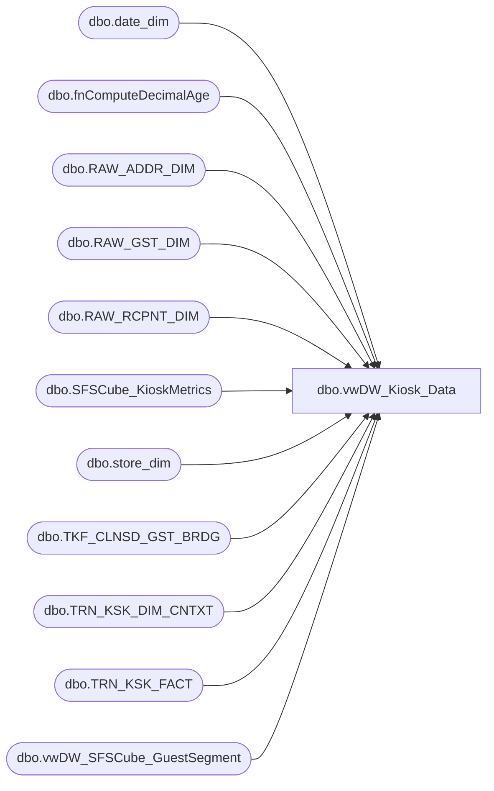

# dbo.vwDW_Kiosk_Data

**Database:** dw  
**Server:** papamart  

## Architecture Diagram



## Table Dependencies

| Referenced Table |
|---|
| dbo.date_dim |
| dbo.fnComputeDecimalAge |
| dbo.RAW_ADDR_DIM |
| dbo.RAW_GST_DIM |
| dbo.RAW_RCPNT_DIM |
| dbo.SFSCube_KioskMetrics |
| dbo.store_dim |
| dbo.TKF_CLNSD_GST_BRDG |
| dbo.TRN_KSK_DIM_CNTXT |
| dbo.TRN_KSK_FACT |
| dbo.vwDW_SFSCube_GuestSegment |

## View Code

```sql
CREATE VIEW [dbo].[vwDW_Kiosk_Data]
AS SELECT --TOP 1000
       t.STR_ID AS Registered_Store_Key
      ,t.NRST_STR_ID AS Nearest_Store_Key
      ,CASE
            WHEN (a.DRVD_CNTRY_ABBRV IS NOT NULL)
            AND (CASE
                      WHEN a.DRVD_CNTRY_ABBRV = 'GB' THEN 'UK'
                      ELSE a.DRVD_CNTRY_ABBRV
                 END <> regis.country) THEN-2
            WHEN t.tor_dstnc_to_str_qty IS NULL THEN-1
            WHEN t.TOR_DSTNC_TO_STR_QTY > 100 THEN 101
            ELSE CAST(t.TOR_DSTNC_TO_STR_QTY AS int)
       END AS Distance_To_Store_Key
      ,ISNULL(t.TOR_DSTNC_TO_STR_QTY, 0) AS Distance_To_Store
      ,t.DT_ID AS date_key
      ,CASE
            WHEN c.GIFT_IND = 'Y' THEN 1
            ELSE 0
       END AS isGift
      ,CASE
            WHEN c.PRTY_TRN_IND = 'Y' THEN 1
            ELSE 0
       END AS isParty
      ,CASE
            WHEN a.DRVD_CNTRY_ABBRV = 'GB' THEN 'UK'
            ELSE a.DRVD_CNTRY_ABBRV
       END AS DRVD_CNTRY_ABBRV
      ,r.DRVD_GNDR_CD AS Registered_GNDR_CD
      ,ISNULL(recip.DRVD_GNDR_CD, 'U') AS Recepient_GNDR_CD
      --,CASE
      --      WHEN RECIP.BRTH_DT IS NULL THEN-1
      --      WHEN DATEDIFF(year, RECIP.BRTH_DT, DTE.actual_date) > 100 THEN 101
      --      ELSE ABS(DATEDIFF(year, RECIP.BRTH_DT, DTE.actual_date))
      -- END AS Recepient_Age
      , dw.dbo.fnComputeDecimalAge(RECIP.BRTH_DT, DTE.actual_date) AS Recepient_Age
      --,CASE
      --      WHEN r.BRTH_DT IS NULL THEN-1
      --      WHEN DATEDIFF(year, r.BRTH_DT, DTE.actual_date) > 100 THEN 101
      --      ELSE ABS(DATEDIFF(year, r.BRTH_DT, DTE.actual_date))
      -- END AS Registered_Age
      , dw.dbo.fnComputeDecimalAge(r.BRTH_DT, DTE.actual_date) AS Registered_Age
      ,c.ADDR_VST_RECUR_CD
      ,c.GST_VST_RECUR_CD
      , ISNULL(GS12.GS_ID,-1) AS GuestSegment12Months
      , ISNULL(GS24.GS_ID,-1) AS GuestSegment24Months
   FROM
       dbo.TRN_KSK_FACT AS t WITH (nolock)
   LEFT OUTER JOIN dbo.TKF_CLNSD_GST_BRDG AS b WITH (nolock)
       ON t.TKF_ID = b.TKF_ID
   LEFT OUTER JOIN dbo.TRN_KSK_DIM_CNTXT AS c WITH (nolock)
       ON t.TRN_KSK_CNTXT_ID = c.TRN_KSK_CNTXT_ID
   LEFT OUTER JOIN dbo.RAW_GST_DIM AS r WITH (nolock)
       ON t.RAW_GST_ID = r.RAW_GST_ID
   LEFT OUTER JOIN dbo.RAW_ADDR_DIM AS a WITH (nolock)
       ON r.RAW_ADDR_ID = a.RAW_ADDR_ID
   LEFT OUTER JOIN dbo.store_dim AS regis WITH (nolock)
       ON t.STR_ID = regis.store_key
   INNER JOIN dbo.date_dim AS DTE WITH (NOLOCK)
       ON t.DT_ID = DTE.date_key
   LEFT OUTER JOIN dbo.RAW_RCPNT_DIM AS RECIP WITH (NOLOCK)
       ON t.RAW_RCPNT_ID = RECIP.RAW_RCPNT_ID
   LEFT JOIN queries.dbo.SFSCube_KioskMetrics AS KM WITH (NOLOCK)
		ON b.clnsd_gst_id = KM.clnsd_gst_id
		AND t.dt_id = km.dt_id
   LEFT JOIN dbo.vwDW_SFSCube_GuestSegment GS12 WITH (NOLOCK)		
		ON km.[12MoVisit] BETWEEN GS12.minVisits AND GS12.maxVisits
   LEFT JOIN dbo.vwDW_SFSCube_GuestSegment GS24 WITH (NOLOCK)		
		ON km.[24MoVisit] BETWEEN GS24.minVisits AND GS24.maxVisits		
   WHERE
   1 = 1
   --AND (t.STR_ID = 1)
   AND (t.DT_ID > 4019)
```

