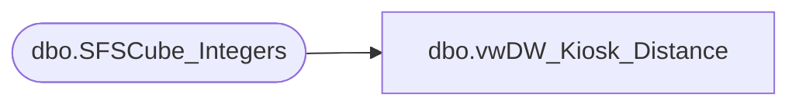

# dbo.vwDW_Kiosk_Distance

**Database:** dw  
**Server:** papamart  

## Architecture Diagram



## Table Dependencies

| Referenced Table |
|---|
| dbo.SFSCube_Integers |

## View Code

```sql
CREATE VIEW [dbo].[vwDW_Kiosk_Distance]
AS SELECT TOP (100) PERCENT
       Number AS Distance
      ,CASE
            WHEN x.number = -2 THEN 'Foreign'
            WHEN x.number = -1 THEN 'Unknown'
            WHEN x.number < 30 THEN '0-30'
            WHEN x.number < 50 THEN '30-50'
            WHEN x.number < 100 THEN '50-100'
            ELSE '100 +'
       END AS BandTourismDescr
      ,CASE
            WHEN x.number = -2 THEN 800
            WHEN x.number = -1 THEN 900
            WHEN x.number < 30 THEN 10
            WHEN x.number < 50 THEN 20
            WHEN x.number < 100 THEN 30
            ELSE 40
       END AS BandTourismSeq
      ,CASE
            WHEN x.number = -2 THEN 'Foreign'
            WHEN x.number = -1 THEN 'Unknown'
            WHEN x.number < 5 THEN '0-5'
            WHEN x.number < 10 THEN '5-10'
            WHEN x.number < 15 THEN '10-15'
            WHEN x.number < 20 THEN '15-20'
            WHEN x.number < 25 THEN '20-25'
            WHEN x.number < 50 THEN '25-50'
            WHEN x.number < 75 THEN '50-75'
            WHEN x.number < 100 THEN '75-100'
            ELSE '100 +'
       END AS Band_5_25Descr
      ,CASE
            WHEN x.number = -2 THEN 800
            WHEN x.number = -1 THEN 900
            WHEN x.number < 5 THEN 10
            WHEN x.number < 10 THEN 20
            WHEN x.number < 15 THEN 30
            WHEN x.number < 20 THEN 40
            WHEN x.number < 25 THEN 50
            WHEN x.number < 50 THEN 60
            WHEN x.number < 75 THEN 70
            WHEN x.number < 100 THEN 80
            ELSE 90
       END AS Band_5_25Seq
   FROM
       (SELECT
            Number
        FROM
            queries.dbo.SFSCube_Integers WITH (NOLOCK)
        WHERE
            (Number <= 101)
        UNION ALL
        SELECT
            -1 AS Expr1 -- Unknown
        UNION ALL
        SELECT
            -2 AS Expr1 -- Foreign 
            ) AS X
ORDER BY
       Number
```

