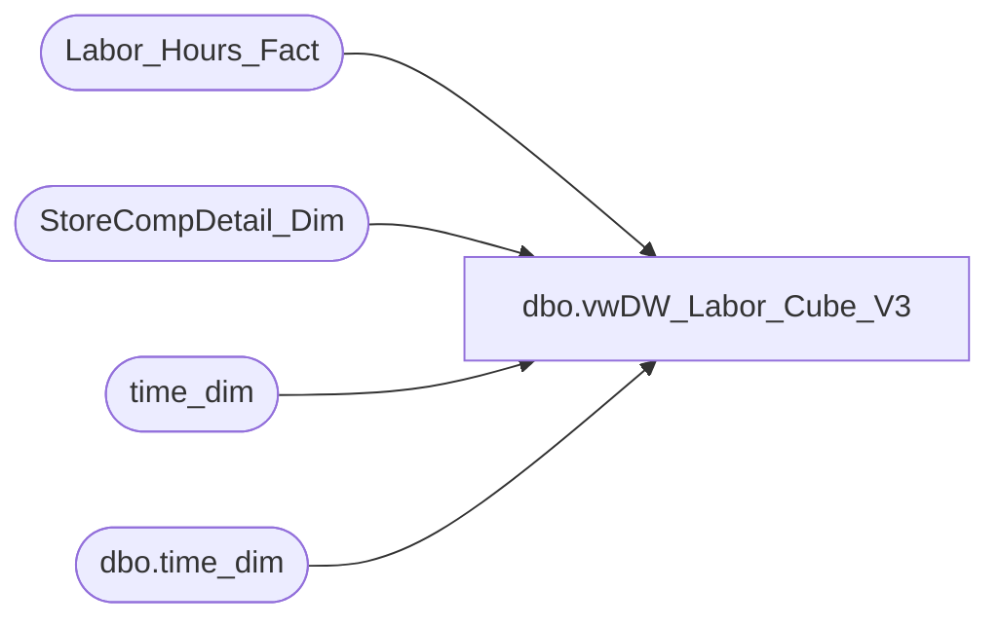

# dbo.vwDW_Labor_Cube_V3

**Database:** dw  
**Server:** papamart  

## Architecture Diagram



## Table Dependencies

| Referenced Table |
|---|
| Labor_Hours_Fact |
| StoreCompDetail_Dim |
| time_dim |
| dbo.time_dim |

## View Code

```sql
CREATE VIEW [dbo].[vwDW_Labor_Cube_V3]
AS
-- =============================================================================================================
-- Name: [dbo].[vwDW_Labor_Cube_V2]
--
-- Description: View underlying the SSAS Labor Cube used on the dashboard.   
-- Aggregates Labor metrics by store and date
--
--	NOTE NOTE NOTE NOTE
--	 This is a long join
--
-- Dependencies: 
--
-- Revision History
--		Name:				Date:			Comments:
--		Gary Murrish		5/24/2012		Flagged transactions using ShopperTrak
--		Gary Murrish		5/7/2012		Initial deployment
--		Dan Tweedie			06/29/2016		--		Dan Tweedie			06/29/2016		Removed 'AND td.hour BETWEEN cmp.ShopperTrakStartHour AND cmp.ShopperTrakEndHour'  so no longer filtering by this
--		Dan Tweedie			2020-08-25		Trying to make view return results faster, turned view into CTE, left original view commented out
-- =============================================================================================================


With
TimeOne as
	(
		SELECT
			time_key,
			CAST(CAST([hour] AS varchar) + ':' + CAST([minute] AS varchar) AS datetime) AS minTime,
			CAST(CAST([hour] AS varchar) + ':' + CAST([minute] + 29 AS varchar) + ':59' AS datetime) AS maxTime,
			0 AS offsetDate
		FROM
			dbo.time_dim AS td WITH (NOLOCK)
		WHERE
			[minute] IN (0, 30)
		UNION ALL
		SELECT
			time_key,
			DATEADD(D, 1, CAST(CAST([hour] AS varchar) + ':' + CAST([minute] AS varchar) AS datetime)) AS minTime,
			DATEADD(D, 1, CAST(CAST([hour] AS varchar) + ':' + CAST([minute] + 29 AS varchar) + ':59' AS datetime)) AS maxTime,
			1 AS offsetDate
		FROM
			dbo.time_dim AS td WITH (NOLOCK)
		WHERE
			[minute] IN (0, 30)
	),
TimeTwo as
	(
		SELECT
			time_key,
			CAST(CAST([hour] AS varchar) + ':' + CAST([minute] AS varchar) AS datetime) AS minTime,
			CAST(CAST([hour] AS varchar) + ':' + CAST([minute] + 29 AS varchar) + ':59' AS datetime) AS maxTime,
			0 AS offsetDate
		FROM
			dbo.time_dim AS td WITH (NOLOCK)
		WHERE
			([minute] IN (0, 30))
		UNION ALL
		SELECT
			time_key,
			DATEADD(D, 1, CAST(CAST([hour] AS varchar) + ':' + CAST([minute] AS varchar) AS datetime)) AS minTime,
			DATEADD(D, 1, CAST(CAST([hour] AS varchar) + ':' + CAST([minute] + 29 AS varchar) + ':59' AS datetime)) AS maxTime,
			1 AS offsetDate
		FROM
			dbo.time_dim AS td WITH (NOLOCK)
		WHERE
			[minute] IN (0, 30)
	),
LaborOne as
	(
		SELECT
			lhf.recID,
			lhf.store_key,
			lhf.date_key,
			lhf.emp_key,
			lhf.job_key,
			lhf.HOURTYPE_KEY,
			lhf.timecode_key,
			lhf.start_Time,
			lhf.end_Time,
			lhf.wrkd_minutes,
			lhf.source_system,
			lhf.INS_DT,
			lhf.ETL_LOG_ID,
			lhf.ETL_EVNT_ID
		FROM
			Labor_Hours_Fact lhf WITH (NOLOCK)
			WHERE lhf.start_Time<> lhf.end_Time
	),
LaborTwo as
	(
		SELECT
			lhf.recID,
			lhf.store_key,
			lhf.date_key,
			lhf.emp_key,
			lhf.job_key,
			lhf.HOURTYPE_KEY,
			lhf.timecode_key,
			lhf.start_Time,
			lhf.end_Time,
			lhf.wrkd_minutes,
			lhf.source_system,
			lhf.INS_DT,
			lhf.ETL_LOG_ID,
			lhf.ETL_EVNT_ID
		FROM
			Labor_Hours_Fact lhf WITH (NOLOCK)
		WHERE
			start_Time = lhf.end_Time
	)
SELECT
	l1.store_key,
	l1.date_key + t1.offsetDate AS date_key,
	t1.time_key,
	CASE
		WHEN t1.minTime <= l1.start_Time AND
		t1.maxTime <= l1.end_Time THEN DATEDIFF(MINUTE, l1.start_Time, t1.maxTime) + 1
		WHEN t1.mintime <= l1.start_Time AND
		t1.maxTime > l1.end_Time THEN DATEDIFF(MINUTE, l1.start_Time, l1.end_Time)
		WHEN t1.mintime > l1.start_Time AND
		t1.maxTime >= l1.end_Time THEN DATEDIFF(MINUTE, t1.minTime, l1.end_Time)
		WHEN t1.mintime > l1.start_Time AND
		t1.maxTime < l1.end_Time THEN DATEDIFF(MINUTE, t1.minTime, t1.maxTime) + 1
		ELSE -99
	END AS minsWorked,
	l1.emp_key,
	l1.HOURTYPE_KEY,
	l1.timecode_key,
	l1.job_key,
	CAST(CASE
		WHEN cmp.isShopperTrak IS NULL THEN 0
		WHEN cmp.isShopperTrak = 1 
			THEN 1
		ELSE 0
	END AS smallint) AS isShopperTrak,
	1 AS calc,
	CAST(CASE
		WHEN cmp.isShopperTrakCompTY IS NULL THEN 0
		WHEN cmp.isShopperTrakCompTY = 1 
		THEN 1
		ELSE 0
	END AS integer) AS isSTComp,
	CAST(CASE
		WHEN cmp.isShopperTrakCompNY IS NULL THEN 0
		WHEN cmp.isShopperTrakCompNY = 1 
			THEN 1
		ELSE 0
	END AS integer) AS isSTCompNextYear,
	CAST(ISNULL(cmp.isCompTY, 0) AS integer) AS isComp,
	CAST(ISNULL(cmp.isCompNY, 0) AS integer) AS isCompNextYear,
	CAST(ISNULL(cmp.isSOTF, 0) AS integer) AS isSOTF

FROM LaborOne l1
join TimeOne t1 
	ON l1.start_Time < t1.maxTime
	AND l1.end_Time > t1.minTime
LEFT JOIN StoreCompDetail_Dim cmp WITH (NOLOCK)
		ON cmp.store_key = l1.store_key
		AND cmp.date_key = l1.date_key
	INNER JOIN time_dim td WITH (NOLOCK)
		ON td.time_key = t1.time_key
UNION ALL
SELECT
	l2.store_key,
	l2.date_key + t2.offsetDate AS date_key,
	t2.time_key,
	l2.wrkd_minutes AS minsWorked,
	l2.emp_key,
	l2.HOURTYPE_KEY,
	l2.timecode_key,
	l2.job_key,
	CAST(CASE
		WHEN cmp.isShopperTrak IS NULL THEN 0
		WHEN cmp.isShopperTrak = 1 
			THEN 1
		ELSE 0
	END AS smallint) AS isShopperTrak,
	1 AS calc,
	CAST(CASE
		WHEN cmp.isShopperTrakCompTY IS NULL THEN 0
		WHEN cmp.isShopperTrakCompTY = 1 
			THEN 1
		ELSE 0
	END AS integer) AS isSTComp,
	CAST(CASE
		WHEN cmp.isShopperTrakCompNY IS NULL THEN 0
		WHEN cmp.isShopperTrakCompNY = 1 
			THEN 1
		ELSE 0
	END AS integer) AS isSTCompNextYear,
	CAST(ISNULL(cmp.isCompTY, 0) AS integer) AS isComp,
	CAST(ISNULL(cmp.isCompNY, 0) AS integer) AS isCompNextYear,
	CAST(ISNULL(cmp.isSOTF, 0) AS integer) AS isSOTF

FROM LaborTwo l2
join TimeTwo t2 ON l2.start_Time BETWEEN t2.minTime AND t2.maxTime
LEFT JOIN StoreCompDetail_Dim cmp WITH (NOLOCK)
	ON cmp.store_key = l2.store_key
	AND cmp.date_key = l2.date_key
INNER JOIN time_dim td WITH (NOLOCK)
	ON td.time_key = t2.time_key


------==============================
------==============================
------==============================


--SELECT
--	wb.store_key,
--	wb.date_key + tme.offsetDate AS date_key,
--	tme.time_key,
--	CASE
--		WHEN tme.minTime <= wb.start_Time AND
--		tme.maxTime <= wb.end_Time THEN DATEDIFF(MINUTE, wb.start_Time, tme.maxTime) + 1
--		WHEN tme.mintime <= wb.start_Time AND
--		tme.maxTime > wb.end_Time THEN DATEDIFF(MINUTE, wb.start_Time, wb.end_Time)
--		WHEN tme.mintime > wb.start_Time AND
--		tme.maxTime >= wb.end_Time THEN DATEDIFF(MINUTE, tme.minTime, wb.end_Time)
--		WHEN tme.mintime > wb.start_Time AND
--		tme.maxTime < wb.end_Time THEN DATEDIFF(MINUTE, tme.minTime, tme.maxTime) + 1
--		ELSE -99
--	END AS minsWorked,
--	wb.emp_key,
--	wb.HOURTYPE_KEY,
--	wb.timecode_key,
--	wb.job_key,
--	CAST(CASE
--		WHEN cmp.isShopperTrak IS NULL THEN 0
--		WHEN cmp.isShopperTrak = 1 
--		--AND td.hour BETWEEN cmp.ShopperTrakStartHour AND cmp.ShopperTrakEndHour 
--			THEN 1
--		ELSE 0
--	END AS smallint) AS isShopperTrak,
--	1 AS calc,
--	CAST(CASE
--		WHEN cmp.isShopperTrakCompTY IS NULL THEN 0
--		WHEN cmp.isShopperTrakCompTY = 1 
--		--AND td.hour BETWEEN cmp.ShopperTrakStartHour AND cmp.ShopperTrakEndHour 
--		THEN 1
--		ELSE 0
--	END AS integer) AS isSTComp,
--	CAST(CASE
--		WHEN cmp.isShopperTrakCompNY IS NULL THEN 0
--		WHEN cmp.isShopperTrakCompNY = 1 
--		--AND td.hour BETWEEN cmp.ShopperTrakStartHour AND cmp.ShopperTrakEndHour 
--			THEN 1
--		ELSE 0
--	END AS integer) AS isSTCompNextYear,
--	CAST(ISNULL(cmp.isCompTY, 0) AS integer) AS isComp,
--	CAST(ISNULL(cmp.isCompNY, 0) AS integer) AS isCompNextYear,
--	CAST(ISNULL(cmp.isSOTF, 0) AS integer) AS isSOTF

--FROM
--	(SELECT
--			lhf.recID,
--			lhf.store_key,
--			lhf.date_key,
--			lhf.emp_key,
--			lhf.job_key,
--			lhf.HOURTYPE_KEY,
--			lhf.timecode_key,
--			lhf.start_Time,
--			lhf.end_Time,
--			lhf.wrkd_minutes,
--			lhf.source_system,
--			lhf.INS_DT,
--			lhf.ETL_LOG_ID,
--			lhf.ETL_EVNT_ID
--		FROM
--			Labor_Hours_Fact lhf WITH (NOLOCK)
--			WHERE lhf.start_Time<> lhf.end_Time) wb
--	INNER JOIN (SELECT
--			time_key,
--			CAST(CAST([hour] AS varchar) + ':' + CAST([minute] AS varchar) AS datetime) AS minTime,
--			CAST(CAST([hour] AS varchar) + ':' + CAST([minute] + 29 AS varchar) + ':59' AS datetime) AS maxTime,
--			0 AS offsetDate
--		FROM
--			dbo.time_dim AS td WITH (NOLOCK)
--		WHERE
--			([minute] IN (0, 30))
--		UNION ALL
--		SELECT
--			time_key,
--			DATEADD(D, 1, CAST(CAST([hour] AS varchar) + ':' + CAST([minute] AS varchar) AS datetime)) AS minTime,
--			DATEADD(D, 1, CAST(CAST([hour] AS varchar) + ':' + CAST([minute] + 29 AS varchar) + ':59' AS datetime)) AS maxTime,
--			1 AS offsetDate
--		FROM
--			dbo.time_dim AS td WITH (NOLOCK)
--		WHERE
--			([minute] IN (0, 30))) AS tme
--		ON wb.start_Time < tme.maxTime
--		AND wb.end_Time > tme.minTime
--	LEFT JOIN StoreCompDetail_Dim cmp WITH (NOLOCK)
--		ON cmp.store_key = wb.store_key
--		AND cmp.date_key = wb.date_key
--	INNER JOIN time_dim td WITH (NOLOCK)
--		ON td.time_key = tme.time_key

--UNION ALL

--SELECT
--	wb.store_key,
--	wb.date_key + tme.offsetDate AS date_key,
--	tme.time_key,
--	wb.wrkd_minutes AS minsWorked,
--	wb.emp_key,
--	wb.HOURTYPE_KEY,
--	wb.timecode_key,
--	wb.job_key,
--	CAST(CASE
--		WHEN cmp.isShopperTrak IS NULL THEN 0
--		WHEN cmp.isShopperTrak = 1 
--		--AND td.hour BETWEEN cmp.ShopperTrakStartHour AND cmp.ShopperTrakEndHour 
--			THEN 1
--		ELSE 0
--	END AS smallint) AS isShopperTrak,
--	1 AS calc,
--	CAST(CASE
--		WHEN cmp.isShopperTrakCompTY IS NULL THEN 0
--		WHEN cmp.isShopperTrakCompTY = 1 
--		--AND td.hour BETWEEN cmp.ShopperTrakStartHour AND cmp.ShopperTrakEndHour 
--			THEN 1
--		ELSE 0
--	END AS integer) AS isSTComp,
--	CAST(CASE
--		WHEN cmp.isShopperTrakCompNY IS NULL THEN 0
--		WHEN cmp.isShopperTrakCompNY = 1 
--		--AND td.hour BETWEEN cmp.ShopperTrakStartHour AND cmp.ShopperTrakEndHour 
--			THEN 1
--		ELSE 0
--	END AS integer) AS isSTCompNextYear,
--	CAST(ISNULL(cmp.isCompTY, 0) AS integer) AS isComp,
--	CAST(ISNULL(cmp.isCompNY, 0) AS integer) AS isCompNextYear,
--	CAST(ISNULL(cmp.isSOTF, 0) AS integer) AS isSOTF

--FROM
--	(SELECT
--			lhf.recID,
--			lhf.store_key,
--			lhf.date_key,
--			lhf.emp_key,
--			lhf.job_key,
--			lhf.HOURTYPE_KEY,
--			lhf.timecode_key,
--			lhf.start_Time,
--			lhf.end_Time,
--			lhf.wrkd_minutes,
--			lhf.source_system,
--			lhf.INS_DT,
--			lhf.ETL_LOG_ID,
--			lhf.ETL_EVNT_ID
--		FROM
--			Labor_Hours_Fact lhf WITH (NOLOCK)
--		WHERE
--			start_Time = lhf.end_Time) wb
--	INNER JOIN (SELECT
--			time_key,
--			CAST(CAST([hour] AS varchar) + ':' + CAST([minute] AS varchar) AS datetime) AS minTime,
--			CAST(CAST([hour] AS varchar) + ':' + CAST([minute] + 29 AS varchar) + ':59' AS datetime) AS maxTime,
--			0 AS offsetDate
--		FROM
--			dbo.time_dim AS td WITH (NOLOCK)
--		WHERE
--			([minute] IN (0, 30))
--		UNION ALL
--		SELECT
--			time_key,
--			DATEADD(D, 1, CAST(CAST([hour] AS varchar) + ':' + CAST([minute] AS varchar) AS datetime)) AS minTime,
--			DATEADD(D, 1, CAST(CAST([hour] AS varchar) + ':' + CAST([minute] + 29 AS varchar) + ':59' AS datetime)) AS maxTime,
--			1 AS offsetDate
--		FROM
--			dbo.time_dim AS td WITH (NOLOCK)
--		WHERE
--			([minute] IN (0, 30))) AS tme
--		ON wb.start_Time BETWEEN tme.minTime AND tme.maxTime
--	LEFT JOIN StoreCompDetail_Dim cmp WITH (NOLOCK)
--		ON cmp.store_key = wb.store_key
--		AND cmp.date_key = wb.date_key
--	INNER JOIN time_dim td WITH (NOLOCK)
--		ON td.time_key = tme.time_key
```

