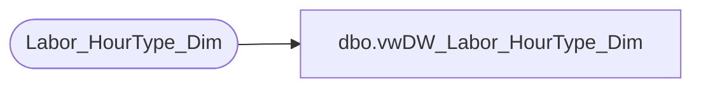

# dbo.vwDW_Labor_HourType_Dim

**Database:** dw  
**Server:** papamart  

## Architecture Diagram



## Table Dependencies

| Referenced Table |
|---|
| Labor_HourType_Dim |

## View Code

```sql
CREATE VIEW [dbo].[vwDW_Labor_HourType_Dim]
AS
-- =============================================================================================================
-- Name: [dbo].[vwDW_Labor_HourType_Dim]
--
-- Description: View HourType Dimension used in the Cube
-- Classifies the Type of Labor Hours.
--
--
-- Dependencies: 
--
-- Revision History
--		Name:				Date:			Comments:
--		Gary Murrish		5/7/2012		Initial deployment
-- =============================================================================================================
SELECT HourType_key
	 , descr
	 , CASE WHEN isPaid = 1 THEN 'Paid' ELSE 'Not Paid' END AS isPaid
FROM
	Labor_HourType_Dim  WITH (NOLOCK)
```

