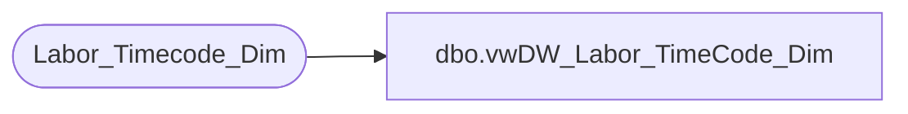

# dbo.vwDW_Labor_TimeCode_Dim

**Database:** dw  
**Server:** papamart  

## Architecture Diagram



## Table Dependencies

| Referenced Table |
|---|
| Labor_Timecode_Dim |

## View Code

```sql
CREATE VIEW [dbo].[vwDW_Labor_TimeCode_Dim]
AS
-- =============================================================================================================
-- Name: [dbo].[vwDW_Labor_TimeCode_Dim]
--
-- Description: View TimeCode Dimension used in the Cube
-- Classifies the Type of Labor Hours.
--
--
-- Dependencies: 
--
-- Revision History
--		Name:				Date:			Comments:
--		Gary Murrish		5/7/2012		Initial deployment
-- =============================================================================================================
SELECT timeCode_key
	 , descr
	 , abrv
	 , CASE WHEN isWork = 1 THEN 'Work' ELSE 'Not Work' END AS isWork
FROM
	Labor_Timecode_Dim  WITH (NOLOCK)
```

