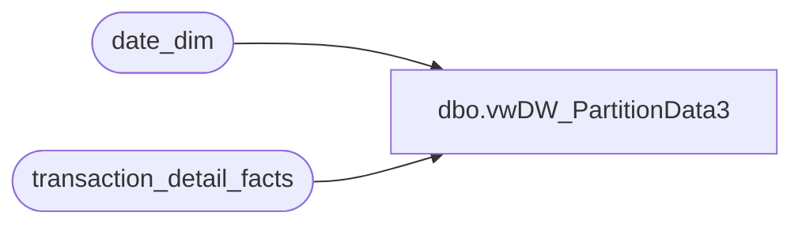

# dbo.vwDW_PartitionData3

**Database:** dw  
**Server:** papamart  

## Architecture Diagram



## Table Dependencies

| Referenced Table |
|---|
| date_dim |
| transaction_detail_facts |

## View Code

```sql
--ALTER VIEW [dbo].[vwDW_PartitionData3_dev_4_RZ]
CREATE VIEW [dbo].[vwDW_PartitionData3]
AS

	-- BAB stores
	SELECT 'BAB DW' AS DataSourceID, 'Papa Mart' AS CubeName, 'Papa Mart' AS CubeID, 
			'Transactions' AS MeasureGroup, 'Transaction Detail Rollup' AS MeasureGroupID, 
			'Transactions_' + CAST(d.fiscal_year AS varchar) + '_' + RIGHT('0' + CAST(d.fiscal_period AS varchar), 2) AS Partition,
			'SELECT * FROM [dbo].[vwDW_Transactions] WHERE date_key &gt;= ' + CAST(min_date_key AS varchar) + ' AND date_key &lt;= ' + CAST(max_date_key AS varchar) AS SQL,
			CONVERT(VARCHAR(10), d.min_date_key) AS min_date_key,
			CONVERT(VARCHAR(10), d.max_date_key) AS max_date_key,
			CASE
				WHEN d.period_id > d.current_period_id - 2 THEN 1
				ELSE 0
			END AS ProcessFlag,
			'1000000' AS EstimatedRows,
			'AggregationDesign' AS AggregationDesignID,
			'[Date].[Fiscal].[Fiscal Period].&amp;[' + CAST(d.fiscal_year AS varchar) + ' ' + RIGHT('0' + CAST(d.fiscal_period AS varchar), 2) + ']' AS PartitionSlice
	FROM
		(SELECT fiscal_year, fiscal_period, period_id,
			(SELECT fiscal_year FROM date_dim WHERE actual_date = convert(datetime, convert(char(10), getdate(), 101))) AS current_fiscal_year,
			(SELECT fiscal_period FROM date_dim WHERE actual_date = convert(datetime, convert(char(10), getdate(), 101))) AS current_fiscal_period,
			(SELECT period_id FROM date_dim WHERE actual_date = convert(datetime, convert(char(10), getdate(), 101))) AS current_period_id,
			(SELECT MIN(date_key) FROM date_dim d2 WHERE d2.fiscal_year = d.fiscal_year AND d2.fiscal_period = d.fiscal_period) min_date_key, 
			(SELECT MAX(date_key) FROM date_dim d2 WHERE d2.fiscal_year = d.fiscal_year AND d2.fiscal_period = d.fiscal_period) max_date_key
		FROM (SELECT DISTINCT fiscal_year, fiscal_period, period_id FROM date_dim WHERE date_key >= (SELECT MIN(date_key) FROM date_dim d WHERE fiscal_year = (SELECT fiscal_year - 3 FROM date_dim d2 WHERE actual_date = convert(datetime, convert(char(10), getdate(), 101))))) d) d
	WHERE EXISTS (SELECT TOP 1 *
					FROM transaction_detail_facts
					WHERE date_key BETWEEN d.min_date_key AND d.max_date_key)

	UNION

	SELECT 'BAB DW' AS DataSourceID, 'Papa Mart' AS CubeName, 'Papa Mart' AS CubeID, 
			'Transactions' AS MeasureGroup, 'Transaction Detail Rollup' AS MeasureGroupID, 
			'Transactions_Franchisees' AS Partition,
			'SELECT * FROM dw.dbo.vwDW_fact_franchisee_transactions' AS SQL,
			'1' AS min_date_key,
			'9999' AS max_date_key,
			0 ProcessFlag,
			'1000000' AS EstimatedRows,
			'AggregationDesign' AS AggregationDesignID,
			'[Date].[Fiscal].[All]' AS PartitionSlice

	-- SFS Guests 

	UNION

	SELECT 'BAB DW' AS DataSourceID, 'Papa Mart' AS CubeName, 'Papa Mart' AS CubeID, 
			'SFS Guest Facts' AS MeasureGroup, 'Vw DW SFS Gsts' AS MeasureGroupID, 
			'NewSFSGsts_' + CAST(d.fiscal_year AS varchar) + '_' + RIGHT('0' + CAST(d.fiscal_period AS varchar), 2) AS Partition,
			'SELECT * FROM [dbo].[vwDW_SFSGsts] WHERE date_key &gt;= ' + CAST(min_date_key AS varchar) + ' AND date_key &lt;= ' + CAST(max_date_key AS varchar) AS SQL,
			CONVERT(VARCHAR(10), d.min_date_key) AS min_date_key,
			CONVERT(VARCHAR(10), d.max_date_key) AS max_date_key,
			CASE
				WHEN d.period_id > d.current_period_id - 2 THEN 1
				ELSE 0
			END AS ProcessFlag,
			'1000000' AS EstimatedRows,
			'AggregationDesign' AS AggregationDesignID,
			'[Date].[Fiscal].[Fiscal Period].&amp;[' + CAST(d.fiscal_year AS varchar) + ' ' + RIGHT('0' + CAST(d.fiscal_period AS varchar), 2) + ']' AS PartitionSlice
	FROM
		(SELECT fiscal_year, fiscal_period, period_id,
			(SELECT fiscal_year FROM date_dim WHERE actual_date = convert(datetime, convert(char(10), getdate(), 101))) AS current_fiscal_year,
			(SELECT fiscal_period FROM date_dim WHERE actual_date = convert(datetime, convert(char(10), getdate(), 101))) AS current_fiscal_period,
			(SELECT period_id FROM date_dim WHERE actual_date = convert(datetime, convert(char(10), getdate(), 101))) AS current_period_id,
			(SELECT MIN(date_key) FROM date_dim d2 WHERE d2.fiscal_year = d.fiscal_year AND d2.fiscal_period = d.fiscal_period) min_date_key, 
			(SELECT MAX(date_key) FROM date_dim d2 WHERE d2.fiscal_year = d.fiscal_year AND d2.fiscal_period = d.fiscal_period) max_date_key
		FROM (SELECT DISTINCT fiscal_year, fiscal_period, period_id FROM date_dim WHERE date_key >= (SELECT MIN(date_key) FROM date_dim d WHERE fiscal_year = (SELECT fiscal_year - 3 FROM date_dim d2 WHERE actual_date = convert(datetime, convert(char(10), getdate(), 101))))) d) d
	WHERE EXISTS (SELECT TOP 1 *
					FROM transaction_detail_facts
					WHERE date_key BETWEEN d.min_date_key AND d.max_date_key)
	
  -- SFS Guests with Email

	UNION

	SELECT 'BAB DW' AS DataSourceID, 'Papa Mart' AS CubeName, 'Papa Mart' AS CubeID, 
			'SFS Guest W Email Facts' AS MeasureGroup, 'SFS Gsts W Email' AS MeasureGroupID, 
			'NewSFSGstsWEmail_' + CAST(d.fiscal_year AS varchar) + '_' + RIGHT('0' + CAST(d.fiscal_period AS varchar), 2) AS Partition,
			'SELECT * FROM [dbo].[vwDW_SFSGsts] WHERE date_key &gt;= ' + CAST(min_date_key AS varchar) + ' AND date_key &lt;= ' + CAST(max_date_key AS varchar) AS SQL,
			CONVERT(VARCHAR(10), d.min_date_key) AS min_date_key,
			CONVERT(VARCHAR(10), d.max_date_key) AS max_date_key,
			CASE
				WHEN d.period_id > d.current_period_id - 2 THEN 1
				ELSE 0
			END AS ProcessFlag,
			'1000000' AS EstimatedRows,
			'AggregationDesign' AS AggregationDesignID,
			'[Date].[Fiscal].[Fiscal Period].&amp;[' + CAST(d.fiscal_year AS varchar) + ' ' + RIGHT('0' + CAST(d.fiscal_period AS varchar), 2) + ']' AS PartitionSlice
	FROM
		(SELECT fiscal_year, fiscal_period, period_id,
			(SELECT fiscal_year FROM date_dim WHERE actual_date = convert(datetime, convert(char(10), getdate(), 101))) AS current_fiscal_year,
			(SELECT fiscal_period FROM date_dim WHERE actual_date = convert(datetime, convert(char(10), getdate(), 101))) AS current_fiscal_period,
			(SELECT period_id FROM date_dim WHERE actual_date = convert(datetime, convert(char(10), getdate(), 101))) AS current_period_id,
			(SELECT MIN(date_key) FROM date_dim d2 WHERE d2.fiscal_year = d.fiscal_year AND d2.fiscal_period = d.fiscal_period) min_date_key, 
			(SELECT MAX(date_key) FROM date_dim d2 WHERE d2.fiscal_year = d.fiscal_year AND d2.fiscal_period = d.fiscal_period) max_date_key
		FROM (SELECT DISTINCT fiscal_year, fiscal_period, period_id FROM date_dim WHERE date_key >= (SELECT MIN(date_key) FROM date_dim d WHERE fiscal_year = (SELECT fiscal_year - 3 FROM date_dim d2 WHERE actual_date = convert(datetime, convert(char(10), getdate(), 101))))) d) d
	WHERE EXISTS (SELECT TOP 1 *
					FROM transaction_detail_facts
					WHERE date_key BETWEEN d.min_date_key AND d.max_date_key)
```

