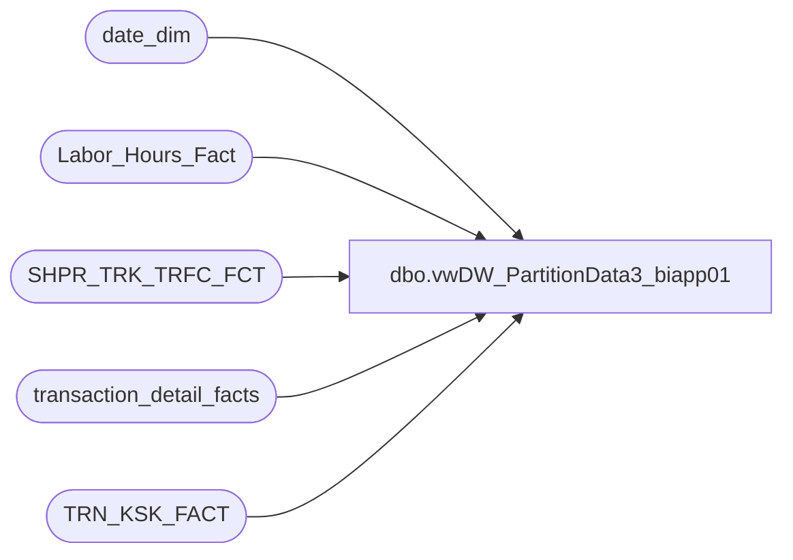

# dbo.vwDW_PartitionData3_biapp01

**Database:** dw  
**Server:** papamart  

## Architecture Diagram



## Table Dependencies

| Referenced Table |
|---|
| date_dim |
| Labor_Hours_Fact |
| SHPR_TRK_TRFC_FCT |
| transaction_detail_facts |
| TRN_KSK_FACT |

## View Code

```sql
CREATE VIEW [dbo].[vwDW_PartitionData3_biapp01]
AS

-- BAB stores
SELECT 'BAB DW' AS DataSourceID
	 , 'Papa Mart' AS CubeName
	 , 'Papa Mart' AS CubeID
	 , 'Transactions' AS MeasureGroup
	 , 'Vw DW Transactions Cube' AS MeasureGroupID
	 , 'Transactions_' + cast(d.fiscal_year AS VARCHAR) + '_' + right('0' + cast(d.fiscal_period AS VARCHAR), 2) AS Partition
	 , 'SELECT * FROM [dbo].[vwDW_Transactions_Cube_V3] with (nolock) WHERE date_key &gt;= ' + cast(min_date_key AS VARCHAR) + ' AND date_key &lt;= ' + cast(max_date_key AS VARCHAR) AS SQL
	 , convert(VARCHAR(10), d.min_date_key) AS min_date_key
	 , convert(VARCHAR(10), d.max_date_key) AS max_date_key
	 , CASE
		   WHEN d.period_id > d.current_period_id - 2 THEN
			   1
		   ELSE
			   0
	   END AS ProcessFlag
	 , '1000000' AS EstimatedRows
	 , 'TransAggNew' AS AggregationDesignID
	 , '[Date].[Fiscal].[Fiscal Period].&amp;[' + cast(d.fiscal_year AS VARCHAR) + ' ' + right('0' + cast(d.fiscal_period AS VARCHAR), 2) + ']' AS PartitionSlice
FROM
	(
	 SELECT fiscal_year
		  , fiscal_period
		  , period_id
		  , (
			 SELECT fiscal_year
			 FROM
				 date_dim
			 WHERE
				 actual_date = convert(DATETIME, convert(CHAR(10), getdate(), 101))) AS current_fiscal_year
		  , (
			 SELECT fiscal_period
			 FROM
				 date_dim
			 WHERE
				 actual_date = convert(DATETIME, convert(CHAR(10), getdate(), 101))) AS current_fiscal_period
		  , (
			 SELECT period_id
			 FROM
				 date_dim
			 WHERE
				 actual_date = convert(DATETIME, convert(CHAR(10), getdate(), 101))) AS current_period_id
		  , (
			 SELECT min(date_key)
			 FROM
				 date_dim d2
			 WHERE
				 d2.fiscal_year = d.fiscal_year
				 AND d2.fiscal_period = d.fiscal_period) min_date_key
		  , (
			 SELECT max(date_key)
			 FROM
				 date_dim d2
			 WHERE
				 d2.fiscal_year = d.fiscal_year
				 AND d2.fiscal_period = d.fiscal_period) max_date_key
	 FROM
		 (
		  SELECT DISTINCT fiscal_year
						, fiscal_period
						, period_id
		  FROM
			  date_dim
		  WHERE
			  date_key >= (
						   SELECT min(date_key)
						   FROM
							   date_dim d
						   WHERE
							   fiscal_year = (
											  SELECT fiscal_year - 1
											  FROM
												  date_dim d2
											  WHERE
												  actual_date = convert(DATETIME, convert(CHAR(10), getdate(), 101))))) d) d
WHERE
	EXISTS (
			SELECT TOP 1 *
			FROM
				transaction_detail_facts
			WHERE
				date_key BETWEEN d.min_date_key AND d.max_date_key)

UNION
SELECT 'BAB DW' AS DataSourceID
	 , 'Papa Mart' AS CubeName
	 , 'Papa Mart' AS CubeID
	 , 'Transactions' AS MeasureGroup
	 , 'Vw DW Transactions Cube' AS MeasureGroupID
	 , 'Transactions_Franchisees' AS Partition
	 , 'SELECT * FROM dw.dbo.vwDW_Transactions_Cube_Franchisees with (nolock)' AS SQL
	 , '1' AS min_date_key
	 , '9999' AS max_date_key
	 , 0 ProcessFlag
	 , '1000000' AS EstimatedRows
	 , 'TransAggNew' AS AggregationDesignID
	 , '[Date].[Fiscal].[All]' AS PartitionSlice

-- SFS Guests 

UNION
SELECT 'BAB DW' AS DataSourceID
	 , 'Papa Mart' AS CubeName
	 , 'Papa Mart' AS CubeID
	 , 'SFS Guest Facts' AS MeasureGroup
	 , 'Vw DW SFS Gsts' AS MeasureGroupID
	 , 'NewSFSGsts_' + cast(d.fiscal_year AS VARCHAR) + '_' + right('0' + cast(d.fiscal_period AS VARCHAR), 2) AS Partition
	 , 'SELECT * FROM [dbo].[vwDW_SFSGsts] with (nolock) WHERE date_key &gt;= ' + cast(min_date_key AS VARCHAR) + ' AND date_key &lt;= ' + cast(max_date_key AS VARCHAR) AS SQL
	 , convert(VARCHAR(10), d.min_date_key) AS min_date_key
	 , convert(VARCHAR(10), d.max_date_key) AS max_date_key
	 , CASE
		   WHEN d.period_id > d.current_period_id - 2 THEN
			   1
		   ELSE
			   0
	   END AS ProcessFlag
	 , '1000000' AS EstimatedRows
	 , 'AggSFSGuests' AS AggregationDesignID
	 , '[Date].[Fiscal].[Fiscal Period].&amp;[' + cast(d.fiscal_year AS VARCHAR) + ' ' + right('0' + cast(d.fiscal_period AS VARCHAR), 2) + ']' AS PartitionSlice
FROM
	(
	 SELECT fiscal_year
		  , fiscal_period
		  , period_id
		  , (
			 SELECT fiscal_year
			 FROM
				 date_dim
			 WHERE
				 actual_date = convert(DATETIME, convert(CHAR(10), getdate(), 101))) AS current_fiscal_year
		  , (
			 SELECT fiscal_period
			 FROM
				 date_dim
			 WHERE
				 actual_date = convert(DATETIME, convert(CHAR(10), getdate(), 101))) AS current_fiscal_period
		  , (
			 SELECT period_id
			 FROM
				 date_dim
			 WHERE
				 actual_date = convert(DATETIME, convert(CHAR(10), getdate(), 101))) AS current_period_id
		  , (
			 SELECT min(date_key)
			 FROM
				 date_dim d2
			 WHERE
				 d2.fiscal_year = d.fiscal_year
				 AND d2.fiscal_period = d.fiscal_period) min_date_key
		  , (
			 SELECT max(date_key)
			 FROM
				 date_dim d2
			 WHERE
				 d2.fiscal_year = d.fiscal_year
				 AND d2.fiscal_period = d.fiscal_period) max_date_key
	 FROM
		 (
		  SELECT DISTINCT fiscal_year
						, fiscal_period
						, period_id
		  FROM
			  date_dim
		  WHERE
			  date_key >= (
						   SELECT min(date_key)
						   FROM
							   date_dim d
						   WHERE
							   fiscal_year = (
											  SELECT fiscal_year - 1
											  FROM
												  date_dim d2
											  WHERE
												  actual_date = convert(DATETIME, convert(CHAR(10), getdate(), 101))))) d) d
WHERE
	EXISTS (
			SELECT TOP 1 *
			FROM
				transaction_detail_facts
			WHERE
				date_key BETWEEN d.min_date_key AND d.max_date_key)

-- SFS Guests with Email

UNION
SELECT 'BAB DW' AS DataSourceID
	 , 'Papa Mart' AS CubeName
	 , 'Papa Mart' AS CubeID
	 , 'SFS Guest W Email Facts' AS MeasureGroup
	 , 'SFS Gsts W Email' AS MeasureGroupID
	 , 'NewSFSGstsWEmail_' + cast(d.fiscal_year AS VARCHAR) + '_' + right('0' + cast(d.fiscal_period AS VARCHAR), 2) AS Partition
	 , 'SELECT * FROM [dbo].[vwDW_SFSGsts] with (nolock) WHERE date_key &gt;= ' + cast(min_date_key AS VARCHAR) + ' AND date_key &lt;= ' + cast(max_date_key AS VARCHAR) AS SQL
	 , convert(VARCHAR(10), d.min_date_key) AS min_date_key
	 , convert(VARCHAR(10), d.max_date_key) AS max_date_key
	 , CASE
		   WHEN d.period_id > d.current_period_id - 2 THEN
			   1
		   ELSE
			   0
	   END AS ProcessFlag
	 , '1000000' AS EstimatedRows
	 , 'AggSFSWEMail' AS AggregationDesignID
	 , '[Date].[Fiscal].[Fiscal Period].&amp;[' + cast(d.fiscal_year AS VARCHAR) + ' ' + right('0' + cast(d.fiscal_period AS VARCHAR), 2) + ']' AS PartitionSlice
FROM
	(
	 SELECT fiscal_year
		  , fiscal_period
		  , period_id
		  , (
			 SELECT fiscal_year
			 FROM
				 date_dim
			 WHERE
				 actual_date = convert(DATETIME, convert(CHAR(10), getdate(), 101))) AS current_fiscal_year
		  , (
			 SELECT fiscal_period
			 FROM
				 date_dim
			 WHERE
				 actual_date = convert(DATETIME, convert(CHAR(10), getdate(), 101))) AS current_fiscal_period
		  , (
			 SELECT period_id
			 FROM
				 date_dim
			 WHERE
				 actual_date = convert(DATETIME, convert(CHAR(10), getdate(), 101))) AS current_period_id
		  , (
			 SELECT min(date_key)
			 FROM
				 date_dim d2
			 WHERE
				 d2.fiscal_year = d.fiscal_year
				 AND d2.fiscal_period = d.fiscal_period) min_date_key
		  , (
			 SELECT max(date_key)
			 FROM
				 date_dim d2
			 WHERE
				 d2.fiscal_year = d.fiscal_year
				 AND d2.fiscal_period = d.fiscal_period) max_date_key
	 FROM
		 (
		  SELECT DISTINCT fiscal_year
						, fiscal_period
						, period_id
		  FROM
			  date_dim
		  WHERE
			  date_key >= (
						   SELECT min(date_key)
						   FROM
							   date_dim d
						   WHERE
							   fiscal_year = (
											  SELECT fiscal_year - 1
											  FROM
												  date_dim d2
											  WHERE
												  actual_date = convert(DATETIME, convert(CHAR(10), getdate(), 101))))) d) d
WHERE
	EXISTS (
			SELECT TOP 1 *
			FROM
				transaction_detail_facts
			WHERE
				date_key BETWEEN d.min_date_key AND d.max_date_key)

-- Registrations
UNION
SELECT 'BAB DW' AS DataSourceID
	 , 'Registrations' AS CubeName
	 , 'Registrations' AS CubeID
	 , 'Registrations' AS MeasureGroup
	 , 'Vw DW Registrations Cube' AS MeasureGroupID
	 , 'Registrations_' + cast(d.fiscal_year AS VARCHAR) + '_Q' + cast(d.fiscal_quarter AS VARCHAR) AS Partition
	 , 'SELECT *	FROM [dbo].[vwDW_Registrations_Cube_V2] with (nolock) WHERE date_key between ' + cast(min_date_key AS VARCHAR) + ' AND  ' + cast(max_date_key AS VARCHAR) AS SQL
	 , convert(VARCHAR(10), d.min_date_key) AS min_date_key
	 , convert(VARCHAR(10), d.max_date_key) AS max_date_key
	 , CASE
		   WHEN d.quarter_id > d.current_quarter_id - 2 THEN
			   1
		   ELSE
			   0
	   END AS ProcessFlag
	 , '1000000' AS EstimatedRows
	 , 'Registration_Agg2' AS AggregationDesignID
	 , '[Date].[Fiscal].[Fiscal Quarter].&amp;[''' + cast(right(d.fiscal_year, 2) AS VARCHAR) + ' Q' + cast(d.fiscal_quarter AS VARCHAR) + ']' AS PartitionSlice
FROM
	(
	 SELECT fiscal_year
		  , fiscal_quarter
		  , quarter_id
		  , (
			 SELECT fiscal_year
			 FROM
				 date_dim
			 WHERE
				 actual_date = convert(DATETIME, convert(CHAR(10), getdate(), 101))) AS current_fiscal_year
		  , (
			 SELECT fiscal_quarter
			 FROM
				 date_dim
			 WHERE
				 actual_date = convert(DATETIME, convert(CHAR(10), getdate(), 101))) AS current_fiscal_quarter
		  , (
			 SELECT quarter_id
			 FROM
				 date_dim
			 WHERE
				 actual_date = convert(DATETIME, convert(CHAR(10), getdate(), 101))) AS current_quarter_id
		  , (
			 SELECT min(date_key)
			 FROM
				 date_dim d2
			 WHERE
				 d2.fiscal_year = d.fiscal_year
				 AND d2.fiscal_quarter = d.fiscal_quarter) min_date_key
		  , (
			 SELECT max(date_key)
			 FROM
				 date_dim d2
			 WHERE
				 d2.fiscal_year = d.fiscal_year
				 AND d2.fiscal_quarter = d.fiscal_quarter) max_date_key
	 FROM
		 (
		  SELECT DISTINCT fiscal_year
						, fiscal_quarter
						, quarter_id

		  FROM
			  date_dim
		  WHERE
			  date_key >= (
						   SELECT min(date_key)
						   FROM
							   date_dim d
						   WHERE
							   fiscal_year = (
											  SELECT fiscal_year - 1
											  FROM
												  date_dim d2
											  WHERE
												  actual_date = convert(DATETIME, convert(CHAR(10), getdate(), 101))))) d) d
WHERE
	EXISTS (
			SELECT TOP 1 *
			FROM
				TRN_KSK_FACT TKF WITH (NOLOCK)
			WHERE
				dt_id BETWEEN d.min_date_key AND d.max_date_key)


-- Labor
UNION
SELECT 'BAB DW' AS DataSourceID
	 , 'Papa Mart' AS CubeName
	 , 'Papa Mart' AS CubeID
	 , 'Labor' AS MeasureGroup
	 , 'Vw DW Labor Cube' AS MeasureGroupID
	 , 'Labor_' + cast(d.fiscal_year AS VARCHAR) + '_Q' + cast(d.fiscal_quarter AS VARCHAR) AS Partition
	 , 'SELECT *	FROM [dbo].[vwDW_Labor_Cube] with (nolock) WHERE date_key between ' + cast(min_date_key AS VARCHAR) + ' AND  ' + cast(max_date_key AS VARCHAR) AS SQL
	 , convert(VARCHAR(10), d.min_date_key) AS min_date_key
	 , convert(VARCHAR(10), d.max_date_key) AS max_date_key
	 , CASE
		   WHEN d.quarter_id > d.current_quarter_id - 2 THEN
			   1
		   ELSE
			   0
	   END AS ProcessFlag
	 , '1000000' AS EstimatedRows
	 , 'AggregationDesign' AS AggregationDesignID
	 , '[Date].[Fiscal].[Fiscal Quarter].&amp;[''' + cast(right(d.fiscal_year, 2) AS VARCHAR) + ' Q' + cast(d.fiscal_quarter AS VARCHAR) + ']' AS PartitionSlice
FROM
	(
	 SELECT fiscal_year
		  , fiscal_quarter
		  , quarter_id
		  , (
			 SELECT fiscal_year
			 FROM
				 date_dim
			 WHERE
				 actual_date = convert(DATETIME, convert(CHAR(10), getdate(), 101))) AS current_fiscal_year
		  , (
			 SELECT fiscal_quarter
			 FROM
				 date_dim
			 WHERE
				 actual_date = convert(DATETIME, convert(CHAR(10), getdate(), 101))) AS current_fiscal_quarter
		  , (
			 SELECT quarter_id
			 FROM
				 date_dim
			 WHERE
				 actual_date = convert(DATETIME, convert(CHAR(10), getdate(), 101))) AS current_quarter_id
		  , (
			 SELECT min(date_key)
			 FROM
				 date_dim d2
			 WHERE
				 d2.fiscal_year = d.fiscal_year
				 AND d2.fiscal_quarter = d.fiscal_quarter) min_date_key
		  , (
			 SELECT max(date_key)
			 FROM
				 date_dim d2
			 WHERE
				 d2.fiscal_year = d.fiscal_year
				 AND d2.fiscal_quarter = d.fiscal_quarter) max_date_key
	 FROM
		 (
		  SELECT DISTINCT fiscal_year
						, fiscal_quarter
						, quarter_id

		  FROM
			  date_dim
		  WHERE
			  date_key >= (
						   SELECT min(date_key)
						   FROM
							   date_dim d
						   WHERE
							   fiscal_year = (
											  SELECT fiscal_year - 1
											  FROM
												  date_dim d2
											  WHERE
												  actual_date = convert(DATETIME, convert(CHAR(10), getdate(), 101))))) d) d
WHERE
	EXISTS (
			SELECT TOP 1 *
			FROM
				Labor_Hours_Fact lhf WITH (NOLOCK)
			WHERE
				lhf.date_key BETWEEN d.min_date_key AND d.max_date_key)


-- ShopperTrak
UNION
SELECT 'BAB DW' AS DataSourceID
	 , 'Papa Mart' AS CubeName
	 , 'Papa Mart' AS CubeID
	 , 'ShopperTrak' AS MeasureGroup
	 , 'Vw DW Shopper Trak Cube' AS MeasureGroupID
	 , 'Shopper_' + cast(d.fiscal_year AS VARCHAR) + '_Q' + cast(d.fiscal_quarter AS VARCHAR) AS Partition
	 , 'SELECT *	FROM [dbo].[vwDW_ShopperTrak_Cube_V3] with (nolock) WHERE date_key between ' + cast(min_date_key AS VARCHAR) + ' AND  ' + cast(max_date_key AS VARCHAR) AS SQL
	 , convert(VARCHAR(10), d.min_date_key) AS min_date_key
	 , convert(VARCHAR(10), d.max_date_key) AS max_date_key
	 , CASE
		   WHEN d.quarter_id > d.current_quarter_id - 2 THEN
			   1
		   ELSE
			   0
	   END AS ProcessFlag
	 , '1000000' AS EstimatedRows
	 , 'ShopperTrakAggregation' AS AggregationDesignID
	 , '[Date].[Fiscal].[Fiscal Quarter].&amp;[''' + cast(right(d.fiscal_year, 2) AS VARCHAR) + ' Q' + cast(d.fiscal_quarter AS VARCHAR) + ']' AS PartitionSlice
FROM
	(
	 SELECT fiscal_year
		  , fiscal_quarter
		  , quarter_id
		  , (
			 SELECT fiscal_year
			 FROM
				 date_dim
			 WHERE
				 actual_date = convert(DATETIME, convert(CHAR(10), getdate(), 101))) AS current_fiscal_year
		  , (
			 SELECT fiscal_quarter
			 FROM
				 date_dim
			 WHERE
				 actual_date = convert(DATETIME, convert(CHAR(10), getdate(), 101))) AS current_fiscal_quarter
		  , (
			 SELECT quarter_id
			 FROM
				 date_dim
			 WHERE
				 actual_date = convert(DATETIME, convert(CHAR(10), getdate(), 101))) AS current_quarter_id
		  , (
			 SELECT min(date_key)
			 FROM
				 date_dim d2
			 WHERE
				 d2.fiscal_year = d.fiscal_year
				 AND d2.fiscal_quarter = d.fiscal_quarter) min_date_key
		  , (
			 SELECT max(date_key)
			 FROM
				 date_dim d2
			 WHERE
				 d2.fiscal_year = d.fiscal_year
				 AND d2.fiscal_quarter = d.fiscal_quarter) max_date_key
	 FROM
		 (
		  SELECT DISTINCT fiscal_year
						, fiscal_quarter
						, quarter_id

		  FROM
			  date_dim
		  WHERE
			  date_key >= (
						   SELECT min(date_key)
						   FROM
							   date_dim d
						   WHERE
							   fiscal_year = (
											  SELECT fiscal_year - 1
											  FROM
												  date_dim d2
											  WHERE
												  actual_date = convert(DATETIME, convert(CHAR(10), getdate(), 101))))) d) d
WHERE
	EXISTS (
			SELECT TOP 1 *
			FROM
				SHPR_TRK_TRFC_FCT STTF  WITH (NOLOCK)
			WHERE
				STTF.DT_KEY BETWEEN d.min_date_key AND d.max_date_key)
```

