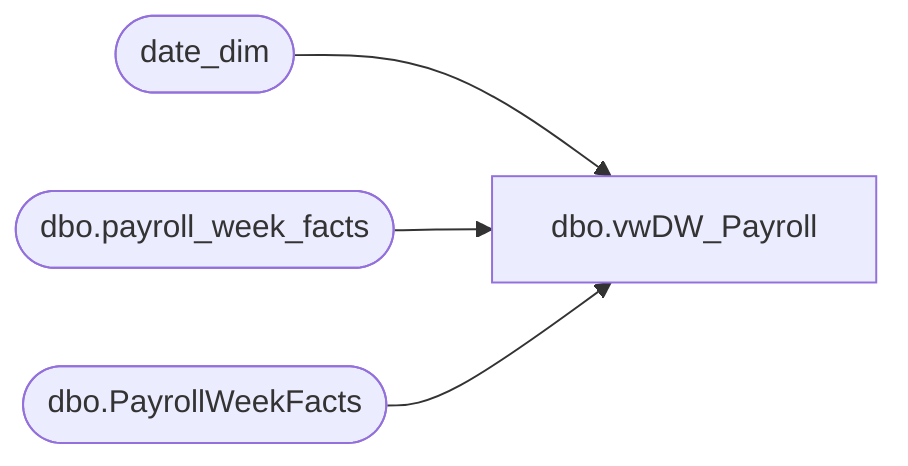

# dbo.vwDW_Payroll

**Database:** dw  
**Server:** papamart  

## Architecture Diagram



## Table Dependencies

| Referenced Table |
|---|
| date_dim |
| dbo.payroll_week_facts |
| dbo.PayrollWeekFacts |

## View Code

```sql
CREATE VIEW [dbo].[vwDW_Payroll]
AS

	---old table pre 2019-01-06
	SELECT p.store_key, p.period_id, d.date_key, p.week_id, p.actual, p.earned, p.loaded_date, p.updated_date
	FROM payroll.dbo.payroll_week_facts p
	INNER JOIN date_dim d ON d.week_id = p.week_id AND d.day_of_week = 7
	--where d.date_key <= 8036 --2019-01-05 00:00:00.000 - Last day of Fiscal 2018-11
	where d.date_key < 8107 --2019-03-17 00:00:00.000 - first day of new UTA system
	UNION
	--new table post 2019-01-05
	SELECT p.store_key, p.period_id, d.date_key, p.week_id, p.actual, p.earned, p.loaded_date, p.updated_date
	FROM payroll.dbo.PayrollWeekFacts p
	INNER JOIN date_dim d ON d.week_id = p.week_id AND d.day_of_week = 7
	where d.date_key >= 8107--2019-03-17 00:00:00.000 - first day of new UTA system


----temporary use this query to use the old view 
--SELECT p.store_key, p.period_id, d.date_key, p.week_id, p.actual, p.earned, p.loaded_date, p.updated_date
--FROM payroll.dbo.payroll_week_facts p
--INNER JOIN date_dim d ON d.week_id = p.week_id AND d.day_of_week = 7
```

