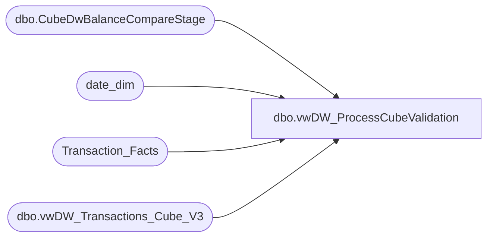

# dbo.vwDW_ProcessCubeValidation

**Database:** dw  
**Server:** papamart  

## Architecture Diagram



## Table Dependencies

| Referenced Table |
|---|
| dbo.CubeDwBalanceCompareStage |
| date_dim |
| Transaction_Facts |
| dbo.vwDW_Transactions_Cube_V3 |

## View Code

```sql
create view [dbo].[vwDW_ProcessCubeValidation] 

as


With CubeSSRS as
(
select
s.CaptureDate,
s.UnitGrossAmount as UnitGrossAmountCube, 
s.GaapAmount as GaapAmountCube
from dwstaging.dbo.CubeDwBalanceCompareStage s
where  1=1
and s.source = 'CUBE'
) , 

dwSSRS as (
select 
s.CaptureDate,
s.UnitGrossAmount as UnitGrossAmountDW, 
s.GaapAmount as GaapAmountDw
from dwstaging.dbo.CubeDwBalanceCompareStage s
where  1=1
and s.source = 'DW'

) , 

SsrsCompare as 
(
select 
d.CaptureDate,
d.GaapAmountDw, 
c.GaapAmountCube, 
d.UnitGrossAmountDW, 
c.UnitGrossAmountCube
from dwSSRS d 
join CubeSSRS c on d.capturedate=c.capturedate
where 1=1
and 

(
d.GaapAmountDw <> c.GaapAmountCube
or
d.UnitGrossAmountDW <> c.UnitGrossAmountCube
) 

), 

 DWTF as 
(
select 
'DW_TF' as Source, 
cast (getdate() as date) as CaptureDate,
cast (dd.actual_date as date) as TransactionDate, 
sum (tf.unit_gross_amount) as UnitGrossAmountDwTF,
sum (tf.GAAP_sales_amount) as GaapAmountDwTf

from Transaction_Facts tf
join date_dim dd on dd.date_key=tf.date_key
where 1=1
and dd.actual_date = CONVERT(DATETIME, CONVERT(CHAR(10), GETDATE() - 1, 101))
group by
cast (dd.actual_date as date)

), 

CubeV3 as 
(

select
'CubeV3_TF' as Source,
cast (getdate() as date) as CaptureDate,
cast (dd.actual_date as date) as TransactionDate, 
sum (tf.unit_gross_amount) as UnitGrossAmountCubeV3, 
sum (tf.GAAP_sales_amount) as GaapAmountCubeV3
from [dbo].[vwDW_Transactions_Cube_V3] tf
join date_dim dd on dd.date_key=tf.date_key
where 1=1
and dd.actual_date = CONVERT(DATETIME, CONVERT(CHAR(10), GETDATE() - 1, 101))
group by 
cast (dd.actual_date as date)
) , 

DwCompare as (
select
d.CaptureDate, 
d.GaapAmountDwTf , 
v.GaapAmountCubeV3,
d.UnitGrossAmountDwTF,
v.UnitGrossAmountCubeV3
from DWTF d 
join CubeV3 v on v.CaptureDate=d.CaptureDate and v.TransactionDate=d.TransactionDate
where 1=1
and 
(
d.GaapAmountDwTf<>v.GaapAmountCubeV3
or 
d.UnitGrossAmountDwTF<>v.UnitGrossAmountCubeV3
) 

)


select count (*) as CountImbalances
from SsrsCompare
union
select count (*)  as CountImbalances
from DwCompare
```

